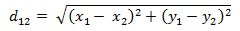
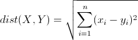
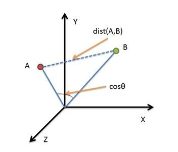
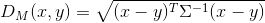

## KL散度（相对熵）

对于同一个随机变量 x 有两个**单独的概率分布 P(x) 和 Q(x)**，我们可以使用 KL 散度来**衡量这两个分布的差异**。

从KL散度公式中可以看到Q的分布越接近P（Q分布越拟合P），那么散度值越小，即损失值越小。

## 交叉熵

等式的后一部分，就是交叉熵：

## Wasserstein距离

Wasserstein距离相比KL散度的优越性在于，即便两个分布没有重叠，Wasserstein距离仍然能够反映它们的远近，也可以提供有意义的梯度

## 最大均值差异（Maximum mean discrepancy，MMD）

度量在再生希尔伯特空间中两个分布的距离，是一种**核学习**方法。

对分布做投影之后，分别求这两个不同分布的样本的函数值均值，对两个均值做差得到这两个分布对应于的均值差（mean discrepancy）。

## [欧氏距离](https://arxiv.org/abs/1703.05175) 

二维平面上两点a(x1,y1)与b(x2,y2)间的欧氏距离

多维空间中各个点之间的绝对距离

## [余弦距离](https://arxiv.org/abs/1606.04080) cosine margine

余弦相似度用向量空间中两个向量夹角的余弦值作为衡量两个个体间差异的大小。相比距离度量，余弦相似度更加注重两个向量在方向上的差异，而非距离或长度上。

## 余弦距离与欧氏距离的差别

欧氏距离衡量的是空间各点的绝对距离，跟各个点所在的位置坐标直接相关；而余弦距离衡量的是空间向量的夹角，更加体现在方向上的差异，而不是位置。

欧氏距离能够体现个体数值特征的绝对差异

余弦距离更多的是从方向上区分差异，而对绝对的数值不敏感

## 测地距离-角距离(angular margin)

单位弧度

在曲面上从A点走到B点（不允许离开曲面）的最短距离

## [EMD距离](https://arxiv.org/abs/2003.06777)

参考

* [如何解决「小样本」+「多分类」问题？](https://www.zhihu.com/question/389155523/answer/1175157989)
* [DeepEMD](https://github.com/icoz69/DeepEMD)

Earth Mover's Distance

如果两个分布被看作在D区域上两种不同方式堆积一定数量的山堆，那么EMD就是把一堆变成另一堆所需要移动单位小块最小的距离之和。

## 马氏距离

可以看作是欧氏距离的一种修正，修正了欧式距离中各个维度尺度不一致且相关的问题。

先举个比较常用的例子，身高和体重，这两个变量拥有不同的单位标准，也就是有不同的scale。比如身高用毫米计算，而体重用千克计算，显然差10mm的身高与差10kg的体重是完全不同的。但在普通的欧氏距离中，这将会算作相同的差距。

数据点x, y之间的马氏距离

## 少样本学习

**n-way k-shot**

* 1-Shot 5-Way

  随机选5类，每类选1张图，这5张图经过网络得到5个特征向量，从这5类里面每类再挑出一些样本也经过网络得到他们的特征向量，然后去和之前那5个向量计算距离，希望他们同一类的距离尽可能小。

* 5-Shot 5-Way

  随机选5类，每类选5张图，这5张图经过网络得到25个特征向量

