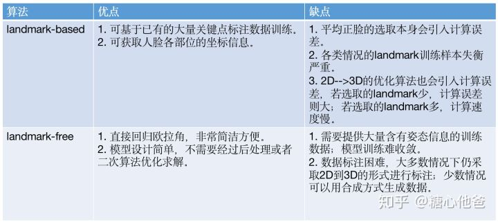
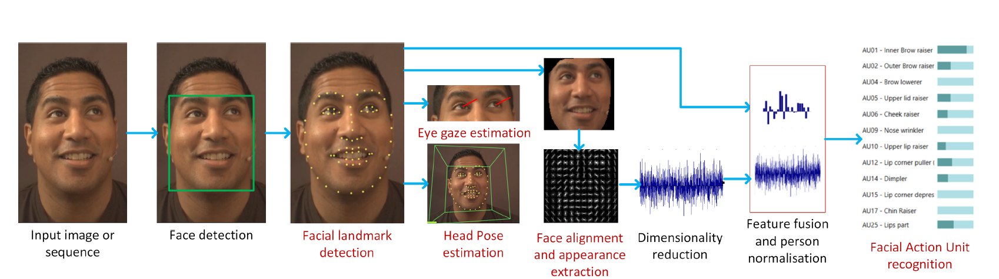
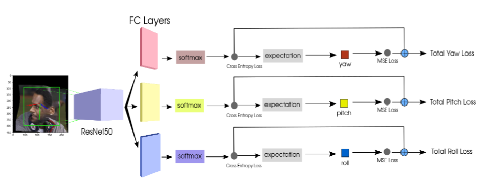

# 头部姿态估计

## 概论

[Fine Grained Head Pose Estimation Without Keypoint - 知乎](https://zhuanlan.zhihu.com/p/73904823?utm_source=wechat_session)

[face_pose_estimation](https://gist.github.com/JuneoXIE/346f5cbdecb435dff13f180f966d9837)

| 方法 | 优点                                                         | 缺点                                   | 算法        |
| ---- | ------------------------------------------------------------ | -------------------------------------- | ----------- |
| RGB  | 成本低易于推广，相关研究成果最多                             | 容易受光照变化，表情变化以及遮挡的影响 | Dlib OpenCV |
| RGBD | 无论在任何的照明条线下，都可以利用Kinect的CMOS红外探测器来感知空间（Kinect SDK 已经集成了头部姿态估计） | 设备价格，精度，速度                   |             |

**基于二维彩色图像的头部姿态估计方法**大致可分为两类方法

* 通过2D标定信息来估计3D姿态信息的算法，如先计算人脸的关键点，然后选取一个参考系（平均正脸的关键点），计算关键点和参考系的变换矩阵，然后通过迭代优化的算法来估计人脸的姿态
* 通过数据驱动的方式训练一个回归器，由该回归器对输入人脸的块进行一个直接的预测。

**基于深度图像的头部姿态估计方法**

## Dlib OpenCV SolvePnP(C++ RGB With Keyponits)

[OpenCV和Dlib进行头部姿势估计 学习OpenCV](https://www.learnopencv.com/head-pose-estimation-using-opencv-and-dlib/)

[解析 C++代码](https://blog.csdn.net/u013512448/article/details/77804161)  

算法的步骤一般为：

- 2D人脸关键点检测
- 3D人脸模型匹配
- 求解3D点和对应2D点的转换关系
- 根据旋转矩阵求解欧拉角

物体相对于相机的姿态可以使用**旋转矩阵**和**平移矩阵**

此方法需要获取三种参数：

* 人脸关键点坐标
* 通用的人脸3D模型关键点左边
* 相机的参数

人脸姿态估计主要是获得脸部朝向的角度信息。本文获得的人脸姿态信息用三个欧拉角（pitch，yaw，roll）表示。

首先定义一个6关键点的3D脸部模型（左眼角，右眼角，鼻尖，左嘴角，右嘴角，下颌），然后采用Dlib检测出图片中对应的6个脸部关键点，采用OpenCV的solvePnP函数解出旋转向量，最后将旋转向量转换为欧拉角。

- 基于Dlib的人脸关键点检测
Dlib提供了一个68关键点的检测模型，而且是按照顺序排列的。因此可以直接索引到需要的6个关键点。  
接着对检测到的人脸进行关键点检测.关键的索引顺序是固定的，姿态估计需要的6个关键点的索引id分别是： 
  
    - 下巴：8 
    - 鼻尖：30 
    - 左眼角：36 
    - 右眼角：45 
    - 左嘴角：48 
    - 右嘴角：54  
  
- 用OpenCV的solvePnP函数估计Pose

  OpenCV中solvePnP 和 solvePnPRansac都可以用来估计Pose。确定pose也就是确定从3D model到图片中人脸的仿射变换矩阵，它包含旋转和平移的信息。solvePnP函数输出结果包括旋转向量(roatation vector)和平移向量(translation vector)。这里我们只关心旋转信息，所以主要将对 roatation vector进行操作。在调用solvePnP函数前需要初始化cameraMatrix，也就是相机内参。

- 将旋转向量转换为欧拉角

  [欧拉角与四元数的转换关系](http://www.cnblogs.com/wqj1212/archive/2010/11/21/1883033.html)  

## OpenFace | CLM-Framework (C++ RGB With Keyponits)

[OpenFace](https://github.com/TadasBaltrusaitis/OpenFace)

[Paper](https://www.cl.cam.ac.uk/research/rainbow/projects/openface/wacv2016.pdf)

剑桥人脸跟踪器，Dlib比CLM-Framework更快

Conditional Local Neural Fields（CLNF）

## Deep-Head-Pose（RGB Without Keypoints ）

* [deep-head-pose](https://github.com/natanielruiz/deep-head-pose)
* [Fine-Grained Head Pose Estimation Without Keypoints](https://arxiv.org/abs/1710.00925v2)

训练一个multi-loss的卷积神经网络，直接使用RGB结合分类和回归损失来预测欧拉角（yaw，pitch and roll）

**实现细节：**

1） 对欧拉角（Yaw，Pitch，Roll）按角度区间进行分类，比如3度，那么Yaw：-90-+90，可以分成180/3= 60个类别，Pitch和Roll同Yaw角类似。这样就可以进行**分类任务**（CE Loss）了。
2） 对分类的结果恢复成实际的角度，类别\*3-90，**在和实际的角度计算回归损失**（MSE Loss）。
3） 最后将回归损失和分类损失进行合并来得到最后的损失，回归损失的前面增加了一个权重系数α。

**数据集：**

300W-LP

Biwi Kinect Head Pose Database