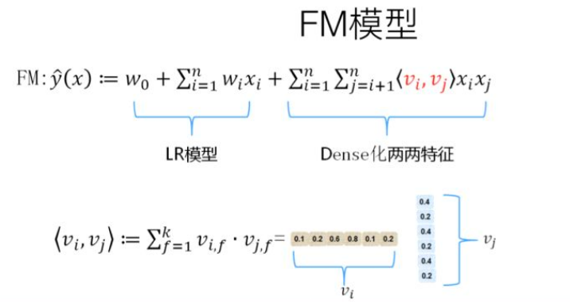
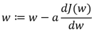

# 相关术语

* CTR (Click Through Rate): 点击率    ==CTR=点击量/展现量==
* CVR (Click Value Rate): 转化率，衡量CPA广告效果的指标   ==CVR=转化量/点击量==

# 面试1

[热乎的字节跳动算法实习面经_笔经面经_牛客网](https://www.nowcoder.com/discuss/541292?type=post&order=time&pos=&page=1&channel=1009&source_id=search_post)

### FM了解么，具体怎么做的，怎么解决权重系数难训练的问题，梯度怎么更新的

FM英文全称是“Factorization Machine”，简称FM模型，中文名“因子分解机”

FM模型引入任意两个特征的二阶特征组合，并且通过学习特征对应的向量来计算法权重值，本质上是在对特征进行Embedding化表征。

权重系数难训练的问题：

* 特征工程存在问题
* 学习速率

梯度：梯度即函数在某一点最大的方向导数，函数沿梯度方向函数有最大的变化率，那么在优化目标函数的时候，自然是沿着**负梯度方向**去减小函数值，以此达到我们的优化目标。

梯度下降算法的参数更新公式：

单参数：

a表示学习率（**learning rate**），函数J（w）对w求导表示改点的斜率。

### DeepFM了解么，embedding层是怎么训练的，结构是什么样的

DeepFM中FM提取低阶组合特征，Deep提取高阶组合特征

Embedding层，两个特点：

1. 尽管输入的长度不同，但是映射后长度都是相同的.embedding_size 或 k
2. embedding层的参数其实是全连接的Weights，是通过神经网络自己学习到的