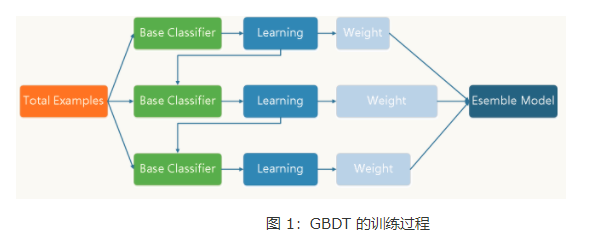

# 相关术语

* CTR (Click Through Rate): 点击率    ==CTR=点击量/展现量==
* CVR (Click Value Rate): 转化率，衡量CPA广告效果的指标   ==CVR=转化量/点击量==

# 面试1

[热乎的字节跳动算法实习面经_笔经面经_牛客网](https://www.nowcoder.com/discuss/541292?type=post&order=time&pos=&page=1&channel=1009&source_id=search_post)

## FM了解么，具体怎么做的，怎么解决权重系数难训练的问题

FM英文全称是“Factorization Machine”，简称FM模型，中文名“因子分解机”


FM模型引入任意两个特征的二阶特征组合，并且通过学习特征对应的向量来计算法权重值，本质上是在对特征进行Embedding化表征。

FM的基本原理是将这些二项式矩阵做矩阵分解，将高维稀疏的特征向量映射到低维连续向量空间，然后根据内积表示二项式特征关系

权重系数难训练的问题：

* 特征工程存在问题
* 学习速率

## 梯度怎么更新的

[梯度下降算法 - machine-learning-notes](https://luweikxy.gitbook.io/machine-learning-notes/gradient-descent-algorithm)

采用SGD来更新模型参数，使模型收敛。

梯度：梯度即函数在某一点最大的方向导数，函数沿梯度方向函数有最大的变化率，那么在优化目标函数的时候，自然是沿着**负梯度方向**去减小函数值，以此达到我们的优化目标。

梯度下降算法:按损失函数梯度下降的方向进行更新参数。

批量梯度下降法（Batch Gradient Descent）：遍历整个训练集，每次迭代采用所有数据来梯度下降

随机梯度下降法（Stochastic Gradient Descent）：一个用一个样本来梯度下降

小批量梯度下降法（Mini-batch Gradient Descent）：用一部分一部分来梯度下降

比较：

梯度下降算法的参数更新公式：

单参数：


a表示学习率（**learning rate**），函数J（w）对w求导表示改点的斜率。

## DeepFM了解么，embedding层是怎么训练的，结构是什么样的

[CTR论文精读(七)--DeepFM - 知乎](https://zhuanlan.zhihu.com/p/54776945)

DeepFM中FM提取低阶组合特征，Deep提取高阶组合特征

Embedding层，两个特点：

1. 尽管输入的长度不同，但是映射后长度都是相同的.embedding_size 或 k
2. embedding层的参数其实是全连接的Weights，是通过神经网络自己学习到的

## 回归问题有哪些排序指标


# 面试2

[字节跳动广告算法实习面试_笔经面经_牛客网](https://www.nowcoder.com/discuss/531486?type=post&order=time&pos=&page=1&channel=1009&source_id=search_post)

## xgboost和GBDT的区别，怎么做并行化的

[[校招-基础算法\]GBDT/XGBoost常见问题 - 知乎](https://zhuanlan.zhihu.com/p/81368182)

### GBDT

GBDT是以决策树（CART）为基学习器的GB算法，是**迭代树**。

> CART分类树算法使用基尼系数来代替信息增益比，基尼系数代表了模型的不纯度，基尼系数越小，不纯度越低，特征越好。

> ID3中使用了信息增益选择特征，增益大优先选择。

> C4.5中，采用信息增益比选择特征

GBDT的核心就在于：**每一棵树学的是之前所有树结论和的残差**



### XGBoost

每一次迭代，都在现有树的基础上，增加一棵树去拟合前面树的预测结果与真实值之间的残差，XGBoost的基本思想和GBDT相同，但是做了一些优化，如默认的缺失值处理，加入了二阶导数信息、正则项、列采样，并且可以并行计算等。

### 区别

* XGBoost加入了**正则项**来控制模型的复杂度，有利于防止过拟合，从而提高模型的泛化能力
* GBDT在模型训练时只是用了代价函数的一阶导数信息，XGBoost对代价函数进行**二阶泰勒展开**，可以同时使用一阶和二阶导数。
* 传统的GBDT采用CART作为基分类器，XGBoost支持**多种类型的基分类器**，比如线性分类器。
* XGBoost能够自动学习出**缺失值的处理策略**

## LSTM原理

## 梯度消失和梯度爆炸

原因：反向传播需要进行链式求导，层数越多，梯度越小，导致梯度消失。

损失函数值在训练过程中变成NaN值，梯度太大，进而导致网络不稳定，产生梯度爆炸

* 使用合适的激活函数，用ReLU、leakReLU取代sigmoid激活函数
* 使用Batch Normalization
* 使用LSTM或者残差结构，或者选择合适的网络层数
* 使用梯度裁剪，如果梯度值大于某个阈值，就进行梯度裁剪
* 使用权重正则化，对大权重的损失函数增添一项惩罚项（L1，L2）
* 使用预训练模型加微调
* 调节学习率，使用合适的LR Schedule（WarmUp）
* 检查数据

## 卷积有哪些

* 1D卷积 2D卷积 3D卷积

* 深度可分离卷积
* 分组卷积
* 空洞卷积
* 可变形卷积

## 广告系统

根据CTR/CVR排序，对用户提供广告推荐

## 有做过数据生成么，比如样本不够怎么办，数据清洗怎么做

## svm有哪些核函数


# 算法题

## 最长回文字串

* 枚举所有子串再判断 
* 回文串就是正着读和反着读都一样的字符串

[一看就懂，不点赞的不准看  - 最长回文子串 - 力扣（LeetCode）](https://leetcode-cn.com/problems/longest-palindromic-substring/solution/yi-kan-jiu-dong-bu-dian-zan-de-bu-zhun-kan-by-wo-y/)

```
class Solution:
    def longestPalindrome(self, s: str) -> str:
        length = len(s)
        dp = [[1] * length for _ in range(length)]
        left, right = 0, 0 #长度为1时
        for i in range(1, length):
             for j in range(length-i):
                if s[j] == s[j+i] and dp[j+1][j+i-1]:
                    dp[j][j+i] = 1 
                    left, right = j, j+i
                else:
                    dp[j][j+i] = 0
        return s[left: right+1]
```

## 有重复项数字的所有排列

[【HOT 100】47.全排列II Python3 回溯 考虑重复 --> 46.全排列 - 全排列 II - 力扣（LeetCode）](https://leetcode-cn.com/problems/permutations-ii/solution/hot-100-47quan-pai-lie-ii-python3-hui-su-kao-lu-zh/)

```
def base2_backtrack(nums, used, track=[]):
    if len(track) == n:
        res.append(track[:])
        return

    for i in range(n):
        # 对已经使用过的进行剪枝
        if used[i]: continue
        # 对存在重复数字的全排列进行剪枝
        if nums[i]==nums[i-1] and used[i-1]==0: continue
        # DO
        used[i] = 1
        track.append(nums[i])
        base2_backtrack(nums, used, track)
        # UNDO
        used[i] = 0
        track.pop()
        
res = []
used = [0 for _ in range(n)]
base2_backtrack([1,1,2], used)
```

##  最近公共祖先

