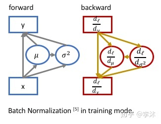

# 正则化方法

## DropBlock

dropout 通常对全连接层很有效，对卷积层效果甚微。

图1：（b）（c）中绿色区域主要蕴含了图像的语义信息，也就是狗所在的主要区域，通过图b的方式随机dropout效果并不好，因为相邻单元也包含了相关信息。按照图C的方式，移除整块区域，例如整个头或者脚，这样可以强制剩余单元学习到用于分类的特征。

## Dropout

在前向传播的时候，让某个神经元的激活值以一定的概率p停止工作，这样可以使模型泛化性更强，因为它不会太依赖某些局部的特征

**（1）取平均的作用**

dropout掉不同的隐藏神经元就类似在训练不同的网络，随机删掉一半隐藏神经元导致网络结构已经不同，整个dropout过程就相当于对很多个不同的神经网络取平均。

训练很多不同的网络，效果类似于embeding。

**（2）减少神经元之间的过度依赖**

迫使网络去学习更加**鲁棒的特征**

## 其他Dropout方法

## Batch Normalization

BN在深层神经网络的作用非常明显：若神经网络训练时遇到收敛速度较慢，或者“梯度爆炸”等无法训练的情况发生时都可以尝试用BN来解决。同时，常规使用情况下同样可以加入BN来加速模型训练，甚至提升模型精度。

BN 是一种**正则化**方法（减少泛化误差），主要作用有：

- **加速网络的训练**（缓解梯度消失，支持更大的学习率）
- **防止过拟合**
- 降低了**参数初始化**的要求。

**当batch值很小时，计算的均值和方差不稳定**

## SyncBN

跨卡同步BN的关键是在前向运算的时候拿到全局的均值和方差，在后向运算时候得到相应的全局梯度。 

## LayerNormization

Layer Normalization是作用于各样本上的，cross-layer（即便cross-channel）的规范化方式，其无需依托于mini-batch上的局部数据，每个训练和推断样本均可利用其本身的数据的进行规范化操作，所以其使用更方便，在Tranformer中就广泛采用了该架构。

以四个维度的图像（batch×channel×height×width）
数据为例，就是在channel×height×width上进行规范化。

## InstanceNormalization

Layer Normalization是作用于各样本的各个layer/channel上的规范化方式，其同样作用于各个样本，且粒度更细。

以四个维度的图像（batch×channel×height×width）
数据为例，就是在每个height×width上进行规范化。

## GroupNormalization

Layer Normalization的粒度太粗，而Instance Normalization的粒度又太细， Group Normalization做到了平衡，即在一定数目的channel上进行规范化。

以四个维度的图像（batch×channel×height×width）
数据为例，就是在每个N_channel×height×width上进行规范化。

## Switchable Normalization

Switchable Normalization是Batch Normalization、Layer Normalization和Instance Normalization的综合，其每层的规范化操作是上述三个规范化的加权和，加权系数为可学习的参数。

## Cross-Iteration Batch Normalization (CBN)

