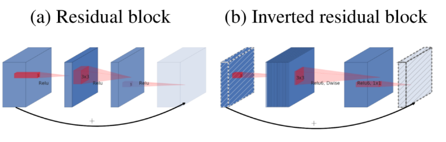
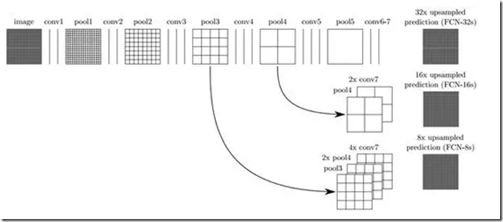

[TOC]


# 数据增强

- **Mixup**：将随机的两张样本按比例混合，分类的结果按比例分配；

- **Cutout**：随机的将样本中的部分区域cut掉，并且填充0像素值，分类的结果不变；

- **CutMix**：就是将一部分区域cut掉但不填充0像素而是随机填充训练集中的其他数据的区域像素值，分类结果按一定的比例分配

- **Mosaic**：将四张图片随机缩放后拼接在一起构成一张训练的图片

- **Random Copy-Paste**：将目标抠出来并在数据集中进行随机位置填充与随机旋转和缩放

- Color Jittering：对颜色的数据增强：图像亮度、饱和度、对比度变化

- Random Scale：尺度变换

- Random Crop：采用随机图像差值方式，对图像进行裁剪、缩放

- Random Horizontal/Vertical Flip：水平/垂直翻转

- Random Shift：平移变换

- Random Rotation/Reflection：旋转/仿射变换

- **GridMask**：**随机在图像上丢弃一块区域，作用相当于是在网络上增加一个正则项，避免网络过拟合**

- **Random Erasing**：用随机值或训练集的平均像素值替换图像的区域。

- **Hide and Seek**：将图像分割成一个由 SxS 图像补丁组成的网格，根据概率设置随机隐藏一些补丁，从而让模型学习整个对象的样子，而不是单独一块，比如不单独依赖动物的脸做识别。

- **AutoAugment**（无监督的数据增强）：学习已有数据增强针对数据集的组合策略

  

# 网络结构

## ResNet ResNeXt


首先这是两者block的区别，左侧为ResNet的block结构，右侧的是ResNeXt的block结构。

Bottleneck architecture**这个是针对于网络结构中输入/输出的维度(dimensions)来讲的**，这三层结构是1X1,3X3和1X1卷积

ResNeXt的**分支是同构的**

## HRNet


将**不同分辨率的feature map进行并联与特征融合**，在并联的基础上，添加不同分辨率feature map之间的融合(fusion)。


## SE-Net

**SE-Net** 通过自适应地重新校准通道特征响应来引入**通道注意力（channel-attention）机制**。 

Squeeze-Excitation


通过学习的方式来自动获取到每个**特征通道的重要程度**，然后依照这个重要程度去提升有用的特征并抑制对当前任务用处不大的特征


Reweight 的操作 Excitation 的输出的权重看做是进过特征选择后的每个特征通道的重要性，然后通过乘法逐通道加权到先前的特征上，完成在通道维度上的对原始特征的**重标定**

## SK-Net

**SK-Net** 通过两个网络分支引入**特征图注意力（feature-map attention**）


## Shufflenet v2

**4条关于 CNN 网络结构设计的准则**

* Guideline 1(G1): 输入通道数与输出通道数保持相等可以最小化内存访问成本（memory access cost,MAC）。
* Guideline 2(G2): 分组卷积中使用过多的分组数会增加内存访问成本（MAC)
* Guideline 3(G3): 网络结构太复杂（分支和基本单元过多）会降低网络的并行程度
* Guideline 4(G4): Element-wise 的操作消耗也不可忽略（包括ReLU，Tensor的相加，偏置的相加等等操作）

**深度分离卷积（depth-wise convolution）和 分组卷积（Group convolution）**


分组卷积（Group convolution）


深度分离卷积（depth-wise convolution）包含深度卷积和逐点卷积


## MobilenetV1

* 把VGG中的3×3卷积都换成了**深度可分离卷积**
* 采用的是ReLU6激活函数（提供了一个上边界）

## MobilenetV2

* 增加Inverted residuals

  通常的residuals block是先1*1的Conv layer，减少通道数下来，再3*3 Conv layer，最后经过一个1*1 的Conv layer，将通道数再“扩张”回去。即先“压缩”，最后“扩张”回去。

  而 inverted residuals就是 先“扩张”，最后“压缩”，Depth-wise convolution之前多了一个1*1的“扩张”层，目的是为了提升通道数，获得更多特征；


* Linear bottlenecks

  为了避免Relu对特征的破坏，在residual block的Eltwise sum之前的那个 1*1 Conv 不再采用Relu，而采用Linear，目的是防止Relu破坏特征。

### 深度可分离卷积

**深度可分离卷积**由depthwise(DW)和pointwise(PW)两个部分组成, 通过将乘法运算变为加法运算, 在能够保证同样卷积精度的情况下, 极大的降低计算成本。


如在上图中一张10x10像素、三通道彩色输入图片（shape为3x10x10）, Depthwise Convolution首先经过第一次逐通道卷积运算(shape为3x3x3), 然后再进行逐点卷积(shape 为3x1x1x16), 那么总的参数量为27+48 =75, 相比于常规卷积(3x3x3x16) 减少了83%的参数量.

### 反置残差结构



Inverted residual block来源于Mobilenet, 传统的残差模块, 先用1x1卷积将输入的feature map的维度降低, 然后进行3x3的卷积操作, 最后再用1x1的卷积将维度变大. 而倒置残差模块先用1x1卷积将输入的feature map维度变大, 然后用3x3 depthwise convolution方式做卷积运算, 最后使用1x1的卷积运算将其维度缩小

## EfficientNet

## FPN

特征金字塔网络 Feature Pyramid Networks

**顶层特征通过上采样（最近邻插值）和底层特征做融合**，而且每层都是独立预测的（足够底层的特征对于检测小物体是很有帮助的）


**算法大致结构**

**一个自底向上的线路，一个自顶向下的线路，横向连接（lateral connection）**。图中放大的区域就是横向连接，这里1*1的卷积核的主要作用是减少卷积核的个数，也就是减少了feature map的个数，并不改变feature map的尺寸大小。

**基于FPN的RPN是怎么训练的**

在FPN的每个融合后特征图的每一层上都接一个RPN子网（3*3卷积和2个并列的1\*1卷积），确定RPN子网的正负anchor box样本，再计算各预测层上RPN的anchor box分类和回归损失。

## BiFPN


## Recursive Feature Pyramid(RFP)

**RFP（递归特征金字塔**）= Recursive Structure + Bottom-up Backbone Layers + Top-down FPN Layers + ASPP as the Connecting Module

递归特征金字塔（RFP）主要**将反馈连接添加到FPN自下而上的过程中**（FPN结构最左侧为普通的卷积网络，默认使用ResNet结构，用作提取语义信息）

# 激活函数

## ReLu

ReLU在负半区为0，会造成神经元死亡的问题，另一方面提供了特征选择的稀疏性。

## Leaky ReLU

Leaky ReLU目的是使负轴信息不会全部丢失，解决了ReLU神经元“死掉”的问题。

## Mish-Activation


Mish的梯度更平滑

`Mish=x * tanh(ln(1+e^x)) `


## Swish


# 损失函数

## Softmax函数

Softmax函数，或称归一化指数函数， softmax将一组向量进行压缩，使得到的向量各元素之和为 1，而压缩后的值便可以作为置信率，所以常用于分类问题。

另外，在实际运算的时候，为了避免上溢和下溢，在将向量丢进softmax之前往往先对每个元素减去其中最大值。


## Softmax Loss


其中y~k~是一个长度为K的one-hot向量，即y~k~属于0，1，只有ground truth对应的y~k~=1。

CrossEntorpy 交叉熵 


因此


## Angular-Softmax Loss（SphereFace、A-Softmax Loss）


## Cosine Margin Loss（CosFace）


## Angular Margin Loss（ArcFace）

**弧矩**

ArcFace是在角度空间分割，ArcFace的angular margin对应着弧距(arc margin，也叫测地距离geodesic distance，在曲面上从A点走到B点（不允许离开曲面）的最短距离）


## Dice Loss（医学影像分割）

[医学影像分割---Dice Loss - 知乎](https://zhuanlan.zhihu.com/p/86704421)

**Dice系数是一种集合相似度度量函数**，通常用于计算两个样本的相似度(值范围为 [0, 1])


1. 预测分割图与 GT 分割图的点乘
2. 逐元素相乘的结果元素的相加和
3. 计算|X|和|Y|，这里可以采用直接元素相加，也可以采用元素平方求和的方法

|X⋂Y| - X 和 Y 之间的交集；|X| 和 |Y| 分别表示 X 和 Y 的元素个数. 其中，分子中的系数 2，是因为分母存在重复计算 X 和 Y 之间的共同元素的原因.

语义分割问题而言，X - GT 分割图像, Y - Pred 分割图像.

**Dice loss**


## Focal loss

[Focal loss - 搜索结果 - 知乎](https://www.zhihu.com/search?type=content&q=Focal loss)

**交叉熵**

![[公式]](image/equation-1565940522253.svg)

**Softmax** (**归一化指数函数**)-所有值加起来为1

![[公式]](image/equation-1589354991885.svg)

**Sigmoid**-所有值加起来不一定为1

![[公式]](image/equation-1589355026514.svg)

Focal loss主要是为了解决one-stage目标检测中正负样本比例严重失衡的问题。该损失函数降低了大量简单负样本在训练中所占的权重，也可理解为一种困难样本挖掘。

**Focal loss是在交叉熵损失函数基础上进行的修改**


其中gamma>0使得减少易分类样本的损失。使得更关注于困难的、错分的样本。

平衡因子alpha，用来平衡正负样本本身的比例不均：文中alpha取0.25，即正样本要比负样本占比小，这是因为**负例易分**。一般在目标检测任务框架中，保持正负样本的比例为 1:3

只添加alpha虽然可以平衡正负样本的重要性，但是无法解决简单与困难样本的问题。

**gamma调节简单样本权重降低的速率**，当gamma为0时即为交叉熵损失函数，当gamma增加时，调整因子的影响也在增加。实验发现**gamma为2是最优**。

易分样本置信度高，**对模型的提升效果非常小**，通过gamma参数降低loss值。

> 注意区分简单样本、困难样本、正样本、负样本的区别

```python
def py_sigmoid_focal_loss(pred,
                          target,
                          weight=None,
                          gamma=2.0,
                          alpha=0.25,
                          reduction='mean',
                          avg_factor=None):
    pred_sigmoid = pred.sigmoid()
    target = target.type_as(pred)
    pt = (1 - pred_sigmoid) * target + pred_sigmoid * (1 - target)
    focal_weight = (alpha * target + (1 - alpha) *
                    (1 - target)) * pt.pow(gamma)
    loss = F.binary_cross_entropy_with_logits(
        pred, target, reduction='none') * focal_weight
    loss = weight_reduce_loss(loss, weight, reduction, avg_factor)
    return loss
```

本质上是binary_cross_entropy_with_logits（BCEloss）乘focal_weight，focal_weight是从**置信度p**的角度入手衰减loss。

## Generalized Focal Loss

Focal Loss解决训练时正负样本不均衡的问题

Generalized Focal Loss：

* **classification score 和 IoU/centerness score 训练测试不一致**
* 边界框的表示具有很强的不确定性

GFL=QFL（结合了IOU与分类）+DFL


y：IOU score

sigma：class score

beta：参数，取2最佳


# 后处理

## Cluster-NMS

## Soft-NMS

## DIou-NMS

# 语义分割

## DeepLab V3+

[Review: DeepLabv3+ — Atrous Separable Convolution (Semantic Segmentation) | by Sik-Ho Tsang | Medium](https://medium.com/@sh.tsang/review-deeplabv3-atrous-separable-convolution-semantic-segmentation-a625f6e83b90)


DeepLabv3+ 融合了SSP还有U-Net结构，把SSP的池化替换成空洞卷积，并且改进了Xception（最大池操作都被深度可分的卷积替换，每次3×3深度卷积添加BN和Relu）

## FCN

FCN 的思想很直观，即直接进行像素级别端到端（end-to-end）的语义分割，它可以基于主流的深度卷积神经网络模型（CNN）来实现。正所谓‘全卷积神经网络‘，在FCN中，传统的全连接层 fc6 和 fc7 均是由卷积层实现，而最后的 fc8 层则被替代为一个 **21 通道**（channel）的 1x1 卷积层，作为网络的最终输出。之所以有 21 个通道是因为 PASCAL VOC 的数据中包含 21 个类别（20个「object」类别和一个「background」类别）


下图为 FCN 的网络结构，若原图为 H×W×3，在经过若干堆叠的卷积和池化层操作后可以得到原图对应的响应张量（Activation tensor）[](http://images2015.cnblogs.com/blog/1139079/201706/1139079-20170621162543570-1328652783.png) ，其中，[](http://images2015.cnblogs.com/blog/1139079/201706/1139079-20170621162544585-1672214780.png) 为 i 第 层的通道数。可以发现，**由于池化层的下采样作用，使得响应张量的长和宽远小于原图的长和宽，这便给像素级别的直接训练带来问题**。


为了解决下采样带来的问题，**FCN 利用双线性插值将响应张量的长宽上采样到原图大小**，另外为了更好的预测图像中的细节部分，**FCN 还将网络中浅层的响应也考虑进来**。具体来说，就是将 Pool4 和 Pool3 的响应也拿来，分别作为模型 FCN-16s 和 FCN-8s 的输出，与原来 FCN-32s 的输出结合在一起做最终的语义分割预测（如下图所示）。




**影响语言分割的像素精度的主要原因是池化层的下采样操作**，由下图可以看出FCN-32s使用FCN 的最后一层卷积和池化的输出，该模型的下采样倍数最高，其对应的语义分割结果最为粗略；而 FCN-8s 则因下采样倍数较小可以取得较为精细的分割结果。


## deeplab v3+相比于deeplab v2的区别在于什么

deeplab v2也是基于encoder和decoder架构的，但是后面有连接CRF条件随机场，而deeplab v3+没有了条件随机场，deeplab v3+的亮点之处在于引入了**ASPP空洞卷积模块**和同步的BN

## deeplab v3+损失函数CrossEntropyLoss

如果是做语义分割任务是得到一张【h,w】的语义图，那么input=【n,c,h,w】target=【n,h,w】

pytorch 损失函数需要把标签为255的忽略，有些数据集标注有白色描边（VOC 2012），不代表任何实际类别

```
nn.CrossEntropyLoss(ignore_index=255, reduction='mean')
```

## 实时语义分割

实时性语义分割算法进行了总结，发现当前主要有三种加速方法：1) 通过 Crop 或者 Resize 限制输入图片进而减少计算量；2) 减少网络通道数，尤其是 Early Stage；3) 还有像 ENet 类似的方法直接丢掉最后一个 Stage，如图10(a)所示。

# 模型设计

## Element-Wise Product（Hadamard）

[Hadamard product (matrices) - Wikipedia](https://en.wikipedia.org/wiki/Hadamard_product_(matrices))

element-wise表示按元素一个一个操作

element-wise product**同位元素对应相乘**（三个矩阵大小相同）


## Point-Wise Product


## Pixel-Wise像素级别

## image-wise图像级别

## patch-wise图片中的一块

## 卷积输出计算公式

参数

- 输入图片大小 *W×W*
- Filter大小 *F×F*
- 步长 *S*
- padding的像素数 *P*

> N = (W − F + 2P )/S+1

**卷积向下取整，池化向上取整**

## 卷积参数量

卷积参数量=（filter size \* 前一层特征图的通道数 ）\* 当前层filter数量


## 全连接层的参数量

卷积参数量=前一层特征图Size* FC层通道数

## 卷积计算量FLOPs

卷积层


Ci=input channel, k=kernel size, HW=output feature map size, Co=output channel.

2是因为一个MAC算2个operations。

不考虑bias时有-1，有bias时没有-1。

上面针对一个input feature map，没考虑batch size

## 深度可分离卷积参数量

对于一张5×5像素、三通道（shape为5×5×3）

普通3×3卷积核，输出通道为4，则参数量为3×4×3×3

> 常规卷积参数量 input chanel × output channel × filter size × filter size

深度可分离卷积分为两部分Depthwise Convolution（深度卷积）和Pointwise Convolution（逐点卷积）


假设输入特征图尺寸为，卷积核尺寸为，输出特征图尺寸为，标准卷积层的参数量为：

N_separable = N_depthwise + N_pointwise

​                        = + 

​                        = 

深度卷积负责滤波，尺寸为(DK,DK,1)，共M个，作用在输入的每个通道上；逐点卷积负责转换通道，尺寸为(1,1,M)，共N个，作用在深度卷积的输出特征映射上。


## 基本模块

* BatchNormalization-ReLU-Convolution（效果更好)
* Convolution-BatchNormalization-ReLU

Note：ReLU肯定不能在BN前，会导致驶入BN的数据分布产生变化

## Bottleneck

# 优化方法

# 自监督学习

## SimCLR


## CPC

## AMDIM

## Moco

## BYOL