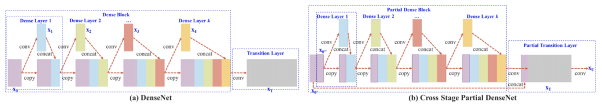

# 目标检测

参考：

- 《[从RCNN到SSD，这应该是最全的一份目标检测算法盘点 | 机器之心](https://www.jiqizhixin.com/articles/2018-04-27?from=synced&keyword=从RCNN到SSD，这应该是最全的一份目标检测算法盘点)》
- 《[基于深度学习的目标检测技术演进：R-CNN、Fast R-CNN、Faster R-CNN、YOLO、SSD | 七月在线](https://www.julyedu.com/question/big/kp_id/32/ques_id/2103)》
- [最详细目标检测讲解 Object Detection and Classification using R-CNNs](https://www.telesens.co/2018/03/11/object-detection-and-classification-using-r-cnns/)

## Faster RCNN

论文：《[Faster R-CNN: Towards Real-Time Object Detection with Region Proposal Networks (NIPS2015)](https://arxiv.org/pdf/1506.01497.pdf)》

参考：

- 《[一文读懂Faster RCNN | 知乎, 白裳](https://zhuanlan.zhihu.com/p/31426458)》
- 《[Faster R-CNN | 知乎, 晓雷](https://zhuanlan.zhihu.com/p/24916624)》

## Cascade-RCNN

**使用不同的IOU阈值，训练多个级联的检测器**。

**Mismatch问题**

- 在training阶段，由于我们知道gt，所以可以很自然的把与gt的iou大于threshold（0.5）的Proposals作为正样本，这些正样本参与之后的bbox回归学习。
- 在inference阶段，由于我们不知道gt，所以只能把所有的proposal都当做正样本，让后面的bbox回归器回归坐标。

training阶段和inference阶段，bbox回归器的输入分布是不一样的，training阶段的输入proposals质量更高(被采样过，IoU>threshold)，inference阶段的输入proposals质量相对较差（没有被采样过，，可能包括很多IoU<threshold的）

**使用不同的IOU阈值，训练多个级联的检测器**。

Cascade R-CNN就是使用不同的IOU阈值，训练了多个级联的检测器，给下一阶段找到一个IoU更高的正样本来训练。

每个阶段cascade都有不同的IoU阈值，可以更好地去除离群点。

Cascade回归作为一种重采样的机制，逐stage提高proposal的IoU值，从而使得前一个stage重新采样过的proposals能够适应下一个有更高阈值的stage。

## YOLO系列

参考：

- 《[YOLO v1 v2 v3系列原理与实现 | 知乎, Joe.Zhao](https://zhuanlan.zhihu.com/p/80855877)》
- 《[YOLO系列：V1,V2,V3,V4简介 | 知乎, 初识CV](https://zhuanlan.zhihu.com/p/136382095)》
- [YOLOv4重磅发布，五大改进，二十多项技巧实验，堪称最强目标检测万花筒 - 知乎](
  https://zhuanlan.zhihu.com/p/135980432)
- [代码](https://github.com/AlexeyAB/darknet)
- [YOLOv4. While object detection matures in the… | by Jonathan Hui | Medium](https://medium.com/@jonathan_hui/yolov4-c9901eaa8e61)
- [YOLOv4 — Superior, Faster & More Accurate Object Detection | by Ritesh Kanjee | Medium](https://medium.com/@riteshkanjee/yolov4-superior-faster-more-accurate-object-detection-7e8194bf1872)
- [吊打一切的YOLOv4的tricks汇总！附参考论文下载](https://mp.weixin.qq.com/s/A6ogmBP9qoOxxc04Im154g)

论文

* v1：《[You Only Look Once: Unified, Real-Time Object Detection (CVPR2016)](https://arxiv.org/pdf/1506.02640)》

- v2：《[YOLO9000: Better, Faster, Stronger (CVPR2017)](https://arxiv.org/pdf/1612.08242)》
- v3：《[YOLOv3: An Incremental Improvement (2018)](https://arxiv.org/pdf/1804.02767)》
- v4：《[YOLOv4: Optimal Speed and Accuracy of Object Detection (2020)](https://arxiv.org/pdf/2004.10934v1)》

### YOLO V3

DarkNet-53的详细网络配置

### YOLO v4

目标检测框架总结：

目标检测两种优化套路：

* **Bag of Freebies**，指的是在训练上增加一些策略，达到更高的精度并且在测试的时候不会增加额外的时间的策略。
  * 比如数据增广的方法图像几何变换、CutOut、grid mask等，网络正则化的方法DropOut、DropBlock等，类别不平衡的处理方法、困难样本挖掘方法、损失函数的设计等。
* **Bag of Specials**，稍微增加测试时间，但是可以提高较多的精度的方法。
  * 比如增大模型感受野的SPP、ASPP、RFB等，引入注意力机制Squeeze-and-Excitation (SE) 、Spatial Attention Module (SAM)等 ，特征集成方法SFAM , ASFF , BiFPN等，改进的激活函数Swish、Mish等，或者是后处理方法如soft NMS、DIoU NMS等。

YOLO v4 框架

- **Backbone：CSPDarknet53**
- **Neck：SPP，PAN**
- **Head：YOLOv3**

相关技术

- Weighted-Residual-Connections (WRC)
- Cross-Stage-Partial-connections (CSP)
- Cross mini-Batch Normalization (CmBN)
- Self-adversarial-training (SAT)
- Mish-activation
- Mosaic data augmentation
- CmBN
  - CBN的一个变体，CBN统计多个迭代步的数据然后做一次BN参数的更新，而因为Mosaic数据增广的使用，可以在空间上按照输入图片的划分来划分特征图，然后把它们视为四个mini-batch的数据来统计均值和方差，有效解决了BN本身对BatchSize大小的要求。
- DropBlock regularization
- CIoU loss

#### **Dense Block & DenseNet**

密集连接

**Dense Block**

在每一层，特征图的数量增加了四倍

**DenseNet**

然后，可以通过在由卷积和池化组成的过渡层，来组合多个Dense Block。（transition layer）

DenseNet的一大特色是通过特征在channel上的连接来实现特征重用

#### **Cross-Stage-Partial-connections (CSP)**

这项新设计通过将输入分为两部分来降低计算复杂性，只有一个部分通过DenseBlock。

注意下图中右图下方多了一条线

#### Path Aggregation Network (PAN)

路径聚合网络

在YOLOv4中将特征图串联在一起

在FPN中，分别以不同的尺度检测对象。这可能会产生重复的预测，并且不会利用其他特征图的信息。PAN首先使用element-wise max操作将所有层的信息融合在一起

#### Spatial Attention Module (SAM)

空间注意模块

注意力机制在 DL 设计中被广泛采用。在SAM中，最大值池化和平均池化分别用于输入feature map，创建两组feature map。结果被输入到一个卷积层，接着是一个 Sigmoid 函数来创建空间注意力。

将空间注意掩模应用于输入特征，输出精细的特征图。

在YOLOv4中，使用修改后的SAM而不应用最大值池化和平均池化。

### YOLO v5

