[TOC]

# 一、目标检测

## Cascade-RCNN

**使用不同的IOU阈值，训练多个级联的检测器**

Cascade R-CNN就是使用不同的IOU阈值，训练了多个级联的检测器，以通过调整bounding boxes，给下一阶段找到一个IoU更高的正样本来训练。

## 训练技巧

### Warmup LR

### 多尺度训练

## 推理技巧

### TTA（Test Time Augmentation）

这里会为原始图像造出多个不同版本，包括不同区域裁剪和更改缩放程度等，并将它们输入到模型中；然后对多个版本进行计算得到平均输出，作为图像的最终输出分数。

## 损失函数


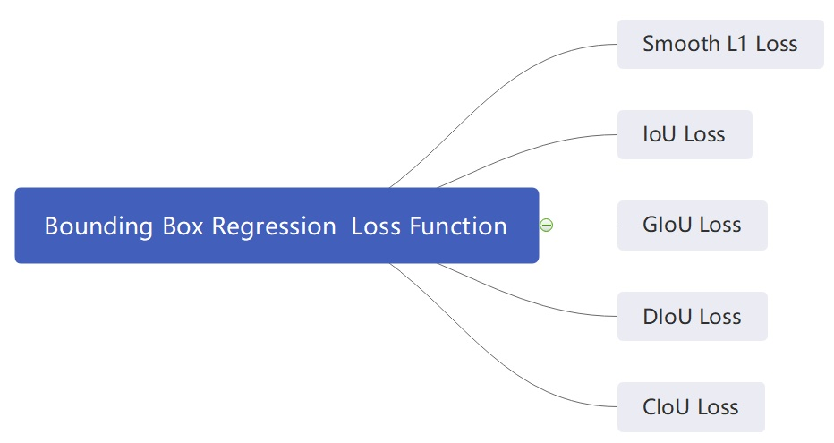

### 1.IoU Loss

交并比

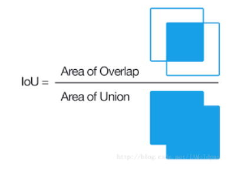

![[公式]](image/equation-1589025634590.svg)

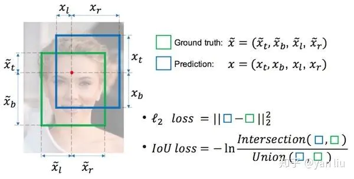

```
import numpy as np

def Iou(box1, box2)
	xmin1, ymin1, xmax1, ymax1 = box1
	xmin2, ymin2, xmax2, ymax2 = box2
	# 获取矩形框交集对应的左上角和右下角的坐标（intersection）
    xx1 = np.max([xmin1, xmin2])
    yy1 = np.max([ymin1, ymin2])
    xx2 = np.min([xmax1, xmax2])
    yy2 = np.min([ymax1, ymax2])
    # 计算两个矩形框面积
    area1 = (xmax1-xmin1) * (ymax1-ymin1) 
    area2 = (xmax2-xmin2) * (ymax2-ymin2)
    # 计算交集面积
    inter_area = (np.max([0, xx2-xx1])) * (np.max([0, yy2-yy1]))　
    # 计算交并比
	iou = inter_area / (area1+area2-inter_area+1e-6)
	
	return iou
```

### 2.GIOU  Loss

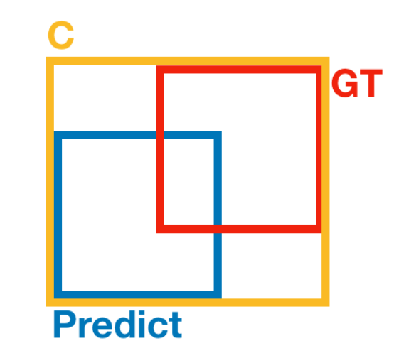

![[公式]](image/equation-1589027488110.svg)

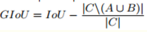

*上面公式的意思是：先计算两个框的最小闭包区域面积* ![[公式]](image/equation-1589027503675.svg) *(通俗理解：**同时包含了预测框和真实框**的最小框的面积)，再计算出IoU，再计算闭包区域中不属于两个框的区域占闭包区域的比重，最后用IoU减去这个比重得到GIoU。*

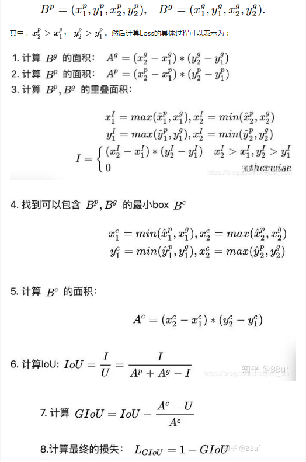

```python
def Giou(rec1,rec2):
    #分别是第一个矩形左右上下的坐标
    x1,x2,y1,y2 = rec1 
    x3,x4,y3,y4 = rec2
    iou = Iou(rec1,rec2)
    area_C = (max(x1,x2,x3,x4)-min(x1,x2,x3,x4))*(max(y1,y2,y3,y4)-min(y1,y2,y3,y4))
    area_1 = (x2-x1)*(y1-y2)
    area_2 = (x4-x3)*(y3-y4)
    sum_area = area_1 + area_2

    w1 = x2 - x1   #第一个矩形的宽
    w2 = x4 - x3   #第二个矩形的宽
    h1 = y1 - y2
    h2 = y3 - y4
    W = min(x1,x2,x3,x4)+w1+w2-max(x1,x2,x3,x4)    #交叉部分的宽
    H = min(y1,y2,y3,y4)+h1+h2-max(y1,y2,y3,y4)    #交叉部分的高
    Area = W*H    #交叉的面积
    add_area = sum_area - Area    #两矩形并集的面积

    end_area = (area_C - add_area)/area_C    #闭包区域中不属于两个框的区域占闭包区域的比重
    giou = iou - end_area
    return giou
```

### 3.DIoU Loss

![[公式]](image/equation-1589027730926.svg)

其中， ![[公式]](image/equation-1589027763479.svg) ， ![[公式]](image/equation-1589027763480.svg) 分别代表了预测框和真实框的中心点，且 ![[公式]](image/equation-1589027763481.svg) 代表的是计算两个中心点间的欧式距离。 ![[公式]](image/equation-1589027763504.svg) 代表的是能够同时包含预测框和真实框的**最小闭包区域**的对角线距离。

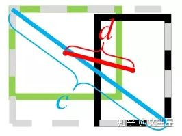

```
def Diou(bboxes1, bboxes2):
    rows = bboxes1.shape[0]
    cols = bboxes2.shape[0]
    dious = torch.zeros((rows, cols))
    if rows * cols == 0:#
        return dious
    exchange = False
    if bboxes1.shape[0] > bboxes2.shape[0]:
        bboxes1, bboxes2 = bboxes2, bboxes1
        dious = torch.zeros((cols, rows))
        exchange = True
    # #xmin,ymin,xmax,ymax->[:,0],[:,1],[:,2],[:,3]
    w1 = bboxes1[:, 2] - bboxes1[:, 0]
    h1 = bboxes1[:, 3] - bboxes1[:, 1] 
    w2 = bboxes2[:, 2] - bboxes2[:, 0]
    h2 = bboxes2[:, 3] - bboxes2[:, 1]
    
    area1 = w1 * h1
    area2 = w2 * h2

    center_x1 = (bboxes1[:, 2] + bboxes1[:, 0]) / 2 
    center_y1 = (bboxes1[:, 3] + bboxes1[:, 1]) / 2 
    center_x2 = (bboxes2[:, 2] + bboxes2[:, 0]) / 2
    center_y2 = (bboxes2[:, 3] + bboxes2[:, 1]) / 2

    inter_max_xy = torch.min(bboxes1[:, 2:],bboxes2[:, 2:]) 
    inter_min_xy = torch.max(bboxes1[:, :2],bboxes2[:, :2]) 
    out_max_xy = torch.max(bboxes1[:, 2:],bboxes2[:, 2:]) 
    out_min_xy = torch.min(bboxes1[:, :2],bboxes2[:, :2])

    inter = torch.clamp((inter_max_xy - inter_min_xy), min=0)
    inter_area = inter[:, 0] * inter[:, 1]
    inter_diag = (center_x2 - center_x1)**2 + (center_y2 - center_y1)**2
    outer = torch.clamp((out_max_xy - out_min_xy), min=0)
    outer_diag = (outer[:, 0] ** 2) + (outer[:, 1] ** 2)
    union = area1+area2-inter_area
    dious = inter_area / union - (inter_diag) / outer_diag
    dious = torch.clamp(dious,min=-1.0,max = 1.0)
    if exchange:
        dious = dious.T
    return dious
```

### 4.RepLoss 

优化解决密集遮挡问题

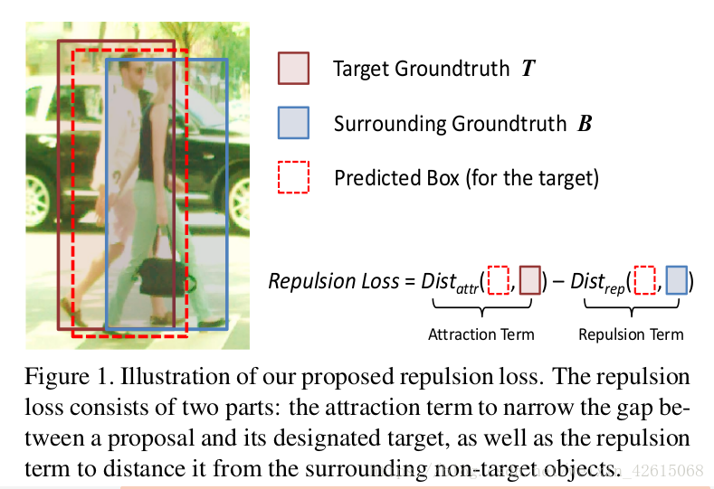!


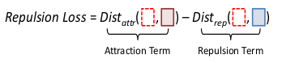

# 二、目标跟踪

## DeepSort

结合匈牙利算法 卡尔曼滤波

### 算法工作流程

1.检测器得到bbox

2.卡尔曼滤波**预测**

3.使用匈牙利算法将**预测后的tracks**和**当前帧中的detecions进行匹配**（级联匹配和IOU匹配）

4.卡尔曼滤波**更新**

* Frame 0：检测器检测到了3个detections，当前没有任何tracks，将这3个detections初始化为tracks                                                                                          
* Frame 1：检测器又检测到了3个detections，对于Frame 0中的tracks，先进行预测得到新的tracks，然后使用匈牙利算法将新的tracks与detections进行匹配，得到(track, detection)匹配对，最后用每对中的detection更新对应的track

### 算法参数

| 参数             | 作用                                                         |
| ---------------- | ------------------------------------------------------------ |
| max_dist         | 最近邻距离度量，马氏距离与余弦距离，用在级联匹配的地方，如果大于此距离，就直接忽略，不进行跟踪 |
| min_confidences  | 检测阈值，忽略所有低于这个值的目标                           |
| nms_max_overlap  | 最大检测重叠，默认为1.0，既不做筛选，若降低该值，则会筛选IOU重叠大于该值的框 |
| max_iou_distance | IOU距离，当IOU小于一定数值时，不认为是同一个目标，注意结果是1-Iou，max_iou_distance所以越大越好 |
| max_age          | 跟踪目标存活期限，代表一个Track存活期限，默认参数是70帧，对于运动速度快的需要减小该值。级联匹配中的循环次数 |
| n_init           | 在类Track中用于判断当前目标状态是否为confirmed，默认参数是3，即当目标确认三次则分配ID，并且此参数用于限制delete的阈值 |
| nn_budget        | 特征列表的长度，每个ID都有一个特征列表，此特征为ReID提取到的特征，如果超过，删除旧的 |

### 匈牙利算法（Hungarian Algorithm）

匈牙利算法用于解决二分图的**最大匹配**问题

算法步骤（假设矩阵为NxN方阵）：

1. 对于矩阵的每一行，减去其中最小的元素
2. 对于矩阵的每一列，减去其中最小的元素
3. 用最少的水平线或垂直线覆盖矩阵中所有的0
4. 如果线的数量等于N，则找到了最优分配，算法结束，否则进入步骤5
5. 找到没有被任何线覆盖的最小元素，每个**没被线覆盖的行**减去这个元素，每个**被线覆盖的列**加上这个元素，返回步骤3

在DeepSORT中，匈牙利算法用来将前一帧中的**跟踪框tracks**与当前帧中的**检测框detections**进行关联，通过**外观信息（appearance information）**和**马氏距离（Mahalanobis distance）**或者余弦距离，或者**IOU**来计算代价矩阵。

### 卡尔曼滤波（Kalman Filter）

用当前状态的观测值去预测下一个状态的预测值

卡尔曼滤波分为两个阶段：(1) **预测**track在下一时刻的位置，(2) 基于detection来**更新**预测的位置。

### 余弦距离

余弦距离=1-余弦相似度

### ReID

#### Mutiple Granularity Network

多重粒度网络

MGN是一个多分支的深度网络：**一个全局特征表示**的分支和**两个局部特征表示**的分支。

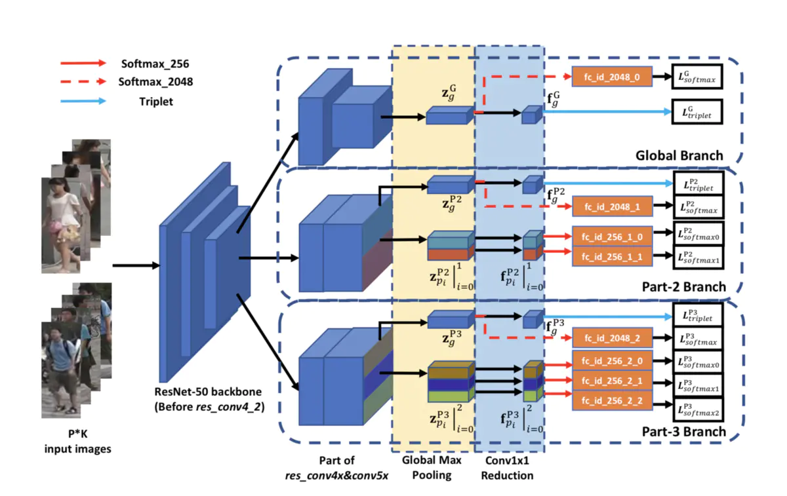

不同的N表示不同的粒度，N越大粒度越细。中间的分支N=2，可以理解为将行人分为上半身和下半身；下面的分支N=3，可以理解为将行人分为上，中，下三个部分。

## MOTDT

跟踪轨迹相关联的候选集不再仅仅只包含检测结果，还包括跟踪预测的（即卡尔曼滤波预测出来的框），从而可以在检测不再可靠时也能较好的跟踪对象。

其**核心思想**是同时从Object detection和object tracking里同时生成object candidates (bbox)，设计一种评分机制以选择最终的Candidates（如下图）。这里的intuition是detection和tracking是相辅相成的，比如detection里的high confidence结果可以防止tracking drifts，而tracking可以降低detection带来的偶然的不准确性。

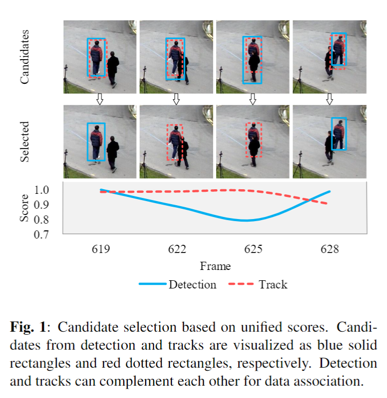


## FairMOT

[多目标跟踪 | FairMOT：统一检测、重识别的多目标跟踪框架，全新Baseline - 云+社区 - 腾讯云](https://cloud.tencent.com/developer/article/1634149)

两步法MOT——使用两个单独的模型，目标检测模型和目标跟踪ReID模型。

单步法MOT——在进行目标检测的**同时**也进行ReID特征提取。所以此处若目标检测产生的anchor是错误的会导致Reid学习错误的特征。并且同个目标的id也会有多个anchor，也会对Reid的学习产生歧义

融合CenterTrack和JDE，选用了DLA34（Deep Layer Aggregation，**深层聚合网络）的主干网络结构，一共三个输出分别用来预测目标的中心点位置，目标中心点的偏移，目标的BBox尺寸。本文还发现**低维特征实际上对MOT更好**，**因为它的训练图像比ReID少**，**学习低维特征有助于减少过拟合小数据的风险，并提高跟踪的稳健性。（数据少，网络参数要少）

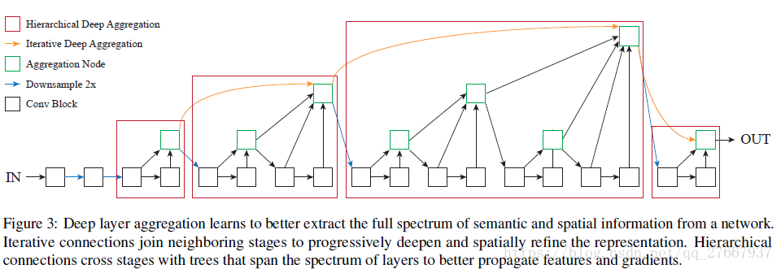

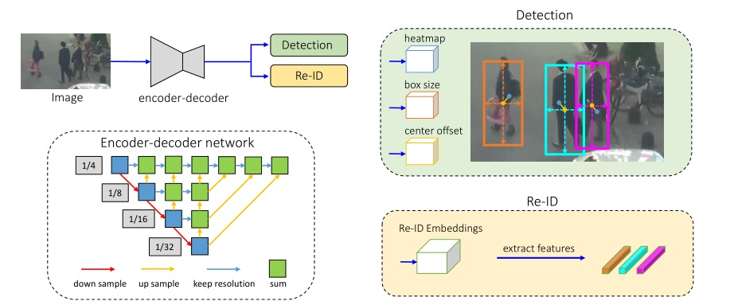

首先，采用 **anchor-free 目标检测方法，估计高分辨率特征图上的目标中心。**去掉锚点这一操作可以缓解歧义问题，使用高分辨率特征图可以帮助 Re-ID 特征与目标中心更好地对齐。

然后，**添加并行分支来估计像素级 Re-ID 特征，这类特征用于预测目标的 id。**


## CenterTrack

CenterNet构建模型时将目标作为一个点，即目标BBox的中心点。采用关键点估计来找到中心点，并回归到其他目标属性，例如**尺寸**，3D位置，**方向**，甚至姿态。

跟踪框也就变成了跟踪中心点。对相邻两帧利用CenterNet进行检测之外，同时预测存在于两帧中目标的**相对位移**，由此进行跟踪预测。


