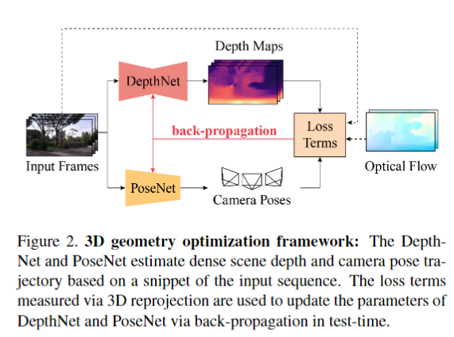

【1】[3D Video Stabilization with Depth Estimation by CNN-based Optimization](https://openaccess.thecvf.com/content/CVPR2021/html/Lee_3D_Video_Stabilization_With_Depth_Estimation_by_CNN-Based_Optimization_CVPR_2021_paper.html)

TLDR：

融合相机姿态位置与图像深度估计

【2】[Real-Time Selfie Video Stabilization](https://arxiv.org/pdf/2009.02007)

参考资料

[yaochih/awesome-video-stabilization: A curated list of video stabilization methods](https://github.com/yaochih/awesome-video-stabilization)

