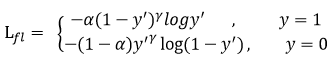
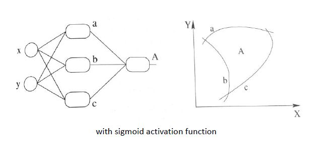
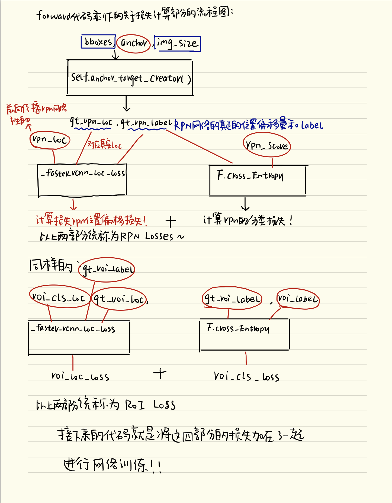

[TOC]

# ==深度学习基础==

## 交叉熵

二分类

![[公式]](image/equation.svg)

`-求和[标签*log（概率）]`

其中：

- y——表示样本的label，正类为1，负类为0
- p——表示样本预测为正的概率

多分类

![[公式]](image/equation-1565940522253.svg)

其中：

- ![[公式]](image/equation-1565940508633.svg) ——类别的数量；
- yc——指示变量（0或1）,如果该类别和样本的类别相同就是1，否则是0；
- ![[公式]](image/equation-1565940508639.svg) ——对于观测样本属于类别 ![[公式]](image/equation-1565940508745.svg) 的预测概率。

## Focal loss

[Focal loss - 搜索结果 - 知乎](https://www.zhihu.com/search?type=content&q=Focal loss)

**交叉熵**

![[公式]](image/equation-1565940522253.svg)

**Softmax** (**归一化指数函数**)-所有值加起来为1

![[公式]](image/equation-1589354991885.svg)

**Sigmoid**-所有值加起来不一定为1

![[公式]](image/equation-1589355026514.svg)

Focal loss主要是为了解决one-stage目标检测中正负样本比例严重失衡的问题。该损失函数降低了大量简单负样本在训练中所占的权重，也可理解为一种困难样本挖掘。

**Focal loss是在交叉熵损失函数基础上进行的修改**




其中gamma>0使得减少易分类样本的损失。使得更关注于困难的、错分的样本。

平衡因子alpha，用来平衡正负样本本身的比例不均：文中alpha取0.25，即正样本要比负样本占比小，这是因为**负例易分**。一般在目标检测任务框架中，保持正负样本的比例为 1:3

只添加alpha虽然可以平衡正负样本的重要性，但是无法解决简单与困难样本的问题。

**gamma调节简单样本权重降低的速率**，当gamma为0时即为交叉熵损失函数，当gamma增加时，调整因子的影响也在增加。实验发现**gamma为2是最优**。

易分样本置信度高，**对模型的提升效果非常小**，通过gamma参数降低loss值。

```python
def py_sigmoid_focal_loss(pred,
                          target,
                          weight=None,
                          gamma=2.0,
                          alpha=0.25,
                          reduction='mean',
                          avg_factor=None):
    pred_sigmoid = pred.sigmoid()
    target = target.type_as(pred)
    pt = (1 - pred_sigmoid) * target + pred_sigmoid * (1 - target)
    focal_weight = (alpha * target + (1 - alpha) *
                    (1 - target)) * pt.pow(gamma)
    loss = F.binary_cross_entropy_with_logits(
        pred, target, reduction='none') * focal_weight
    loss = weight_reduce_loss(loss, weight, reduction, avg_factor)
    return loss
```

本质上是binary_cross_entropy_with_logits（BCEloss）乘focal_weight，focal_weight是从**置信度p**的角度入手衰减loss。


**Focal Loss存在的问题**

* 过多关注困难样本（困难样本可能的脏数据、离群点）会导致网络学习奇异化
* alpha、gamma是靠实验经验取值

## GHM Loss （Gradient Harmonized）

Focal Loss是从**置信度p**的角度入手衰减loss，而GHM是**一定范围置信度p的样本数量**的角度衰减loss。

**谁的数量多衰减谁**

**梯度模长**


```
g = torch.abs(pred.sigmoid().detach() - target)
```

**g正比于检测的难易程度，g越大则检测难度越大。**


**梯度密度**  Gradient Density


`1/区间长度 连加 样本数量`


**用于分类的GHM损失** GHM-C Loss


## CosFace


## ArcFace Loss

利用margin来扩大不同类之间距离的损失函数

ArchFace中是直接在**角度空间**（angular space）中最大化分类界限（测地距离），而CosineFace是在**余弦空间**中最大化分类界限（余弦距离）

![[公式]](image/equation-1589457396643.svg)

CosFace非常类似，只是将 m作为角度加上去了，这样就强行拉大了同类之间的角度，使得神经网络更努力地将同类收得更紧。

## 过拟合怎么解决

* 数据增强、正则化（BN、L1、L2）、dropout、dropblock、早期停止

## L1和L2范数

**L1和L2的区别？L1有什么缺点？L2呢？平时用L1多还是用L2多？为什么正则化选L2呢？为什么不选L1？L1为什么产生稀疏解？**

L0范数：向量中非0元素的个数。

L1范数：向量中各个元素**绝对值之和**。权值的**绝对值之和**。也有个美称叫“稀疏规则算子”（Lasso regularization）。

L2范数：向量中各元素**平方和开根号**。也叫“岭回归”（Ridge Regression），也叫它“权值衰减weight decay”


L1范数更容易产生稀疏的权重，L2范数更容易产生分散的权重

L2对大数，对异常值更敏感

L1正则化有助于生成一个稀疏权值矩阵（稀疏矩阵指的是很多元素为0，只有少数元素是非零值的矩阵），L1能产生等于0的权值，即产生稀疏的效果，L2可以得迅速得到比较小的权值，但是难以收敛到0，所以产生的不是稀疏而是平滑的效果。

## 为什么要有激活函数

激活函数可以引入非线性因素，解决线性模型所不能解决的问题

无激活函数


有激活函数



## Adam和SGD的区别

Adam：比较傻瓜式，可以自动调节学习率。不追求极致的和初学者能用它把模型训练到一个比较满意的效果。二阶优化器。

SGD：一般框架中默认的优化器，适合要求比较高的模型训练。普遍适用于各种数据集，一般给个较大的bash_lr训练一段时间后再降低进行训练。

**推荐做法：模型好且快速收敛的方法**
**用adam训练一段时间，然后用sgd继续训练提高模型精度。**

使用大的学习率，只要不发散就行

## 上采样有什么方式？

- 双线性插值

- 最邻近插值

- 反卷积==转置卷积

  转置卷积计算过程是将输入的每个元素值作为卷积核的权重，相乘后作为该元素对应的上采样输出

  

- 上池化（unpooling）

  

- PixelShuffle **亚像素卷积** sub-pixel convolution

  

  

  通过卷积先得到r^2个通道的特征图（特征图大小和输入低分辨率图像一致），然后通过周期筛选（periodic shuffing）的方法得到这个高分辨率的图像

## 反向传播算法

误差反向传播

反向传播算法（BP 算法）主要由两个阶段组成：激励传播与权重更新。

**第1阶段：激励传播**

每次迭代中的传播环节包含两步：

1. （前向传播阶段）将训练输入送入网络以获得激励响应；
2. （反向传播阶段）将激励响应同训练输入对应的目标输出求差，从而获得输出层和隐藏层的响应误差。

**第2阶段：权重更新**

对于每个突触上的权重，按照以下步骤进行更新：

1. 将输入激励和响应误差相乘，从而获得权重的梯度；
2. 将这个梯度乘上一个比例并取反后加到权重上。

这个比例（百分比）将会影响到训练过程的速度和效果，因此成为“训练因子”。梯度的方向指明了误差扩大的方向，因此在更新权重的时候需要对其取反，从而减小权重引起的误差。

第 1 和第 2 阶段可以反复循环迭代，直到网络对输入的响应达到满意的预定的目标范围为止。

## 牛顿梯度下降

## 静态图与动态图区别

[动态图与静态图-文档-天元MegEngine](https://megengine.org.cn/doc/basic/dynamic_and_static_graph.html)

**静态图**：特点是计算图的**构建**和**计算**是分开的（Define and Run），静态图可以通过**编译优化**的方式进行图的优化，得到**更加节省内存**与**减少计算量**的静态图，会更加适合做部署

> 编译优化：
>
> 1.对象复用、零拷贝 ：实现“原地”（inplace）修改
>
> 2.算子融合（Operator Fuse）：将乘法和加法融合为一个三元操作（假设底层支持） **乘加** ，降低计算量。

**动态图**：方便debug，方便查看中间计算结果，更容易查看与修改底层，允许运行程序的时候动态去修正你的模型结构

## sigmod和softmax的区别和联系


# ==目标检测==

## Faster-RCNN YOLO SSD的区别

### **YOLO**

* **将检测问题转化为了回归问题**，直接预测出BBox的坐标与类别
* 将原图划分为SxS的栅格，每个格子预测2个的BBox坐标和对应的分类置信度，一共产生98个BBox（7x7x2）
* 速度快

### SSD

* 采用多层金字塔结构（**采用多尺度特征图用于检测**），直接预测出BBox的坐标与类别（跟YOLO类似）
* 采用**先验框**生成Anchor

### Faster-RCNN

* Region Proposal Network

## RCNN系列模型的区别


## 介绍Faster RCNN的流程及损失函数，为什么这样设计损失函数


**流程**

* Backbone。先通过主干网络提取特征图
* Region Proposal Networks。在通过RPN网络判断anchors属于前景还是背景，这里RPN网络包括两个部分，Anchor的生成和两层的卷积层
* Roi Ailing。该层收集输入的feature maps和proposals，综合这些信息后提取proposal feature maps，送入后续全连接层判定目标类别。
* Classification。利用proposal feature maps计算proposal的类别，同时再次bounding box regression获得检测框最终的精确位置。

**损失函数**

* Smooth L1 Loss（边框回归损失）

  融合L2损失：f(x)=x^2 ，L1损失：f(x)=|x|，构造成分段函数。

  L2损失对于比较大的误差的惩罚很高

  L1损失在0点处导数不存在，因此可能会影响收敛

  

* Cross Entropy Loss（分类损失）

## 介绍YOLO的流程

* 将图片Resize成448\*448，图片分割得到7\*7网格(cell)

* CNN提取特征和预测：卷积负责提特征。全链接负责预测：

  **a**) 7\*7\*2=98个bounding box(bbox) 的坐标![[公式]](https://www.zhihu.com/equation?tex=x_%7Bcenter%7D%2Cy_%7Bcenter%7D%2Cw%2Ch)和是否有物体的confidence 。 

  **b)** 7\*7=49个cell所属20个物体的概率。

* 过滤bbox（通过nms）


## 怎么处理样本的不均衡？

* OHEM（online hard example mining）在线困难样本挖掘

  OHEM算法，它在训练过程中自动选择困难样本，根据loss对其进行排序，选出K个困难样本，反向传播时，只对这K个proposal的梯度回传。

* Focal Loss

  Focal loss主要是为了解决one-stage目标检测中正负样本比例严重失衡的问题。

## DeeplabV2，CRF后处理的目的

CRF-条件随机场，利用crf修饰分割所得的图像边缘，CRF是后处理，是不参与训练的，在测试的时候对feature map做完CRF后，再双线性插值resize到原图尺寸。

根据原图image（5割通道的信息，包括RGB和坐标位置 x y）和 图像跑过fcn模型后所得到softmax（具有概率分布的），这两个数据进行再一次的像素点分类。

## 如何解决训练样本少的问题

1.利用预训练模型进行迁移微调（fine-tuning），预训练模型通常在特征上拥有很好的语义表达。

2.单样本或者少样本学习（one-shot，few-shot learning），这种方式适用于样本类别远远大于样本数量的情况等极端数据集。例如有 1000 个类别，每个类别只提供 1-5 个样本。少样本学习同样也需要借助预训练模型，但有别于微调的在于，微调通常仍然在学习不同类别的语义，而少样本学习通常需要学习样本之间的距离度量。例如孪生网络（Siamese Neural Networks）就是通过训练两个同种结构的网络来判别输入的两张图片是否属于同一类。

## 对 fine-tuning (微调模型的理解)，为什么要修改最后几层神经网络权值？

1.CNN 中更靠近底部的层（定义模型时先添加到模型中的层）编码的是更加通用的可复用特征，而更靠近顶部的层（最后添加到模型中的层）编码的是更专业业化的特征。微调这些更专业化的特征更加有用，它更代表了新数据集上的有用特征。 

2.训练的参数越多，过拟合的风险越大。很多 SOTA 模型拥有超过千万的参数，在一个不大的数据集上训练这么多参数是有过拟合风险的，除非你的数据集像 Imagenet 那样大。

## 两分布间距离的度量：MMD、KL散度、Wasserstein 对比

都可以衡量两个样本之间的差异，KL散度度量的不是距离，而是一种**信息损失**。最大均值差异（Maximum mean discrepancy，MMD），度量在**再生希尔伯特空间**中两个分布的距离，是一种核学习方法（先经过一个函数的变换）

## 讲一下NMS SoftNMS

**NMS**

**算法逻辑:**
输入: nn 行 44 列的候选框数组, 以及对应的 nn 行 11 列的置信度数组.
输出: mm 行 44 列的候选框数组, 以及对应的 mm 行 11 列的置信度数组, mm 对应的是去重后的候选框数量
算法流程:

1. 计算 nn 个候选框的面积大小
2. 对置信度进行排序, 获取排序后的下标序号, 即采用`argsort`
3. 将当前置信度最大的框加入返回值列表中
4. 获取当前置信度最大的候选框与其他任意候选框的相交面积
5. 利用相交的面积和两个框自身的面积计算框的交并比, 将交并比大于阈值的框删除.
6. 对剩余的框重复以上过程

```python
import numpy as np

def py_cpu_nms(dets, thresh):
    """Pure Python NMS baseline."""
    x1 = dets[:, 0]
    y1 = dets[:, 1]
    x2 = dets[:, 2]
    y2 = dets[:, 3]
    scores = dets[:, 4]

    areas = (x2 - x1 + 1) * (y2 - y1 + 1)
    
	#打分从大到小排列，取index
    order = scores.argsort()[::-1] 

    keep = []
    while order.size > 0:
        #order[0]是当前分数最大的窗口，肯定保留
        i = order[0]
        keep.append(i)
        
		#计算窗口i与其他所有窗口的交叠部分的面积
        xx1 = np.maximum(x1[i], x1[order[1:]])
        yy1 = np.maximum(y1[i], y1[order[1:]])
        xx2 = np.minimum(x2[i], x2[order[1:]])
        yy2 = np.minimum(y2[i], y2[order[1:]])

        w = np.maximum(0.0, xx2 - xx1 + 1) #计算w
        h = np.maximum(0.0, yy2 - yy1 + 1) #计算h
        #交叉面积
        inter = w * h       
        #计算iou
        ovr = inter / (areas[i] + areas[order[1:]] - inter)
        """
        保留重叠面积小于threshold的
        np.where的返回值是tuple
        np.where(condition, x, y) 满足条件(condition)，输出x，不满足输出y
        """
        inds = np.where(ovr <= thresh)[0]
        #order里面只保留与窗口i交叠面积小于threshold的那些窗口，由于ovr长度比order长度少1(不包含i)，所以inds+1对应到保留的窗口
        order = order[inds + 1]
    return keep
```

**Soft-NMS**

**算法逻辑:**
输入:

- bboxes: 坐标矩阵, 每个边框表示为 [x1, y1, x2, y2]
- scores: 每个 box 对应的分数, 在 Soft-NMS 中, scores 会发生变化(**对外部变量也有影响**)
- iou_thresh: 交并比的最低阈值
- sigma2: 使用 gaussian 函数的方差, sigma2 代表 σ2σ2
- score_thresh: 最终分数的最低阈值
- method: 使用的惩罚方法, 1 代表线性惩罚, 2 代表高斯惩罚, 其他情况代表默认的 NMS

返回值: 最终留下的 boxes 的 index, 同时, scores 值也已经被改变.
算法流程:

1. 在 bboxes 之后添加对于的下标[0, 1, 2…], 最终 bboxes 的 shape 为 [n, 5], 前四个为坐标, 后一个为下标
2. 计算每个 box 自身的面积
3. **对于每一个下标 ii**, 找出 i 后面的最大 score 及其下标, 如果当前 i 的得分小于后面的最大 score, 则与之交换, 确保 i 上的 score 最大.
4. 计算 IoU
5. 根据用户选定的方法更新 scores 的值
6. 以上过程循环 NN 次后(NN 为总边框的数量), 将最终得分大于最低阈值的下标返回, 根据下标获取最终存留的 Boxes, **注意, 此时, 外部 scores 的值已经完成更新, 无需借助下标来获取.**


```
import numpy as np

def soft_nms(bboxes, scores, iou_thresh=0.3, sigma2=0.5, score_thresh=0.001, method=2):
    # 在 bboxes 之后添加对于的下标[0, 1, 2...], 最终 bboxes 的 shape 为 [n, 5], 前四个为坐标, 后一个为下标
    N = bboxes.shape[0] # 总的 box 的数量
    indexes = np.array([np.arange(N)])  # 下标: 0, 1, 2, ..., n-1
    bboxes = np.concatenate((bboxes, indexes.T), axis=1) # concatenate 之后, bboxes 的操作不会对外部变量产生影响

    # 计算每个 box 的面积
    x1 = bboxes[:, 0]
    y1 = bboxes[:, 1]
    x2 = bboxes[:, 2]
    y2 = bboxes[:, 3]
    areas = (x2 - x1 + 1) * (y2 - y1 + 1)

    for i in range(N):
        # 找出 i 后面的最大 score 及其下标
        pos = i + 1
        if i != N-1:
            maxscore = np.max(scores[pos:], axis=0)
            maxpos = np.argmax(scores[pos:], axis=0)
        else:
            maxscore = scores[-1]
            maxpos = 0

        # 如果当前 i 的得分小于后面的最大 score, 则与之交换, 确保 i 上的 score 最大
        if scores[i] < maxscore:
            bboxes[[i, maxpos + i + 1]] = bboxes[[maxpos + i + 1, i]]
            scores[[i, maxpos + i + 1]] = scores[[maxpos + i + 1, i]]
            areas[[i, maxpos + i + 1]] = areas[[maxpos + i + 1, i]]

        # IoU calculate
        xx1 = np.maximum(bboxes[i, 0], bboxes[pos:, 0])
        yy1 = np.maximum(bboxes[i, 1], bboxes[pos:, 1])
        xx2 = np.minimum(bboxes[i, 2], bboxes[pos:, 2])
        yy2 = np.minimum(bboxes[i, 3], bboxes[pos:, 3])
        w = np.maximum(0.0, xx2 - xx1 + 1)
        h = np.maximum(0.0, yy2 - yy1 + 1)
        intersection = w * h
        iou = intersection / (areas[i] + areas[pos:] - intersection)

        # Three methods: 1.linear 2.gaussian 3.original NMS
        if method == 1:  # linear
            weight = np.ones(iou.shape)
            weight[iou > iou_thresh] = weight[iou > iou_thresh] - iou[iou > iou_thresh]
        elif method == 2:  # gaussian
            weight = np.exp(-(iou * iou) / sigma2)
        else:  # original NMS
            weight = np.ones(iou.shape)
            weight[iou > iou_thresh] = 0

        scores[pos:] = weight * scores[pos:]

    # select the boxes and keep the corresponding indexes
    inds = bboxes[:, 4][scores > score_thresh]
    keep = inds.astype(int)
    return keep

# boxes and scores
boxes = np.array([[200, 200, 400, 400], [220, 220, 420, 420],
                  [240, 200, 440, 400], [200, 240, 400, 440],
                  [1, 1, 2, 2]], dtype=np.float32)
boxscores = np.array([0.9, 0.8, 0.7, 0.6, 0.5], dtype=np.float32)
index = soft_nms(boxes, boxscores, method=2)
print(index) # 按照 scores 的排序指明了对应的 box 的下标
print(boxes[index])
print(boxscores) # 注意, scores 不需要用 index 获取, scores 已经是更新过的排序 scores
```

## 小目标检测的技巧

* 在尺度上做文章**FPN**
* 在Anchor上做文章，anchor的密度 anchor的范围 anchor的形状数量
* 数据增强
  * Oversampling  我们通过在训练期间对这些图像进行过采样来解决包含小对象的相对较少图像的问题（多用这类图片）。
  * Copy-Pasting Strategies 将小物体在图片中复制多分，在保证不影响其他物体的基础上，增加小物体在图片中出现的次数（把小目标扣下来贴到原图中去），提升被anchor包含的概率。

## FasterRCNN




## 目标检测中Anchor参数的设置

**anchor的密度：**由检测所用feature map的stride决定，这个值与前景阈值密切相关。

**anchor的范围：**RetinaNet中是anchor范围是32~512，这里应根据任务检测目标的范围确定，按需调整anchor范围，或目标变化范围太大如MS COCO，这时候应采用多尺度测试。

**anchor的形状：**RetinaNet每个位置预测三尺度三比例共9个形状的anchor，这样可以增加anchor的密度，但stride决定这些形状都是同样的滑窗步进，需考虑步进会不会太大，如RetinaNet框架前景阈值是0.5时，一般anchor大小是stride的4倍左右。

    anchor_scales=[8],放缩的尺度，要将宽和高按照各个scale的值放大
    
    anchor_strides=[4, 8, 16, 32, 64],也就是对应feature map对应到原图多少个像素，所以它的值等于原图中anchor的基础大小
    
    anchor_ratios=[0.5, 1.0, 2.0],宽高比
例如：当anchor stride = 4，anchor_ratios = [0.5, 1.0, 2.0]，scales = [4, 8, 16]时，首先可以得到一个((0,0),(3,3))的基础框，宽高都为4，将这个4××4的区域按照anchor_ratios进行变换，保证面积不变，宽高比符合要求，可以做如下转换


无论用哪种方式都能保证面积不变，而宽高比符合anchor_ratios。将转换后的hs和ws乘上对应的scales，就能得到放缩后的anchor，有三种ratio，三种scale，一共可以得到9个anchor，再根据中心坐标，算出每个anchor的((xmin, ymin),(xmax, ymax))。

得到左上角的所有anchor坐标之后，只需要对他们进行坐标的平移，就能得到整张图片上所有的anchor的坐标，有平移就会涉及到x和y方向的stride，一般将stride设为与anchor_stride相等，也可以根据情况自己设置。


## 目标检测one-stage和two-stage网络的区别

**主要区别**

1.one-stage网络速度要快很多
2.one-stage网络的准确性要比two-stage网络要低

two-stage，需要对anchor区域都要进行这样的分类和回归，所以它非常耗时。one-stage只需要对这个数据块进行分类和回归就可以。

two-stage比one-stage精度高的原因是训练过程中产生的anchor质量。

## DCN可变形卷积

[Deformable ConvNets](https://blog.csdn.net/u011974639/article/details/79996353)

[DCN V1代码阅读笔记 - BBuf的个人空间 - OSCHINA](https://my.oschina.net/u/4580321/blog/4358336)


DCN在**输入的特征图每个位置都生成偏移量（两个方向）**（注意是特征图的每个位置而不是卷积核的每个位置），这样HxWxN的feature map经过一个conv就得到了一个HxWx2N的offset filed，正好每个feature map位置有两个偏移量。

* 在DCNV1里，Deformable Conv只学习offset：


* 而在DCNV2中，加入了对每个采样点的权重：


DCN相似于一个可学习采样位置的空洞卷积 “learnable” dilated (atrous) convolution 

* 可学习的感受野（dynamic and learnable receptive field）

## 感受野

特征图上一个像素点所对应原图的大小

