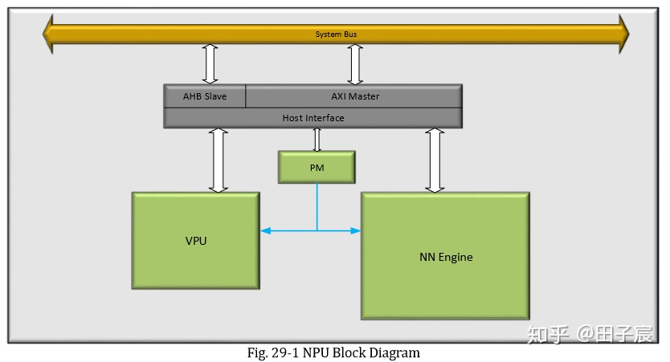

# RK3399 Pro

[Firefly | 让科技更简单，让生活更智能](http://www.t-firefly.com/doc/download/page/id/3.html)

加速核 NPU

NPU由4个部分组成：Host Interface、Power Management、Nerual Network Engine、Vector Processing Unit

- Host Interface：AXI用来从内存中取数据（128bit），AHB用来传递配置信息和debug（32bit）
- Power Management：处理Power、Clock、Reset和同步
- Nerual Network Engine：支持int8、int16、fp16，卷积、pooling、relu等操作在NN Engine上进行
- Vector Processing Unit：一个SIMD器件，一个周期可以执行16个元素的乘法/加法，Elewise操作在VPU上执行

NPU的运算能力：

- 1920个int8 MAD（multiply-add units）
- 192个int16 MAD
- 64个fp16 MAD

基本支持常用算子，包括CNN和RNN的

算子列表

* INT8, INT16, FP16
* Convolution size NXN , N <=11*stride, stride <= min(input width, input height)
* Liner, MIMO, Fully Connected, Fully Convolution
* Support network sparse coefficient decompression
* Support Max, average pooling (2x2, 3x3, stride <= min(input width, input height))
* Local average pooling size <= 11x11
* Support unpooling
* Support batch normalize, l2 normalize, l2 normalize scale, local response normalize
* Support permute, reshape, concat, depth to space, space to depth, flatten, reorg, squeeze and split
* Support region proposal
* Support priorbox layer
* Support Non-max Suppression
* Support ROI pooling
* Support dilate convolution, N <=11*stride, stride <= min(input width, input height), dilation <1024*
* *Support de-convolution, N <=11*stride, stride <= min(input width, input height)
* Support Elementwise addition, div, floor, max, mul, scale, sub
* Support elu, leaky_relu, prelu, relu, relu1, relu6, sigmod, softmax, tanh
* Support LSTM, RNN
* Support channel shuffle
* Support dequantize, dropout.

