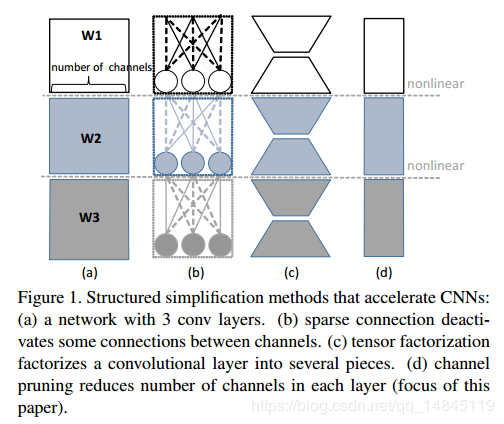
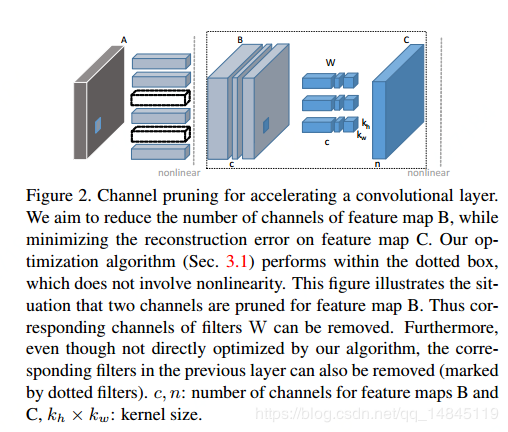
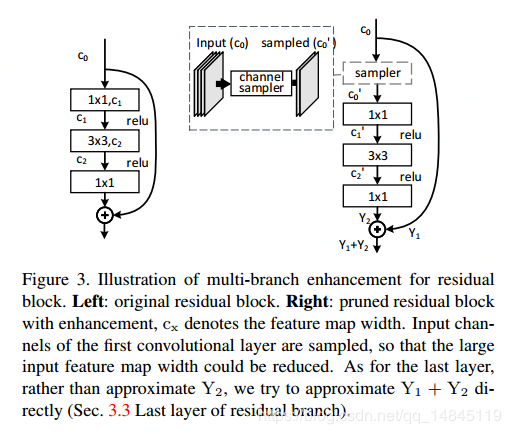

# 前端压缩

- 知识蒸馏

  复杂模型:性能较优，但参数量很大，计算效率低；小模型计算效率高，但是其性能较差。知识蒸馏是让复杂模型学习到的知识迁移到小模型当中。

- 紧凑的模型结构设计

  对神经网络卷积的方式进行改进。比如：使用两个3x3的卷积替换一个5x5的卷积、使用深度可分离卷积等等方式降低计算参数量。

- 滤波器层面的剪枝

  对较小的权重矩阵进行剔除，对整个神经网络进行微调。缺点：容易导致精度损失较大，造成权重冗余，剪枝不彻底。 

# 后端压缩

- 低秩近似
- 未加限制的剪枝
- 参数量化
- 二值网络

# Filters Pruning 

* [(23条消息)论文品读：Pruning filters for effecient convnets_hsqyc的博客-CSDN博客](https://blog.csdn.net/hsqyc/article/details/84029360)

### Prune and Retrain 方法

1. 裁剪所有层后再继续训练网络
2. 裁剪一层，重新训练一下

# Channel Pruning

结构简化（Structured simplification）的加速方法：

通道剪枝：

剪枝残差结构模块：

# 参考

* [超全总结：神经网络加速之量化模型 | 附带代码 | 机器之心](https://www.jiqizhixin.com/articles/2018-06-01-11)
* [当前深度神经网络模型压缩和加速都有哪些方法？ | 机器之心](https://www.jiqizhixin.com/articles/2018-05-22-9)
* [Neural Network Distiller](https://nervanasystems.github.io/distiller/index.html)
* [Awesome-model-compression-and-acceleration](https://github.com/memoiry/Awesome-model-compression-and-acceleration)
* [深度學習的模型壓縮與加速 Model Compression and Acceleration - YouTube](https://www.youtube.com/playlist?list=PLj6E8qlqmkFv3cCjjX2SA1D4FJ9fadDij)