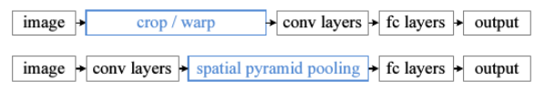
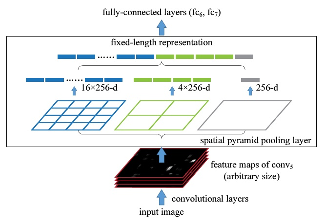

# 中兴

## 1、 知道CBN么，可以说一下么？

[Cross-iterationBatchNorm Github](https://github.com/Howal/Cross-iterationBatchNorm)

Cross-iteration batch normalization  通过计算几个相近的batch的近似统计参数，泰勒多项式去估计几个连续batch的统计参数

BN其实就是在学习两个参数（均值、方差），这两个参数会因为Batchsize太小而不稳定，CBN就是用了神经网络训练过程中参数变换是smooth的所以可以做近似计算。主要思路就是把前几个iter的结果也拿进来算当前iter的均值方差，来近似大Batch。

## 2、 SPP（空间金字塔池化 Spatial Pyramid Pooling）可以说一下么？

CNN所需要的固定维度输入（裁剪 cropping 和扭曲 warping）

SSP形成了一个固定长度的特征向量，将这个向量输入到后面的全连接层

## 3、 目标检测一阶段和二阶段的区别？

## 4、 Mish和Leaky ReLU的区别是什么？Mish有什么优势？

## 5、 SSD和YOLOv3的主要区别是什么？

## 6、 Darknet和VGG的区别什么？

## 7、 ResNet系列你熟悉么？可以谈谈么？

## 8、 如何提升小目标检测结果？

## 9、 介绍一下Ohem和focal loss，说一下两者的区别？

## 10、你知道哪些度量距离？都有什么区别？

## 11、 说说你对anchor free的理解？

基于关键点的目标检测网络

CornerNet

CenterNet

## 12、你可以对照公式说一下卡尔曼滤波么？

## 14、LR和SVM的区别是什么？

# 地平线

## 1、讲一下科研项目

## 2、怎么构造Loss函数

## 3、Anchor怎么调

## 4、头部姿态检测中坐标系是怎么变换的

## 5、OpenCV中图像去噪的算法

# 焦点科技

## 1、你怎么看Anchor-Free框架的

## 2、你对少样本训练怎么理解

## 3、CenterTrack怎么做目标跟踪的