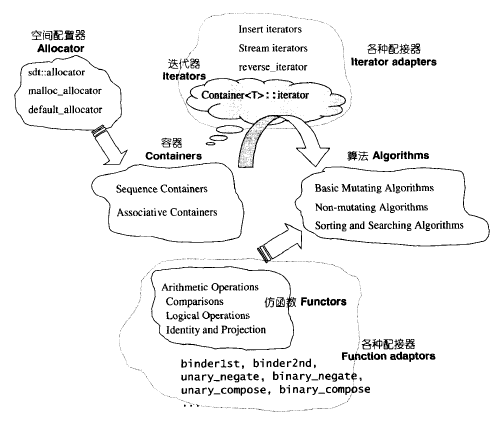

# C++

参考

* [C++基础教程](http://c.biancheng.net/cplus/)
* [STL教程：C++ STL快速入门（非常详细）](http://c.biancheng.net/stl/)
* [C++ 常用STL库总结 | AI柠檬](https://blog.ailemon.me/2019/03/29/cpp-stl-library-summary/)

## iterator

不同容器的迭代器

| 容器                               | 对应的迭代器类型 |
| ---------------------------------- | ---------------- |
| array                              | 随机访问迭代器   |
| vector                             | 随机访问迭代器   |
| deque                              | 随机访问迭代器   |
| list                               | 双向迭代器       |
| set / multiset                     | 双向迭代器       |
| map / multimap                     | 双向迭代器       |
| forward_list                       | 前向迭代器       |
| unordered_map / unordered_multimap | 前向迭代器       |
| unordered_set / unordered_multiset | 前向迭代器       |
| stack                              | 不支持迭代器     |
| queue                              | 不支持迭代器     |

不同容器的迭代器

| 迭代器定义方式 | 具体格式                                   |
| -------------- | ------------------------------------------ |
| **正向迭代器** | **容器类名::iterator 迭代器名;**           |
| 常量正向迭代器 | 容器类名::const_iterator 迭代器名;         |
| 反向迭代器     | 容器类名::reverse_iterator 迭代器名;       |
| 常量反向迭代器 | 容器类名::const_reverse_iterator 迭代器名; |

## vector

### 初始化与赋值

- 不带参数的构造函数初始化
- 带参数的构造函数初始化

### 方法

| 函数成员         | 函数功能                                                     |
| ---------------- | ------------------------------------------------------------ |
| **begin()**      | **返回指向容器中第一个元素的迭代器。**                       |
| **end()**        | **返回指向容器最后一个元素所在位置后一个位置的迭代器，通常和 begin() 结合使用。** |
| rbegin()         | 返回指向最后一个元素的迭代器。                               |
| rend()           | 返回指向第一个元素所在位置前一个位置的迭代器。               |
| cbegin()         | 和 begin() 功能相同，只不过在其基础上，增加了 const 属性，不能用于修改元素。 |
| cend()           | 和 end() 功能相同，只不过在其基础上，增加了 const 属性，不能用于修改元素。 |
| crbegin()        | 和 rbegin() 功能相同，只不过在其基础上，增加了 const 属性，不能用于修改元素。 |
| crend()          | 和 rend() 功能相同，只不过在其基础上，增加了 const 属性，不能用于修改元素。 |
| **size()**       | **返回实际元素个数。**                                       |
| max_size()       | 返回元素个数的最大值。这通常是一个很大的值，一般是 232-1，所以我们很少会用到这个函数。 |
| resize()         | 改变实际元素的个数。                                         |
| capacity()       | 返回当前容量。                                               |
| empty()          | 判断容器中是否有元素，若无元素，则返回 true；反之，返回 false。 |
| reserve()        | 增加容器的容量。                                             |
| shrink _to_fit() | 将内存减少到等于当前元素实际所使用的大小。                   |
| operator[ ]      | 重载了 [ ] 运算符，可以向访问数组中元素那样，通过下标即可访问甚至修改 vector 容器中的元素。 |
| at()             | 使用经过边界检查的索引访问元素。                             |
| front()          | 返回第一个元素的引用。                                       |
| back()           | 返回最后一个元素的引用。                                     |
| data()           | 返回指向容器中第一个元素的指针。                             |
| assign()         | 用新元素替换原有内容。                                       |
| **push_back()**  | **在序列的尾部添加一个元素。**                               |
| pop_back()       | 移出序列尾部的元素。                                         |
| insert()         | 在指定的位置插入一个或多个元素。                             |
| erase()          | 移出一个元素或一段元素。                                     |
| clear()          | 移出所有的元素，容器大小变为 0。                             |
| swap()           | 交换两个容器的所有元素。                                     |
| emplace()        | 在指定的位置直接生成一个元素。                               |
| emplace_back()   | 在序列尾部生成一个元素。                                     |

## Queue

```
size()#查询大小
front()#获取队首元素
back()#获取队尾元素
push()#入队
pop()#出队
```


## STL六大组件

STL提供了六大组件，彼此组合套用协同工作。

容器(containers)，算法(algorithm)，迭代器(iterator)，

仿函数(functors)，适配器(adapters)，配置器(allocators)。


**容器(contaioner)：**

包含了各种数据结构。
例如动态数组(vector)，链表(list)，双端队列(deque)，集合(set)，映射(map)等…

作用是在一块空间内存放数据。

从实现的角度看，STL容器是一种类模板(class template)。


**算法(algorithm)：**

各种常用的算法，如sort，search，copy，erase，max，min等…

作用是实现对数据的操作。

从实现的角度看，STL算法是一种函数模板(function template)。

 

**迭代器(iterator)：**

包含了各种容器存取操作。
例如operator*，operator->，operator++，operator- -等指针操作。

作用是 容器 与 算法 之间的胶合剂。算法通过迭代器存取容器的内容。

从实现的角度看，迭代器是一种将指针操作重载的类模板(class template)。

迭代器共有五种类型已经它们的衍生变化。

所有的容器都附带自己的专属迭代器，因为只有容器设计者才知道如何遍历自己的元素。

原生指针(native pointer)也是一种迭代器。

 

**仿函数(functor)：**

行为类似函数，可作为算法的某种策略(policy)。

从实现的角度看，仿函数是一种重载了operator()的类(class)或类模板(class template)。

一般 函数指针(指向函数的指针)可视为狭义的仿函数。

 

**适配器(adapter)：**

一种用来修饰容器(container)或仿函数(functor)或迭代器(iterator)接口的东西。

改变 容器 接口的称为 容器适配器(container adapter)。

改变 仿函数 接口的称为 仿函数适配器(functor adapter)。

改变 迭代器 接口的称为 迭代器适配器(iterator adapter)。

 

**配接器(allocator)：**

负责空间的配置和管理。

从实现的角度来看，配置器是一种实现了 动态 空间配置，空间管理，空间释放的类模板(class template).


它们之间的交互关系：



容器(container)通过配置器(allocator)获得数据存储空间。

算法(algorithm)通过迭代器(iterator)存取容器(container)内容。

仿函数(functor)可以协助算法(algorithm)完成不同策略变化。

配接器(adapter)可以修饰或套接仿函数(functor)。


## C++ 11 新特性

### auto关键字（自动类型推导）

for(auto &i:s) 对i的操作将直接改变s

for(auto i:s) 对i的操作将不改变s

其中s为迭代器

## GCC编译

（1）预处理
（2）编译
（3）汇编
（4）链接