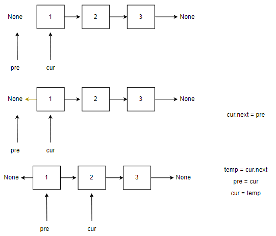

> [牛客题霸-名企高频面试题_牛客网](https://www.nowcoder.com/ta/job-code-high-week)

[TOC]

## 反转链表（双指针）

```
输入: 1->2->3->4->5->NULL
输出: 5->4->3->2->1->NULL
```

```python
# -*- coding:utf-8 -*-
# class ListNode:
#     def __init__(self, x):
#         self.val = x
#         self.next = None
class Solution:
    def ReverseList(self, pHead):
        pre = None
        cur = pHead
        while cur!=None:
            temp = cur.next
            cur.next = pre
            pre = cur
            cur = tmp
        return pre
```



```c++
class Solution {
public:
    ListNode* reverseList(ListNode* head) {
        ListNode* pre = NULL;
        ListNode* cur = head;
        while (cur!=NULL) {
            ListNode* next = cur->next;
            cur->next = pre;
            pre = cur;
            cur = next;
        }
        return pre;
    }
};
```


## 最小的K个数（排序、快排、堆）

* 排序

  ```python
  class Solution:
      def getLeastNumbers(self, arr: List[int], k: int) -> List[int]:
          if arr == [] or k > len(arr):
              return []
          arr.sort()
          return arr[:k]
  ```

  ```c++
  class Solution {
  public:
      vector<int> getLeastNumbers(vector<int>& arr, int k) {
          vector<int> vec(k, 0);
          sort(arr.begin(), arr.end());
          for (int i = 0; i < k; ++i) {
              vec[i] = arr[i];
          }
          return vec;
      }
  };
  ```

* 快排

  ```python
  #该方法与常规排序一样
  class Solution:
      def GetLeastNumbers_Solution(self, tinput, k):
          def quick_sort(lst):
              if not lst:
                  return []
              pivot = lst[0]
              left = quick_sort([x for x in lst[1: ] if x < pivot])
              right = quick_sort([x for x in lst[1: ] if x >= pivot])
              return left + [pivot] + right
   
          if tinput == [] or k > len(tinput):
              return []
          tinput = quick_sort(tinput)
          return tinput[: k]
  ```

   partition方法（改造版快速排序）

  快速排序的思想是将数据分成两个部分，左边的小于基础数，右面的大于基础数，如果基础数的坐标 i 恰好等于 k，那么我们就可以确定 arr[:k]就是我们的解

  ```python
  class Solution:
      def partition(self, nums, l, r):
          pivot = l
          i = l + 1
          for j in range(l+1, r+1)://左闭右开
              if nums[j] <= nums[pivot]:
                  nums[i], nums[j] = nums[j], nums[i]
                  i += 1
          nums[i - 1], nums[pivot] = nums[pivot], nums[i - 1]
          return i - 1
  
  
      def getLeastNumbers(self, arr: List[int], k: int) -> List[int]:
          if k >= len(arr): return arr
          def quick_sort(l, r):
              i = self.partition(arr, l, r)
              # print(arr)
              if k < i: return quick_sort(l, i - 1) 
              if k > i: return quick_sort(i + 1, r)
              return arr[:k]
              
          return quick_sort(0, len(arr) - 1)
  ```
  
  
  
  ```
  class Solution:
      def getLeastNumbers(self, arr: List[int], k: int) -> List[int]:
          if k >= len(arr): return arr
          def quick_sort(l, r):
              i, j = l, r
              while i < j:
                  while i < j and arr[j] >= arr[l]: j -= 1
                  while i < j and arr[i] <= arr[l]: i += 1
                  arr[i], arr[j] = arr[j], arr[i]
              arr[l], arr[i] = arr[i], arr[l]
              if k < i: return quick_sort(l, i - 1) 
              if k > i: return quick_sort(i + 1, r)
              return arr[:k]
              
          return quick_sort(0, len(arr) - 1)
  ```

## 两数之和（哈希表）

```
class Solution:
    def twoSum(self, nums: List[int], target: int) -> List[int]:
        hashmap={}
        # 将数据存储成哈希表
        for i,num in enumerate(nums):
            hashmap[num] = i

        for i,num in enumerate(nums):
            j = hashmap.get(target - num)
            if j is not None and i!=j:
                return [i,j]

        return []
```

```
class Solution:
    def twoSum(self, nums: List[int], target: int) -> List[int]:
        hashmap={}
        # 将数据存储成哈希表
        for i,num in enumerate(nums):
            hashmap[num] = i

        for i,num in enumerate(nums):
            if target - num in hashmap:
                if i!=hashmap[target - num]:
                    return [i,hashmap[target - num]]

        return []
```

## 斐波那契数列（动态规划）

```
class Solution:
    def fib(self, n: int) -> int:
        a, b = 0, 1
        for _ in range(n):
            a, b = b, a + b
        return a % 1000000007
```

## 二分查找（双指针）

输入为排序数组

```
def binary_search(list, item):
    low = 0
    high = len(list) - 1
    while low <= high:
        mid = (high - low) / 2 + low    # 避免(high + low) / 2溢出
        guess = list[mid]
        if guess > item:
            high = mid - 1
        elif guess < item:
            low = mid + 1
        else:
            return mid
    return None
```

## 排序

输入 [5,2,3,1,4]

输出 [1,2,3,4,5]

```python
class Solution:
    def quick_sort(self, li):
        # 快速排序 通过
        if len(li) < 2:
            return li
        else:
            tmp = li[0]
            less = [i for i in li[1:] if i <= tmp]
            more = [i for i in li[1:] if i > tmp]
            return self.quick_sort(less) + [tmp] + self.quick_sort(more)
```

## 设计LRU缓存结构（哈希、双向链表）

```
LRUCache lRUCache = new LRUCache(2);
lRUCache.put(1, 1); // 缓存是 {1=1}
lRUCache.put(2, 2); // 缓存是 {1=1, 2=2}
lRUCache.get(1);    // 返回 1
lRUCache.put(3, 3); // 该操作会使得关键字 2 作废，缓存是 {1=1, 3=3}
lRUCache.get(2);    // 返回 -1 (未找到)
lRUCache.put(4, 4); // 该操作会使得关键字 1 作废，缓存是 {4=4, 3=3}
lRUCache.get(1);    // 返回 -1 (未找到)
lRUCache.get(3);    // 返回 3
lRUCache.get(4);    // 返回 4
```

```
from collections import OrderedDict
class LRUCache():
    # 在末尾加入一项
    # 去除最前端一项
    # 将队列中某一项移到末尾
    def __init__(self, capacity: int):
        self.hashLink = OrderedDict()
        self.capacity = capacity

    def get(self, key: int) -> int:
        if key not in self.hashLink:
            return -1
        self.hashLink.move_to_end(key)
        return self.hashLink[key]

    def put(self, key: int, value: int) -> None:
        if key in self.hashLink:
            self.hashLink.move_to_end(key)
        self.hashLink[key] = value
        if len(self.hashLink) > self.capacity:
            self.hashLink.popitem(last=False)
```


