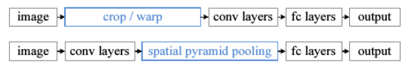
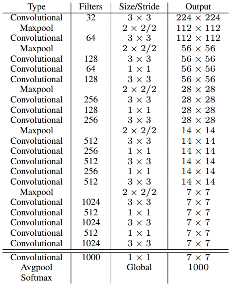

# 中兴

## 知道CBN么，可以说一下么？

[Cross-iterationBatchNorm Github](https://github.com/Howal/Cross-iterationBatchNorm)

Cross-iteration batch normalization  通过计算几个相近的batch的近似统计参数，泰勒多项式去估计几个连续batch的统计参数

BN其实就是在学习两个参数（均值、方差），这两个参数会因为Batchsize太小而不稳定，CBN就是用了神经网络训练过程中参数变换是smooth的所以可以做近似计算。主要思路就是把前几个iter的结果也拿进来算当前iter的均值方差，来近似大Batch。

## SPP（空间金字塔池化 Spatial Pyramid Pooling）可以说一下么？

CNN所需要的固定维度输入（裁剪 cropping 和扭曲 warping）




SSP形成了一个固定长度的特征向量，将这个向量输入到后面的全连接层。

通过SPP，我们就把一张任意大小的图片通过max-pooling（`1+2*2+4*4=21`）转换成了一个**固定大小的21维特征**

## 目标检测一阶段和二阶段的区别？

1.one-stage网络速度要快很多
2.one-stage网络的准确性要比two-stage网络要低

two-stage，需要对anchor区域都要进行这样的分类和回归，所以它非常耗时。one-stage只需要对这个数据块进行分类和回归就可以。two-stage比one-stage精度高的原因是训练过程中产生的anchor质量。

## Mish和Leaky ReLU的区别是什么？Mish有什么优势？

 Mish和Leaky ReLU主要差别在负半轴，Mish解决了当输入参数小于-4时让输出趋于0减小模型的计算复杂度，Leaky ReLU在负半轴无穷远处会产生较大的梯度回传，增加模型的计算复杂度

Leaky ReLU函数解决了ReLU函数在**输入为负的情况下产生的梯度消失问题**。

Mish的输出更加平滑，有利于损失函数的优化

## SSD和YOLOv3的主要区别是什么？

## Darknet和VGG的区别什么？

Darknet-19是在VGG上加了1×1卷积的

Darknet-53是在ResNet50的残差单元前加了`1*1`和`3*3`卷积，第一个卷积总是会把通道先降下来，然后第二个再负责升上去，以降低网络的计算量。

* YOLO V2 Darknet-19 3x3卷积和1x1卷积堆叠，在加上最大池化



* YOLO V3 Darknet-53 启发自ResNet，引入残差单元，并在残差单元前加入`1*1`和`3*3`卷积


## ResNet系列你熟悉么？可以谈谈么？

## 如何提升小目标检测结果？

## 介绍一下Ohem和focal loss，说一下两者的区别？

## 你知道哪些度量距离？都有什么区别？

## 说说你对anchor free的理解？

基于关键点的目标检测网络

CornerNet

CenterNet

## 你可以对照公式说一下卡尔曼滤波么？

## LR和SVM的区别是什么？

**LR**和Linear **SVM**本质不同来自于loss function不同

# 中兴2

## c语言中struct结构体怎么计算空间大小

## Python的cmp函数是怎么实现的

## 选择题：字符串指针与数组定义的字符串区别

char *p=“Hello” a[]={'a','b',,...'e'} 相差‘\0’

## 选择题：c语言中struct数据指向问题，结构体指针

```
struct man
{
char name[32];
char sex;
};
struct man man_1;
struct man *p;
p = &man_1;
下面对结构体man的sex字段使用不正确的是：
A. p->sex;
B. man_1.sex;
C. (*p).sex
D. *p.sex
```


# 地平线

## 讲一下科研项目

## 怎么构造Loss函数

## Anchor怎么调

## 头部姿态检测中坐标系是怎么变换的

## OpenCV中图像去噪的算法


# 焦点科技

## 你怎么看Anchor-Free框架的，为什么目标但阶段精度跟两阶段精度差不多？

## 你对少样本训练怎么理解

## CenterTrack怎么做目标跟踪的


# 大华

## C/C++的内存分区

在c++中，内存被划分为四个区。**代码区、静态存储区、堆和栈**。

- 代码区。存放程序代码
- 静态存储区。将程序中的静态变量、全局变量存放在此区域
- 堆。程序中，由程序员申请的内存空间（new、malloc）。空间的释放一般也有程序员控制（一个new对应一个delete）。当程序员没有释放该内存空间的时候，程序运行完毕时操作系统会对该内存空间进行回收。
- 栈。就是那些由编译器在需要的时候分配，在不需要的时候自动清除的变量的存储区。里面的变量通常是局部变量、函数参数等。

# 大华2

## 二叉树的底层实现

## Python多线程

## 深度学习多机训练怎么做通信


