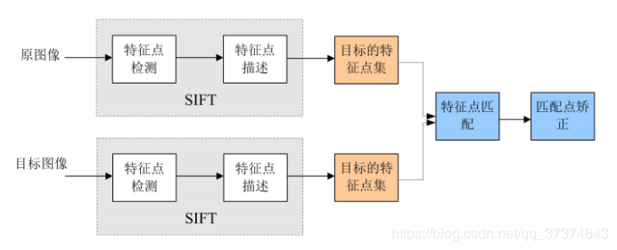

## 3A算法

## 图像去噪

- 均值滤波

  一个K×K大小的窗口从图像左上角开始，从左到右，从上到下划过整个图像，这个K×K的窗口称为卷积核，卷积核的锚点一般位于窗口的中心位置，计算窗口内像素的平均值，用这个平均值来代替锚点的像素值

- 高斯滤波

- 中值滤波

  中值滤波后代替锚点的像素值为卷积核内像素灰度值的中值。

- 双边滤波

## 图像去雾

## 色调映射 Tone Mapping

* 全局算法（global tone mapping）：直方图均衡化、Gamma、对数校正、直方图规定化、分段灰度变换
* 局部算法（local tone mapping）：分块中值直方图等

## SIFT算法思想

在不同的尺度空间上查找关键点，并计算出关键点的方向。

### 算法流程

1.构建尺度空间金字塔，并提取关键点

2.定位关键点并确定特征方向

3.匹配关键点的特征向量