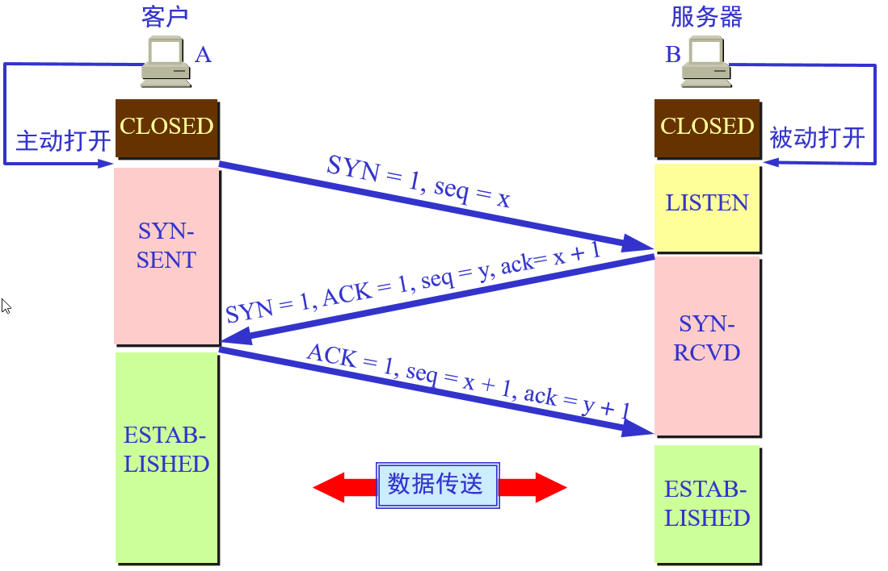
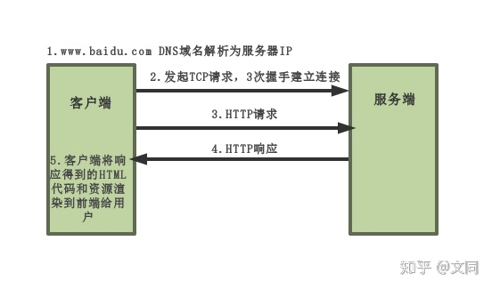
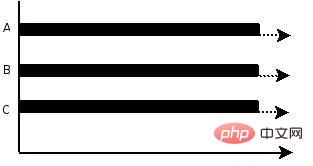
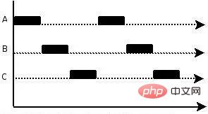
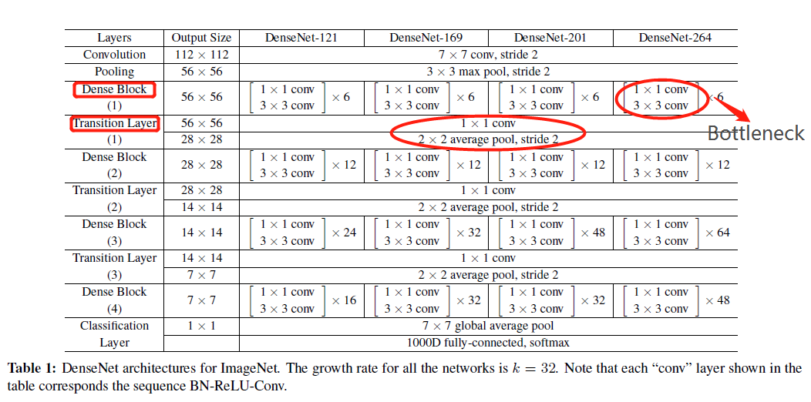
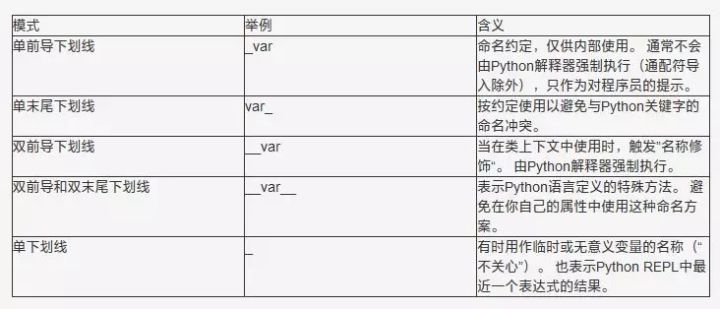

# 面试1

[中兴软件开发面试](https://blog.csdn.net/jerryz2017/article/details/100603157?ops_request_misc=%7B%22request%5Fid%22%3A%22159430027919724835802133%22%2C%22scm%22%3A%2220140713.130102334.pc%5Fall.%22%7D&request_id=159430027919724835802133&biz_id=0&utm_medium=distribute.pc_search_result.none-task-blog-2~all~first_rank_ecpm_v3~rank_ctr_v3-2-100603157.ecpm_v1_rank_ctr_v3&utm_term=中兴+软件开发)

## python常用库有哪些？

- os：提供不少于操作系统相关联的函数
- sys：通常用于命令行参数
- datetime：日期时间
- re：正则匹配
- math：数学运算

## 常用排序算法有哪些？

1. **冒泡排序（Bubble Sort）**
5. **归并排序（Merge Sort）**
6. **快速排序（Quick Sort）**

## 上面的排序算法中那种最快，复杂度是多少？

最快 快速排序 O(nlogn)

冒泡排序 O(n^2)

## 类方法中__init__与__new__的区别?

`__new__`是用来创造一个类的实例的（constructor），而`__init__`是用来初始化一个实例的（initializer）。

## 熟悉哪些数据结构？

列表 字典 集合 链表 队列 二叉树 堆栈

## 链表适用于哪些场合？

频繁做插入删除操作，数据大小没有固定

## 可变数据类型和不可变数据类型？

- 可变类型：会在原来的内存地址上修改元素 比如： **列表，字典**
- 不可变类型：不会在原来的内存地址上修改元素，而是指向了新的内存引用 比如：**整型，**
  **字符串，元组**

## 强制改变不可变数据类型会怎样？

Python会抛出TypeError异常


# 面试2

[中兴软件开发提前批面经_笔经面经_牛客网](https://www.nowcoder.com/discuss/450141?type=post&order=rank&pos=&page=1&channel=2000&source_id=search_post)

## Python读取Excel文件的方式

* xlrd
* panda

## 判断是否为空的表达方式

* if x is None

* if not x      

  not True为False，not False为True

  None、空列表[]、空字典{}、空元组()、0等一系列代表空和无的对象会被转换成False，not None=True

* **if x is not None**      if not x is None

## 判断两个字符串是否相等

用"==" 符号比较两个字符串

‘==’ 是用来判断两个对象的值是否相等的

 is 用来判断是否是同一个对象，也就是说is是来判断两个变量的地址引用是否相同

## Python中列表，元组，字典，集合的区别

列表List，可重复，类型可不同

元组Tuple，元组是只读的，不能修改

字典dict，定义了键和值之间一对一的关系

集合set，一个无序不重复元素集

## sizeof与strlen的区别

strlen测量的是字符的实际长度，以'\0' 结束。而sizeof 测量的是字符的分配大小。

strlen是函数，结果要在运行的时候才能计算出来

sizeof 是运算符，其值在编译时即计算好了。char占1个字节，int占4个字节，long点4个字节，而double占8个字节。但 `char*,int*,long*,double*`都占4个字节的空间。

# 面试3

[中兴优招一二面_笔经面经_牛客网](https://www.nowcoder.com/discuss/451227?type=post&order=create&pos=&page=1&channel=2000&source_id=search_post)

# 面试4

[中兴ZTE2020.7.15优招一面记录_笔经面经_牛客网](https://www.nowcoder.com/discuss/452446?type=post&order=create&pos=&page=1&channel=2000&source_id=search_post)

## LINUX系统下怎么设置文件权限

数字 4 、2 和 1，表示读、写、执行权限，即 r=4，w=2，x=1

rwx = 4 + 2 + 1 = 7

rw = 4 + 2 = 6

rx = 4 +1 = 5

拥有者 、群组 、其它组( u、 g 、o)，分别代表User、Group、及Other的权限

- 设置所有人可以读写及执行

  chmod 777 file  (等价于  chmod u=rwx,g=rwx,o=rwx file 或  chmod a=rwx file)

- 设置拥有者可读写，其他人不可读写执行

  chmod 600 file (等价于  chmod u=rw,g=---,o=--- file）

# 面试5

[中兴优招 base南京_笔经面经_牛客网](https://www.nowcoder.com/discuss/454029?channel=2000&source_id=home_feed)

## 判断短的字符串在长的字符串中出现的次数

* KMP算法 Knuth-Morris-Pratt 字符串查找算法
* 双指针
* 滑动窗口

```python
a = "abababc"
b = "ab"
# 方法 1
count_a = a.count(b)
print(count_a)

# 方法 2 
# 双指针
i = 0
j = 0
count_b = 0
while i<len(a):
    if a[i]==b[j]:
        i+=1
        j+=1
    else:
        i+=1
        j=0
    if j == len(b):
        count_b += 1
        j = 0

print(count_b)

        
# 方法 3
# 固定滑动窗口
j = len(b)
count_c = 0
for i in range(len(a)):
    if a[i:i+j] == b:
        count_c += 1
print(count_c)
```

```C++
int main() {
    char a[]="abababc";
    char b[]="ab";
    
    int i=0;
    int j=0;
    int count=0;
    while(a[i]!='\0'){
        if(a[i]==b[j]){
            i++;
            j++;
        }else{
            i++;
            j=0;
        }
        if(b[j]=='\0'){
            count++;
            j=0;
        }
    }
    
    std::cout << count;
}
```

# 面试6

[中兴优招面经_笔经面经_牛客网](https://www.nowcoder.com/discuss/454332?type=post&order=rank&pos=&page=1&channel=2000&source_id=search_post)

## vector与list

[请你说一说vector和list的区别，应用，越详细越好_c++校招面试题目合集_牛客网](https://www.nowcoder.com/ta/review-c/review?tpId=22&tqId=31513&query=vector&asc=true&order=&page=1)

vector拥有一段连续的内存空间，因此支持随机访问，如果需要高效的随即访问，而不在乎插入和删除的效率，使用vector。

list拥有一段不连续的内存空间，如果需要高效的插入和删除，而不关心随机访问，则应使用list。

## 内存泄漏

内存泄漏通常是由于调用了malloc/new等内存申请的操作，但是缺少了对应的free/delete。为了判断内存是否泄露，我们一方面可以使用linux环境下的内存泄漏检查工具Valgrind

## 多线程加锁

线程之间的锁有：**互斥锁、条件锁、自旋锁、读写锁、递归锁。**一般而言，锁的功能越强大，性能就会越低。

**互斥锁：**Mutex

进程使用的内存地址可以上锁，即一个线程使用某些共享内存时，其他线程必须等它结束，才能使用这一块内存。（比如火车上的洗手间）－"互斥锁"

**避免多个线程在某一时刻同时操作一个共享资源**。例如线程池中的有多个空闲线程和一个队列。任何是一个线程都要使用互斥锁互斥访问队列，以避免多个线程同时访问队列以发生错乱。在某一时刻，只有一个线程可以获取互斥锁，在释放互斥锁之前其他线程都不能获取该互斥锁。如果其他线程想要获取这个互斥锁，那么这个线程只能以**阻塞方式**进行等待。

**条件锁：**

条件锁就是所谓的条件变量，**某一个线程因为某个条件为满足时可以使程序处于阻塞状态**。一旦条件满足以“信号量”的方式唤醒一个因为该条件而被阻塞的线程。最为常见就是在线程池中，起初没有任务时任务队列为空，此时**线程池中的线程因为“任务队列为空”这个条件处于阻塞状态**。一旦有任务进来，就会以信号量的方式唤醒一个线程来处理这个任务。

**自旋锁：**

假设我们有一个两个处理器core1和core2计算机，现在在这台计算机上运行的程序中有两个线程：T1和T2分别在处理器core1和core2上运行，两个线程之间共享着一个资源。

首先我们说明互斥锁的工作原理，互斥锁是是一种sleep-waiting的锁。假设线程T1获取互斥锁并且正在core1上运行时，此时线程T2也想要获取互斥锁（pthread_mutex_lock），但是由于T1正在使用互斥锁使得T2被阻塞。当T2处于阻塞状态时，T2被放入到等待队列中去，处理器core2会去处理其他任务而不必一直等待（忙等）。也就是说处理器不会因为线程阻塞而空闲着，它去处理其他事务去了。

而自旋锁就不同了，自旋锁是一种busy-waiting的锁。也就是说，如果T1正在使用自旋锁，而T2也去申请这个自旋锁，此时T2肯定得不到这个自旋锁。与互斥锁相反的是，此时运行T2的处理器core2会一直不断地循环检查锁是否可用（自旋锁请求），直到获取到这个自旋锁为止。

**如果一个线程想要获取一个被使用的自旋锁，那么它会一致占用CPU请求这个自旋锁使得CPU不能去做其他的事情**，直到获取这个锁为止，这就是“自旋”的含义。

**当发生阻塞时，互斥锁可以让CPU去处理其他的任务；而自旋锁让CPU一直不断循环请求获取这个锁。**

**读写锁：**

允许在数据库上同时执行多个“读”操作，但是某一时刻只能在数据库上有一个“写”操作来更新数据。

## socket通信的实现

[请问你有没有基于做过socket的开发？具体网络层的操作该怎么做？（其实就..._c++校招面试题目合集_牛客网](https://www.nowcoder.com/ta/review-c/review?tpId=22&tqId=31562&query=socket&asc=true&order=&page=2)

[请你来说一下socket编程中服务器端和客户端主要用到哪些函数_c++校招面试题目合集_牛客网](https://www.nowcoder.com/ta/review-c/review?tpId=22&tqId=31571&query=socket&asc=true&order=&page=3)

**基于TCP的socket**

服务端：socket-bind-listen-accept-recv-close

客户端：socket-connect-send-close

**基于UDP的socket**

服务端：socket-bind-recvfrom-sendto-close

客户端：socket-sendto-recvfrom-close

## 二叉树深度优先遍历的几种方法

- 深度优先遍历
  - 前序遍历
  - 中序遍历
  - 后序遍历
- 广度优先遍历（层次遍历）

## 二叉树减枝、判断环

* 在递归中加入判断条件，若满足剪枝条件，返回None
* 可以建立一个集合判断是否访问过

# 面试6

[(24条消息)2021年中兴西安研究所提前批技术面试_王学门徒-CSDN博客_中兴2021提前批面试](https://blog.csdn.net/qq_35353824/article/details/107106896?>?ops_request_misc=&request_id=&biz_id=102&utm_term=中兴优招面经&utm_medium=distribute.pc_search_result.none-task-blog-2~all~sobaiduweb~default-1-107106896)

## C++基础

### C++中的内存管理（智能指针）

[C++ 知识点 | C11 智能指针 - 董涛的博客 | Aiden Blog](https://aiden-dong.github.io/2020/01/26/cpp智能指针/)

C++内存分配通过`new` 和 `delete` 操作符

RAII（Resource Acquisition Is Initialization）**资源即对象**的管理策略。是一种利用对象生命周期来控制程序资源（如内存、文件句柄、网络连接、互斥量等等）的简单技术。 RAII 的一般做法是这样的：在对象构造时获取资源，接着控制对资源的访问使之在对象的生命周期内始终保持有效，最后在对象析构的时候释放资源。借此，我们实际上把管理一份资源的责任托管给了一个对象。主要应用智能指针！

**智能指针**

使用智能指针，就不用去管理指针的**生命周期**，通过控制**ownership** 所有权，使实现资源管理。

| 指针类别     | 支持   | 备注                                  |
| ------------ | ------ | ------------------------------------- |
| `unique_ptr` | C++ 11 | 拥有独有对象所有权语义的智能指针      |
| `shared_ptr` | C++ 11 | 拥有共享对象所有权语义的智能指针      |
| `weak_ptr`   | C++ 11 | 到 std::shared_ptr 所管理对象的弱引用 |

**shared_ptr最大的好处就是不用手动delete,只要一个对象不再被任何一个shared_ptr所指向，它就会自动销毁。**

unique_ptr引用计数为1，只能有一个对象拥有所有权，当对象被销毁时自动释放资源。


用make_shared/make_unique声明

weak_ptr弱指针，weak_ptr的构造函数不会修改引用计数的值，从而不会对对象的内存进行管理，其类似一个普通指针，但不指向引用计数的共享内存，但是其可以检测到所管理的对象是否已经被释放，从而避免非法访问。

## Linux

### 同步、异步的区别

同步：**必须一件一件事做**，等前一件做完了才能做下一件事。发出一个调用时，在没有得到结果之前，该*调用*就不返回。

异步：可以同时做事情。调用在发出之后，这个调用就直接返回了，调用者不会立刻得到结果。被调用者通过状态、通知来通知调用者。

同步和异步：调用者必须循环自去查看事件有没有发生，这种情况是同步。调用者不用自己去查看事件有没有发生，而是等待着注册在事件上的回调函数通知自己，这种情况是异步

在处理 IO 的时候，阻塞和非阻塞都是同步 IO。


### 多线程，多进程怎么创建

**进程的创建与终止**

fork　创建子进程 

exit     终止进程

**线程**

pthread_create 　　  //创建线程

pthread_exit 　　　　//退出线程

### 多线程中的wait和sleep的区别是什么

wait会释放线程锁，线程挂起并将线程放入任务队列，被notify时线程才被唤醒

sleep线程只是进入睡眠一段时间，时间到继续执行，不会释放线程锁

## 计算机网路

### TCP和UDP的区别，以及哪个更有效率

UDP传输效率高，适用于对高速传输和实时性有较高的通信


# 面试7

[中兴优招软开岗一面、二面_笔经面经_牛客网](https://www.nowcoder.com/discuss/451104?type=post&order=time&pos=&page=0&channel=2000&source_id=search_post)

## TCP/IP四层协议

```
应用层（FTP E-mail HTTP）
传输层（TCP UDP）
网络层（IP）
链路层（以太网协议） 网络接口层
```

## 操作系统进程之间通讯

1. **管道/匿名管道(pipe)**
2. **有名管道(FIFO)**
3. 信号（signal）
4. 消息队列
5. 共享内存
6. 信号量
7. 套接字（socket)

## 使用过Linux吗？说说常用命令

```
cd ls mkdir rm fdisk man
torch cat wget nohup grep cp mv
vim watch ps kill
```

## 消息队列技术的优点

```
解耦(多个系统)
异步
削峰
```

## 消息队列放到内存还是磁盘？

```
RabbitMQ是先放内存，后异步刷到磁盘
Kafka的消息是保存或缓存在磁盘上的
```

## 如何保证http请求安全

```
使用HTTPS
```

# 面试8

[中兴-软件开发-提前批面经_笔经面经_牛客网](https://www.nowcoder.com/discuss/456563?type=post&order=hot&pos=&page=1&channel=666&source_id=search_post)

## TCP的三次握手



## 三次握手会不会存在什么风险

- SYN Flood 攻击 DDoS攻击

  伪装IP向服务器发送一个SYN请求建立连接，然后服务器向真实IP回复SYN和ACK，真实因为没有请求所以不作回应，服务器收不到应答，导致重发，被攻击服务器的SYN_RECV队列被恶意的数据包占满

> ## SYN Flood 防护措施 防止恶意用户
>
> * Syn Cache技术
>
>   收到SYN时不急着去分配TCB，而是先回应一个ACK报文，并在一个专用的HASH表中（Cache）中保存这种半开连接，直到收到正确的ACK报文再去分配TCB线程控制块（Thread Control Block，*TCB*）
>
> * Syn Cookie技术
>
>   Syn Cookie技术则完全不使用任何存储资源，它使用一种特殊的算法生成Sequence Number，这种算法考虑到了对方的IP、端口、己方IP、端口的固定信息，以及对方无法知道而己方比较固定的一些信息，如MSS、时间等，在收到对方 的ACK报文后，重新计算一遍，看其是否与对方回应报文中的（Sequence Number-1）相同，从而决定是否分配TCB资源

## https的协议是什么

HTTP协议是**超文本传输协议**，HTTP是一个基于TCP/IP通信协议来传递数据的协议，HTTP协议一般用于B/S架构。



## 栈和堆有什么区别

1. 申请方式的不同。栈由系统自动分配，而堆是人为申请开辟；
2. 申请大小的不同。栈获得的空间较小，而堆获得的空间较大；
3. 申请效率的不同。栈速度较快，堆速度比较慢;
4. 底层不同。栈是连续的空间，堆是不连续的空间，是一棵完全二叉树。
5. 存储内容的不同。==栈在函数调用时，第一个进栈的是主函数中的下一条指令的地址，然后是函数的各个参数，== 在大多数C编译器中，参数是由右向左入栈的，==然后是函数中的局部变量，注意静态变量是不入栈的，== 静态变量存储在静态存储区。当本次函数调用结束后，局部变量先出栈，然后是参数，最后栈顶指针指向最开始存的地址，也就是主函数中的下一条指令，程序由该点继续运行；==堆一般是在堆的头部用一个字节存放堆的大小。堆中的具体内容由程序员安排。==

# 面试9

[中兴优招-base南京_笔经面经_牛客网](https://www.nowcoder.com/discuss/454670?type=2&order=0&pos=17&page=1&channel=666&source_id=discuss_tag)

## 神经网络的输出尺寸怎么计算

- 输入图片大小 W×W
- Filter大小 F×F
- 步长 S
- padding的像素数 P

> N = (*W − F* + 2*P* )/*S*+1
>
> 输出图片大小为 N×N

## 处理过拟合的方法

数据增强、正则化（BN，CBN，L2，Dropout，DropBlock）、提前终止训练

# 面试10

[offer对比 顺便发一部面经_笔经面经_牛客网](https://www.nowcoder.com/discuss/311651?type=2&order=0&pos=7&page=1&channel=666&source_id=discuss_tag)

## 堆和栈区别

## 手撕冒泡排序

```c++
void bubble_sort(int *a,int len){
    int max = len-1;
    int i,j;
    for(i=0;i<max;i++){
        for(j=0;j<max-i;j++){
            //由小到大排序，大的往后移动
            if(a[j]>a[j+1]){
                int t = a[j];
                a[j] = a[j+1];
                a[j+1] = t;
            }
        }
    }
}
```

优化版本

```c++
void bubble_sort(int *a,int len){
    int max = len-1;
    int i,j;
    for(i=0;i<max;i++){
        //每次遍历标志位都要先置为0，才能判断后面的元素是否发生了交换
		int flag = 0;
        
        for(j=0;j<max-i;j++){
            //由小到大排序，大的往后移动
            if(a[j]>a[j+1]){
                int t = a[j];
                a[j] = a[j+1];
                a[j+1] = t;
                flag = 1;
            }
        }
        
        //判断标志位是否为0，如果为0，说明后面的元素已经有序，就直接return
		if (flag == 0)
		{
			return;
		}
    }
}
```


[中兴提前批面经_笔经面经_牛客网](
https://www.nowcoder.com/discuss/447132?type=2&order=0&pos=6&page=1&channel=666&source_id=discuss_tag)

[中兴面试经验之谈(结合自己与网上的面经)_zhf的博客-CSDN博客_中兴终面面试经验](https://blog.csdn.net/weixin_43283397/article/details/106405607?ops_request_misc=%257B%2522request%255Fid%2522%253A%2522159428038019724839208620%2522%252C%2522scm%2522%253A%252220140713.130102334..%2522%257D&request_id=159428038019724839208620&biz_id=0&utm_medium=distribute.pc_search_result.none-task-blog-2~blog~first_rank_v2~rank_blog_v1-4-106405607.pc_v2_rank_blog_v1&utm_term=%E4%B8%AD%E5%85%B4%E9%9D%A2%E8%AF%95)

# 面试11

[中兴一面面经，攒点人品。半个小时就结束了。让等通知_笔经面经_牛客网](https://www.nowcoder.com/discuss/460553?type=post&order=rank&pos=&page=1&channel=2000&source_id=search_post)

## 并行和并发的区别

区别在微观上，并行是多个任务同时执行，并发是多个任务在相同时间间隔下交替执行。

并行(parallel)



并发(concurrency)



## 进程和线程的区别

1. 进程是cpu资源分配的最小单位，线程是cpu调度的最小单位。

2. 进程在执行过程中拥有独立的内存单元，而多个线程共享进程的内存。

3. 进程编程调试简单可靠性高，但是创建销毁开销大；线程正相反，开销小，切换速度快，但是编程调试相对复杂。
4. 一个进程崩溃，不会对其他进程产生影响；而一个线程崩溃，会让同一进程内的其他线程也死掉。
5. 进程间通信比较复杂，而同一进程的线程由于共享代码段和数据段，所以通信比较容易

## 数据库范式

[数据库逻辑设计之三大范式通俗理解，一看就懂，书上说的太晦涩 - 刻意练习 - SegmentFault 思否](https://segmentfault.com/a/1190000013695030)

第一范式 1NF是对属性的**`原子性`**，要求属性具有原子性，不可再分解 

> 如学生（学号，姓名，性别，出生年月日），如果认为最后一列还可以再分成（出生年，出生月，出生日），它就不是一范式了

第二范式 2NF是对记录的**`惟一性`**，要求记录有惟一标识，即实体的惟一性，即不存在部分依赖

> 这个表明显说明了两个事务:学生信息, 课程信息;由于非主键字段必须依赖主键，这里**学分依赖课程号**，**姓名依赖与学号**，所以不符合二范式。

第三范式 3NF是对字段的**`冗余性`**，要求任何字段不能由其他字段派生出来，它要求字段没有冗余，即不存在传递依赖

# 面试12

[中国通信/中兴南京/华为上海/中国铁通校招通信协议工程师面经_笔经面经_牛客网](https://www.nowcoder.com/discuss/461903?type=post&order=create&pos=&page=0&channel=2000&source_id=search_post)

## 简述数组和指针的区别

**存储的内容不同**：数组是用于储存多个相同类型数据的集合。指针相当于一个变量，但是它和不同变量不一样，它存放的是其它变量在内存中的地址。

**存储的地方不同**：数组名存储在栈区，数组元素存储在堆区；指针是存储在栈区。

**存储的大小不同**：指针在 32 位平台中，指针本身占据了 4 字节的长度，64位是8个字节。数组则是整个的占用空间的大小

# 旷视面试1

[旷视（一面+二面）面经_笔经面经_牛客网](https://www.nowcoder.com/discuss/434222?type=2&order=3&pos=2&page=1&channel=2000&source_id=discuss_tag)

## 代码：给定rand5()函数实现rand7()函数

分析：随机数函数的关键是确保产生每一个数的的概率相等。我们可用通过5 * rand5() + rand5()产生[0:24]，舍弃[21:24]，最后除以7取余数，则可得到概率相等的[0:6]的数值

```python
def rand7():
    while(true):
        num = 5 * rand5() + rand5()
        if num < 21:
            return num % 7
```

给一个数组，对每个元素计算该元素右侧小于该数的数量

## NCHW的特征图BN层参数


- BN的计算就是把每个通道的NHW单独拿出来归一化处理
- 针对每个channel我们都有一组γ,β
- 当batch size越小，BN的表现效果也越不好，因为计算过程中所得到的均值和方差不能代表全局


# 旷视面试2

[计算机视觉暑期实习面经_笔经面经_牛客网](https://www.nowcoder.com/discuss/186000?type=0&order=0&pos=37&page=1&source_id=discuss_tag&channel=2000)

[旷视实习生一面经验 计算机视觉_笔经面经_牛客网](https://www.nowcoder.com/discuss/165854)

## 代码：Leetcode.754

一个人从原点出发，可以往左走可以往右走，每次走的步数递增1，问能不能到达一个位置x？如果能，给出走的步数最少的方案？

解析：

因为轴对称，所以取绝对值统一往右移动

最大位置>=target并且两者奇偶性相同

```
class Solution:
    def reachNumber(self, target: int) -> int:
        target = abs(target)
        p, i = 0, 0
        while p < target or (p + target) % 2 != 0:
            i += 1
            p = p + i
        return i
```

## 代码：Leetcode.146 LRU

```
class LRUCache:

    def __init__(self, capacity: int):
        self.maxsize = capacity
        self.lrucache = OrderedDict()


    def get(self, key: int) -> int:
        if key in self.lrucache:
            self.lrucache.move_to_end(key)
        return self.lrucache.get(key,-1)


    def put(self, key: int, value: int) -> None:
        if key in self.lrucache:
            del self.lrucache[key]
        self.lrucache[key] = value 
        if len(self.lrucache)>self.maxsize:
            self.lrucache.popitem(last = False)   
```

## 代码：Leetcode.509 [斐波那契数](https://leetcode-cn.com/problems/fibonacci-number/)

```
class Solution:
    def fib(self, N: int, cache={}) -> int:
        if N<=1:
            return N
        
        if N in cache:
            return cache[N]
        
        cache[N] = self.fib(N-1,cache)+self.fib(N-2,cache)
        return cache[N]
```


## DenseNet的优势

（1）缓解了梯度消失问题

（2）增强了特征在网络间的传播

（3）实现和加强了特征重用

（4）有效减少了参数数量

密集连接，充分地利用各层的特征，并且利用bottleneck降维减少计算量

**利用bottleneck layer，Translation layer以及较小的growth rate使得网络变窄，参数减少，有效抑制了过拟合，同时计算量也减少了**



Translation layer

> 因为使用拼接的缘故，每经过一次拼接输出通道数可能会激增。为了控制模型复杂度，这里引入一个过渡块。（引自李沐gluon中文教程）

Growth rate

> 表示每个dense block中每层输出的feature map个数。

## 谈谈resnet结构

Residual block结构

shortcut connectio特征融合

# 旷视面试3

[旷视科技face++ AI工程师面经](http://www.jeepxie.net/article/739882.html)

## 代码 [287. 寻找重复数](https://leetcode-cn.com/problems/find-the-duplicate-number/)

题目：给出一个n+2个元素构成的数组，其中所有的元素都在1-n之间，找出重复的那两个元素，最快且使用最少的空间。

解析：桶排序法，时间复杂度O(n)，空间复杂度O(1)，利用交换操作在nums数组上实现原址桶排序。

[算法1：最快最简单的排序——桶排序 - 我好像在哪见过你 - 博客园](https://www.cnblogs.com/bqwzx/p/11029264.html)

## 代码 [56. 合并区间](https://leetcode-cn.com/problems/merge-intervals/)

题目：给出一些整数区间的无序集合，如何将这些集合进行合并，最后返回合并到不能在合并的区间集合

## 虚函数是什么原理，c++是如何实现多态的

[简述C++虚函数作用及底层实现原理__牛客网](https://www.nowcoder.com/questionTerminal/1f67d4e2b6134c298e993e622181b333)

C++虚函数的作用：实现类的多态性，基类指针可以指向派生类对象的同名函数。

实现原理：虚函数表+虚表指针

RTTI（Run Time Type Identification）运行时类型识别。


## [322. 零钱兑换](https://leetcode-cn.com/problems/coin-change/)

```python
class Solution:
    def coinChange(self, coins: List[int], amount: int) -> int:
        dp = [float('inf')] * (amount + 1)
        dp[0] = 0
        
        for coin in coins:
            for x in range(coin, amount + 1):
                dp[x] = min(dp[x], dp[x - coin] + 1)
        return dp[amount] if dp[amount] != float('inf') else -1 

```

# 大华1

[大华大数据C++电话面_笔经面经_牛客网](https://www.nowcoder.com/discuss/463830?type=2&order=3&pos=3&page=1&channel=666&source_id=discuss_tag)

## TCP四次挥手

## C++虚函数的概念和使用场景

虚函数的作用是允许在派生类中重新定义与基类同名的函数，并且可以通过基类指针或引用来访问基类和派生类中的同名函数。这就是**多态**

## 单元测试需要注意的问题

单元测试是用来对一个模块、一个函数或者一个类来进行正确性检验的测试工作。

- 参数覆盖边界值
  - 确保参数边界值均被覆盖。 对于数字, 测试负数, 0, 正数, 最小值, 最大值, NaN (非数字), 无穷大等。
- 让单元测试很容易跑起来
- 测试由简入繁

# 大华2

[浙江大华提前批大数据开发（C\C++）一面凉经_笔经面经_牛客网](https://www.nowcoder.com/discuss/455092?type=2&order=3&pos=6&page=1&channel=666&source_id=discuss_tag)

## C++的特性

封装 继承 多态

## C++多态的原理

[面试必知必会|理解C++虚函数 - 掘金](https://juejin.im/post/6844903991780835342)

子类会重写父类函数，并程序运行时，父类指针可以根据具体指向的子类对象，来执行不同的函数，表现为多态。

多态的实现主要分为静态多态和动态多态，静态多态主要是重载，在编译的时候就已经确定；动态多态是用虚函数机制实现的，在运行期间动态绑定。

## 析构函数加virtual关键字

将可能会被继承的父类的析构函数设置为虚函数，可以保证当我们new 一个子类，然后使用基类指针指向该子类对象，释放基类指针时可以释放掉子类的空间，防止内存泄漏。

## 介绍一下用过的智能指针，有啥区别

三种智能指针（weak_ptr、shared_ptr与unique_ptr）

shared_ptr：允许多个指针指向同一个对象，每多一个指针指向，引用计数+1，一旦个 shared_ptr hared_ptr 的计数器变为 0，它就会自动 释。

unique_ptr: 只能有一个指针指向同一个对象，本质上就是引用计数为1的shared_ptr。某个时刻 只能有 一个 unique_ptr指向一个给定对象 。当 unique_ptr 被销毁时，它所指向的对象也被销毁时

weak_ptr  它不增加对象的引用计数，即弱引用。指向一个由shared_ptr管理的对象而不影响所指对象的生命周期，也就是将一个weak_ptr绑定到一个shared_ptr不会改变shared_ptr的引用计数。弱引用能检测对象是否被释放，从而避免访问非法内存。

## new、delete，malloc、free的区别

new/delete是C++的关键字，而malloc/free是C语言的库函数，后者使用必须指明申请内存空间的大小，对于类类型的对象，后者不会调用构造函数和析构函数

# 大华3

[浙江大华C/C++开发一面（校招）_笔经面经_牛客网](https://www.nowcoder.com/discuss/443291?type=2&order=3&pos=11&page=1&channel=666&source_id=discuss_tag)

## 设计模式

单例模式：保证一个类只有一个实例

工厂模式：用于批量管理对象的创建过程，便于程序的维护和扩展。

# 大华4

[求问浙江大华的情况(附面经)_笔经面经_牛客网](https://www.nowcoder.com/discuss/290077?type=2&order=3&pos=32&page=1&source_id=discuss_tag&channel=666)

## python对列表去重

```python
# 循环遍历法
old_list = [2, 3, 4, 5, 1, 2, 3]
new_list = []
for i in old_list:
    if i not in new_list:
        new_list.append(i)
print(new_list) # [2, 3, 4, 5, 1]

# 用字典dict去重
old_list = [2, 3, 4, 5, 1, 2, 3]
new_list = list(dict.fromkeys(old_list))
print(new_list) # [2, 3, 4, 5, 1]

# 用集合set去重
old_list = [2, 3, 4, 5, 1, 2, 3]
new_list = list(set(old_list))
print(new_list) # 不保证顺序：[1, 2, 3, 4, 5]
```

## Python全局解释器锁

Python全局解释器锁(Global Interpreter Lock)或GIL是一个互斥锁，它只允许一个线程来控制Python解释器。

## 命名变量，首字母变成下划线有什么用

1、object #公用方法

2、_object #半保护

​         \#被看作是“protect”，意思是只有类对象和子类对象自己能访问到这些变量，

​         在模块或类外不可以使用，不能用’from module import *’导入。

​        \#__object 是为了避免与子类的方法名称冲突， 对于该标识符描述的方法，父

​         类的方法不能轻易地被子类的方法覆盖，他们的名字实际上是

​         _classname__methodname。

3、_ _ object #全私有，全保护

​            \#私有成员“private”，意思是只有类对象自己能访问，连子类对象也不能访

​             问到这个数据，不能用’from module import *’导入。

4、_ _ object_ _   #**内建方法，用户不要这样定义**



# 大华4

[(1条未读通知) 大华大数据C++电话一面和二面_笔经面经_牛客网](https://www.nowcoder.com/discuss/463830?type=2&order=0&pos=7&page=1&channel=666&source_id=discuss_tag)

# 大华5（智能算法）

[(1条未读通知) 2020年大华智能算法面经_笔经面经_牛客网](https://www.nowcoder.com/discuss/467177?type=post&order=time&pos=&page=1&channel=666&source_id=search_post)

## 二阶梯度优化方法

Adam利用梯度的一阶矩估计和二阶矩估计动态调整学习率

## 马氏距离

表示点与一个分布之间的距离。它是一种有效的计算两个未知样本集的相似度的方法。