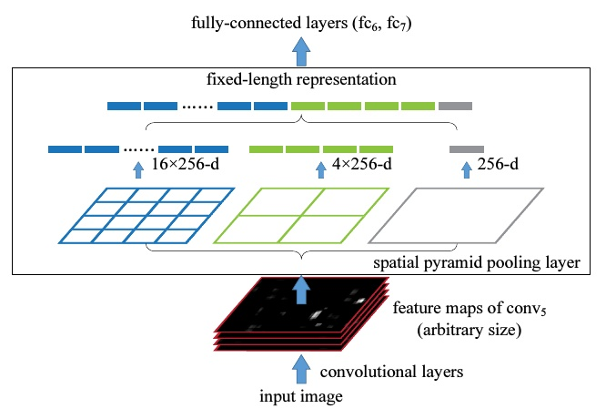
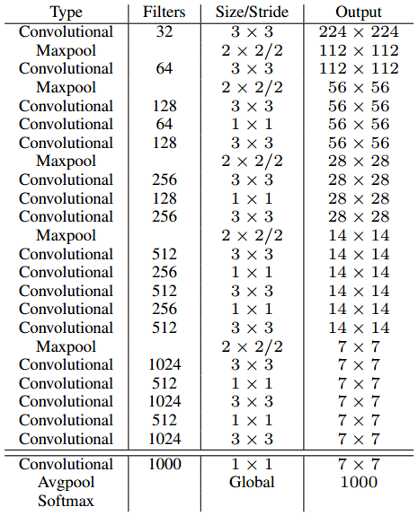
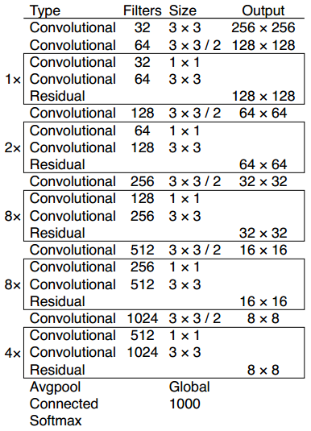
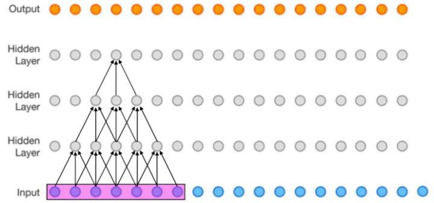

# 中兴

## 知道CBN么，可以说一下么？

[Cross-iterationBatchNorm Github](https://github.com/Howal/Cross-iterationBatchNorm)

Cross-iteration batch normalization  通过计算几个相近的batch的近似统计参数，泰勒多项式去估计几个连续batch的统计参数

BN其实就是在学习两个参数（均值、方差），这两个参数会因为Batchsize太小而不稳定，CBN就是用了神经网络训练过程中参数变换是smooth的所以可以做近似计算。主要思路就是把前几个iter的结果也拿进来算当前iter的均值方差，来近似大Batch。

## SPP（空间金字塔池化 Spatial Pyramid Pooling）可以说一下么？

CNN所需要的固定维度输入（裁剪 cropping 和扭曲 warping）




SSP形成了一个固定长度的特征向量，将这个向量输入到后面的全连接层。

通过SPP，我们就把一张任意大小的图片通过max-pooling（`1+2*2+4*4=21`）转换成了一个**固定大小的21维特征**

## 目标检测一阶段和二阶段的区别？

1.one-stage网络速度要快很多
2.one-stage网络的准确性要比two-stage网络要低

two-stage，需要对anchor区域都要进行这样的分类和回归，所以它非常耗时。one-stage只需要对这个数据块进行分类和回归就可以。two-stage比one-stage精度高的原因是训练过程中产生的anchor质量。

## Mish和Leaky ReLU的区别是什么？Mish有什么优势？

 Mish和Leaky ReLU主要差别在负半轴，Mish解决了当输入参数小于-4时让输出趋于0减小模型的计算复杂度，Leaky ReLU在负半轴无穷远处会产生较大的梯度回传，增加模型的计算复杂度

Leaky ReLU函数解决了ReLU函数在**输入为负的情况下产生的梯度消失问题**。

Mish的输出更加平滑，有利于损失函数的优化

## SSD和YOLOv3的主要区别是什么？

## Darknet和VGG的区别什么？

Darknet-19是在VGG上加了1×1卷积的

Darknet-53是在ResNet50的残差单元前加了`1*1`和`3*3`卷积，第一个卷积总是会把通道先降下来，然后第二个再负责升上去，以降低网络的计算量。

* YOLO V2 Darknet-19 3x3卷积和1x1卷积堆叠，在加上最大池化



* YOLO V3 Darknet-53 启发自ResNet，引入残差单元，并在残差单元前加入`1*1`和`3*3`卷积



## ResNet系列你熟悉么？可以谈谈么？

## 如何提升小目标检测结果？

## 介绍一下Ohem和focal loss，说一下两者的区别？

## 你知道哪些度量距离？都有什么区别？

## 说说你对anchor free的理解？

基于关键点的目标检测网络

CornerNet

CenterNet

## 你可以对照公式说一下卡尔曼滤波么？

## LR和SVM的区别是什么？

**LR**和Linear **SVM**本质不同来自于loss function不同

# 中兴2

## c语言中struct结构体怎么计算空间大小

## Python的cmp函数是怎么实现的

## 选择题：字符串指针与数组定义的字符串区别

char *p=“Hello” a[]={'a','b',,...'e'} 相差‘\0’

## 选择题：c语言中struct数据指向问题，结构体指针

```
struct man
{
char name[32];
char sex;
};
struct man man_1;
struct man *p;
p = &man_1;
下面对结构体man的sex字段使用不正确的是：
A. p->sex;
B. man_1.sex;
C. (*p).sex
D. *p.sex
```


# 地平线

## 讲一下科研项目

## 怎么构造Loss函数

## Anchor怎么调

## 头部姿态检测中坐标系是怎么变换的

## OpenCV中图像去噪的算法


# 焦点科技

## 你怎么看Anchor-Free框架的，为什么目标但阶段精度跟两阶段精度差不多？

## 你对少样本训练怎么理解

## CenterTrack怎么做目标跟踪的


# 大华

## 指针和引用的区别

1. 指针拥有自己的一块空间，而引用只是一个别名
2. 引用不能为空（必须初始化），指针可以为空，指向空对象。
3. 指针在使用中可以指向其它对象，但是引用只能是一个对象的引用，不能被改变
4. 引用和指针的++自增运算符意义不同
5. 引用的大小是所引用对象的大小，指针的大小，是指针本身大小，通常是4字节

## const指针的作用

把const读作常量，把星号*读作指针

比如：

int * const p 就是指针常量（const pointer），指针的地址是常量

int const * p 就是常量指针（pointer to const），指向的量是常量

## C/C++的内存分区

在c++中，内存被划分为四个区。**代码区、静态存储区、堆和栈**。

- 代码区。存放程序代码
- 静态存储区。将程序中的静态变量、全局变量存放在此区域
- 堆。程序中，由程序员申请的内存空间（new、malloc）。空间的释放一般也有程序员控制（一个new对应一个delete）。当程序员没有释放该内存空间的时候，程序运行完毕时操作系统会对该内存空间进行回收。
- 栈。就是那些由编译器在需要的时候分配，在不需要的时候自动清除的变量的存储区。里面的变量通常是局部变量、函数参数等。

# 大华2

## 二叉树的底层实现

## Python多线程

**多线程**由全局解释器锁（GIL）来控制，这个锁的的存在导致同一时刻只有一个线程在运行（单位时间多个核只能跑一个线程）

**多进程**是可以利用多核（可以通过多进程实现多核任务），多个Python进程有各自独立的GIL锁，互不影响

**计算密集型任务**：进行大量的数学计算，消耗CPU资源，比如图像滤波

**I/O密集型任务**：网络、磁盘IO，CPU消耗很少，任务的大部分时间都在等待IO操作完成，比如Web应用


相关库：multiprocessing（多进程）、os（多进程，fork()）、threading（多线程）

进程间通信：multiprocessing中父进程中创建两个子进程，一个往`Queue`里写数据，一个从`Queue`里读数据，**管道，有名管道 ，消息队列，信号，信号量，套接字**。

线程间的通信：锁机制（互斥锁、读写锁、自旋锁）、信号量、信号

GIL锁有什么好处（Python限制多线程的原因）：不用考虑线程安全问题，更加适合做I/O密集型任务，单线程情况下更快

## 目标检测中有哪些超参数

## 深度学习多机训练怎么做通信


# Tencent1

死锁

构造函数能否为虚函数

内存泄露是什么

栈和队列的区别

多线程怎么保证每个线程都同时完成任务

哈希表的本质，的哈希值如何生成

最小栈

# Tencent2

字符串替换


# 天准

## 感受野

感受野被定义为特征图上一个像素点所对应原图的大小

比如下图（该图为了方便，将二维简化为一维），这个三层的神经卷积神经网络，每一层卷积核为3*3，那么最上层特征所对应的感受野就为如图所示的7x7。



## 职业规划

# 寒武纪

说说你对CUDA的理解

计算机中的Cache

操作系统中的虚拟内存

虚函数

# Tencent

## 容器的深拷贝和浅拷贝

## hashcode equals

[type_info::hash_code - C++ Reference](http://www.cplusplus.com/reference/typeinfo/type_info/hash_code/)

[(23条消息)hashCode与equals的作用与区别及应当注意的细节_Jovan佳传的博客-CSDN博客](https://blog.csdn.net/yingshuanglu2564/article/details/82708775?utm_medium=distribute.pc_relevant.none-task-blog-BlogCommendFromMachineLearnPai2-3.channel_param&depth_1-utm_source=distribute.pc_relevant.none-task-blog-BlogCommendFromMachineLearnPai2-3.channel_param)

# 图森未来

### Cascade RCNN RPN怎么做筛选出128个样本

### 使用多个IOU阈值对AP50的影响

### 深度可以分离卷积的计算量与输入图像大小有关吗？计算量能提升多少

# 大华笔试

## 霍夫曼编码


# 深信服

类方法

python里面的get set方法@propter @setter

python单例模式

快排

python 的类特性

sql删除某个index

http版本


http的加密方式

### 如何设计一个抢票系统

* 特点：高并发
* 优化方案：
  1. **页面端优化**，实现浏览器层请求拦截达到**限流**的作用，用JS控制让查询或者抢票按钮只有一次有效请求机会，或者限制在N秒之内只能提交一次
  2. **站点层优化**，水平扩展部署多个实例，采用页面缓存，达到一个**削峰**的作用
  3. **服务层优化**，使用内存缓存（Redis、Memchched，由于数据库读写属于磁盘IO，性能很低），将秒杀成功的订单通知信息通过[消息队列](https://cloud.tencent.com/product/cmq?from=10680)（RabbitMQ、Kafka）来异步处理

- 主要手段：

  - 限流与降级:
    - 客户端限流:按钮置灰;js控制每秒只能发送一个请求
    - 站点层限流:
      - Nginx限流:限制IP的连接和并发分别由两个模块:
        - limit_req_zone： 用来限制单位时间内的请求数，即速率限制,采用的漏桶算法。
        - limit_req_conn： 用来限制同一时间连接数，即并发限制。
      - 站点层限流：防止脚本刷单；单个部署实例的每秒最大请求数，每个用户每秒的最大请求或者通过Redis记录和限制单个用户只能请求一次。
        - 写流量:根据uuid限制每个用户每秒只能一个请求。
        - 读流量：页面缓存和页面数据缓存。页面缓存可以是进程缓存，页面数据缓存一般是分布式缓存，保持各节点的数据一致性，如库存数量可以放到分布式缓存中。
      - 降级
        - 如果流量太大，导致站点层限流后还是出现问题挂了或者站点层没问题，队列出问题了，则需要采取降级策略。
        - 对于站点层出问题，则可以在客户端直接提示“服务器繁忙，稍后再试”。
        - 对于队列挂了或者Redis挂了无法读取到库存信息，则可以在站点层降级处理，直接返回和提示“抢购人数太多，请稍后尝试”。

- 队列削峰：通过第一步限流后，将合法流量放到一个队列中，实现流量削峰，达到流量可控和异步处理。

  - 入队条件
    - 先将库存数量放到分布式缓存中，如Redis；先检查库存是否还有，有则扣减库存，这里尽量使用单线程，扣除成功将该请求放到队列中。
    - 否则库存不足，直接返回抢购完毕，或者可以优化一下说“抢购完毕，如果有小伙伴放弃，可以继续抢购”来避免队列消息处理失败导致还有没卖完。
  - 请求响应
    - 入队成功或者失败都可以将该请求直接返回了，不过页面可以显示等待中或者提示抢购结果稍后通知，如现在很多抢票都是这样的。

- 服务层异步处理

  - 服务层消费队列的数据，由于此时速度是可控的，故可以起一个后台服务节点即可，消费队列的数据，进行下单操作，递减数据库库存。
  - 如果消费队列的某个数据失败，可以采用fail-fast的原则，直接提示失败，不需要进行重试之类的复杂操作。

- 抢购结果通知

  :由于使用了队列来异步处理，即入队后或者库存不足无法入队，该次抢购请求是直接返回了的，故对于抢购结果是需要进行额外通知的。

  - 客户端轮询
    - 可以通过客户端定时请求服务端，如每秒发送一个请求，如果成功，则提示抢购成功；失败，则返回失败。例如，客户端可以在没有轮询到处理结果时提示“抢购中，请耐心等待”，如果轮询到结果则提示成功或失败。
  - 消息推送
    - 另外一种方式可以是直接通过消息推送的方式来通知用户抢购结果。


# 吉利

仿射变换与透视变换的区别

# 美图

求无序数组的中位数（Top K 问题）

Python调用父类方法 super

