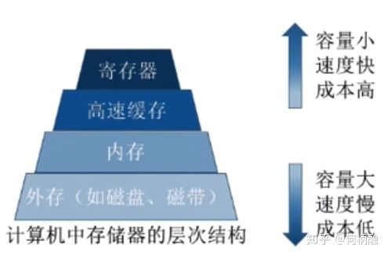
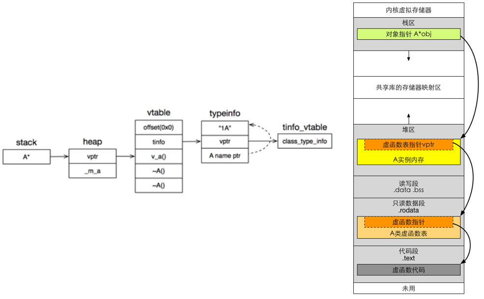

[TOC]


# 计算机网络

## TCP如何保证可靠传输？

1. **三次握手**
2. **确认应答和超时重传**
3. **数据校验**：接收方会缓存未按序到达的数据，重新排序后再交给应用层。

4. **数据合理分片和排序**：接收方会缓存未按序到达的数据，重新排序后再交给应用层。

5. **流量控制**：当接收方来不及处理发送方的数据，能通过滑动窗口，提示发送方降低发送的速率，防止包丢失。
6. **拥塞控制**：当网络拥塞时，通过拥塞窗口，减少数据的发送，防止包丢失。

## TCP 是如何通过滑动窗口协议实现==流量控制==和==拥塞控制==的？

通过调节窗口的大小

窗口指的是一次批量的发送多少数据（**缓冲区**）

在确认应答策略中，对每一个发送的数据段，都要给一个ACK确认应答，收到ACK后再发送下一个数据段，这样做有一个比较大的缺点，就是性能比较差，尤其是数据往返的时间长的时候，使用滑动窗口，就可以一次发送多条数据，从而就提高了性能

## TCP滑动窗口协议

用于网络数据传输时的流量控制，拥塞控制。该协议可以加速数据的传输，提高网络的吞吐量。

TCP滑动窗口是以字节为单位的，发送方的发送窗口是根据接收方窗口设置的

> 可靠性，滑动窗口只有在队列前部的被确认之后，才会往后移动，保证数据包被接收方确认并接收。
>
> 提高传输效率
>
> 稳定性，滑动窗口大小，会进行动态调整，可以尽量地避免网络拥塞，更加稳定。

## TCP三次握手 四次挥手

TCP 的三次握手过程如下：
C-> SYN -> S
S->SYN/ACK->C
C->ACK->S

TCP 的四次挥手过程如下：
C->FIN->S
S->ACK->C
S->FIN->C
C->ACK->S

## 数据库：创建一个表，增删改查

create table

insert into 表名(字段名1,字段名2,字段名3……) values(值1,值2,值3……)

delete from 表名

select * from 表名

update 表名 set 字段名=值, 字段名=值, 字段名=值……

# 操作系统

## 进程和线程的区别

* **概念**：进程是**CPU资源分配**的**最小单位**，线程是**CPU调度**的**最小单位**。
* **系统资源**：进程在执行过程中拥有独立的内存单元，而多个线程共享进程的内存。线程创建销毁内存开销大
* **通信**：进程间通信比较复杂，而同一进程的线程由于共享代码段和数据段，所以通信比较容易，进程通信效率相比较线程通信效率低
* **程序可靠性**：一个进程崩溃，不会对其他进程产生影响；而一个线程崩溃，会让同一进程内的其他线程也死掉。
* **调试**：多进程编程相比较多线程调试简单，Bug也会容易找

## 阻塞，非阻塞，同步，异步的异同

阻塞和非阻塞：调用者在事件没有发生的时候，一直在等待事件发生，不能去处理别的任务这是阻塞。调用者在事件没有发生的时候，可以去处理别的任务这是非阻塞。

同步和异步：调用者必须循环自去查看事件有没有发生，这种情况是同步。调用者不用自己去查看事件有没有发生，而是等待着注册在事件上的回调函数通知自己，这种情况是异步

## 死锁产生的原因及四个必要条件

[死锁产生的条件和解决死锁的方法_风格色的博客-CSDN博客](https://blog.csdn.net/qq_27068845/article/details/78818381)

[[c++11\]多线程编程(四)——死锁(Dead Lock) - 个人文章 - SegmentFault 思否](https://segmentfault.com/a/1190000016217199)

[c++ Programming - Bo Qian's Space](https://boqian.weebly.com/c-programming.html)

**死锁概念**：死锁指的是两个或两个以上的进程或线程因**争夺资源**而相互等待**阻塞**的情形

**产生死锁的原因主要是**：

1. 因为系统资源不足。
2. 进程运行推进的顺序不合适。
3. 资源分配不当等。

**产生死锁的四个必要条件**：

1. 互斥条件，进程分配到的资源不允许其他进程访问
2. 请求保持，进程分配到资源后，不释放自己的资源还要请求其他被人家占有的资源
3. 不可剥夺，进程已有的资源，其他进程不可抢夺
4. 循环等待，进程互相等待资源

**避免死锁**：

- 每个线程只持有一个锁， 锁上就不会产生死锁。
- 避免在持有锁时调用用户提供的代码。不要在互斥锁保护的区域使用用户自定义的代码，因为用户的代码可能操作了其他的互斥锁。
- 如果想同时对多个互斥锁上锁，要使用`std::lock()`
- 使用固定顺序获取锁（比较地址），或者使用层次锁
  - 可以比较`mutex`的地址，每次都先锁地址小的	
  - 使用层次锁，将互斥锁包装一下，给锁定义一个层次的属性，每次按层次由高到低的顺序上锁。

**死锁检测**：

死锁检测算法：当任一进程申请一个已被其他进程占有的资源时，通过反复查找资源分配表和进程等待表 ，来确定该进程对这个资源的申请是否会导致环路，若是，便确定出现死锁。

1. 等待获得锁自旋超过2微秒时间后开始检测是否发生了死锁
2. **建立资源分配表**，为每个进程和每个资源指定一个唯一的号码，表中包含“资源号”和占有该资源的“进程号”两项。（**有向图的环判断问题**）
3. 进程等待表

## 虚拟内存

[为什么 Linux 需要虚拟内存 - 面向信仰编程](https://draveness.me/whys-the-design-os-virtual-memory/)

物理内存容量不够，当容量不够时会造成操作系统无法正常推进。采用虚拟内存可以提高物理内存的和磁盘的利用率。虚拟内存相当于物理内存与磁盘之间的cache缓存

操作系统使用**逻辑地址**和**物理地址**这两个概念，逻辑地址就可以理解为虚拟地址，这个地址是让用户，也就是我们使用者看的，这个地址是虚拟的，并不真实存在，但是经过硬件和软件的配合，将逻辑地址映射到硬件中实实在在的物理地址上，实现了逻辑地址和物理地址的分离。


**高速缓冲技术**：将近期会频繁访问到的数据存放到更高速的存储器中，暂时用不到的数据放在更低速存储器中。



# ==C/C++程序基础==

## 源码编译（CMake、GCC）

### CMake “undefined reference to” 解决方法

原因：c和c++混编导致

需要在库文件的头文件中加上使用C编译选项，使被调用的代码仍然使用C编译选项

```
#ifdef __cplusplus
extern "C"
{
#endif
#include "XXX.h"
#ifdef __cplusplus
}
#endif
```


## 数据类型所占字节数

| 类型          | 16位 | 32 位 | 64位 |
| ------------- | ---- | ----- | ---- |
| char          | 1    | 1     | 1    |
| short int     | 2    | 2     | 2    |
| int           | 2    | 4     | 4    |
| unsigned int  | 2    | 4     | 4    |
| float         | 4    | 4     | 4    |
| double        | 8    | 8     | 8    |
| long          | 4    | 4     | 8    |
| long long     | 8    | 8     | 8    |
| unsigned long | 4    | 4     | 8    |

## 多态 | 虚函数

[面试必知必会|理解C++虚函数 - 掘金](https://juejin.im/post/6844903991780835342)

[简述C++虚函数作用及底层实现原理__牛客网](https://www.nowcoder.com/questionTerminal/1f67d4e2b6134c298e993e622181b333)

* 多态的实现主要分为静态多态和动态多态。
  * 静态多态通过重载、模板来实现，在编译的时候就已经确定，实现静态绑定
  * 动态多态是用虚函数机制实现的，在运行期间动态绑定。
* 允许在派生类中重新定义与基类同名的函数，并且可以通过基类指针来访问基类和派生类中的同名**函数**。 
* **虚函数实现原理**：虚函数表+虚表指针
* **内存分布**：虚表指针存在堆区、虚函数表存在只读数据段
* 虚函数表与类绑定，虚表指针与对象绑定




## c++ 强制类型转换

* const_cast

  用于去除类型的const或volatile属性

* static_cast  

  1. 用于类层次结构中基类（父类）和派生类（子类）之间指针或引用的转换。进行上行转换是安全的（派生类转基类），下行转换是不安全的。

     原因：上行转换，由于子类总是包含父类的所有数据成员和函数成员；对于下行转换，static_cast只是在编译时进行类型坚持，没有运行时的类型检查，是不安全的。

  2. 用于基本数据类型之间的转换，如把int转换成char。（可以把非const转换成const，不能把const转换成const）

  3. 将左值转换为右值

* dynamic_cast

  主要用于类层次间的上行转换和下行转换

* reinterpret_cast

  可以把一个指针转换成一个整数，也可以把一个整数转换成一个指针

## Public、Protected、Private的区别

### 基本概念

最终目的是为了满足**面向接口编程**的要求，实现使用不同的继承方式达到接口隔离

|          | public    | protected | private |
| -------- | --------- | --------- | ------- |
| 公有继承 | public    | protected | 不可见  |
| 保护继承 | protected | protected | 不可见  |
| 私有继承 | private   | private   | 不可见  |

**1）基类成员对派生类都是：共有和保护的成员是可见的，私有的的成员是不可见的。**

**2）基类成员对派生类的对象来说：要看基类的成员在派生类中变成了什么类型的成员。如：私有继承时，基类的共有成员和私有成员都变成了派生类中的私有成员，因此对于派生类中的对象来说基类的共有成员和私有成员就是不可见的。**

eg.在公有继承时，派生类的对象可以访问基类中的公有成员；派生类的成员函数可以访问基类中的公有成员和保护成员。这里，一定要区分清楚**派生类的对象**和**派生类中的成员函数**对基类的访问是不同的。

### 区别

* 访问范围不同：

  public: 可以被该类中的函数、子类的函数、其友元函数访问；可以由该类的对象访问

  protected: 可以被该类中的函数、子类的函数、其友元函数访问,；不能被该类的对象访问

  private: 只能由该类中的函数、其友元函数访问,不能被任何其他访问，该类的对象也不能访问.


## C++多线程优化

OpenMP Boost OpenBLAS SIMD 浮点转定点

## GCC编译优化选项

gcc -O0 -O1 -O2 -O3 四级优化选项

- O1优化会消耗少多的编译时间，它主要对代码的分支，常量以及表达式等进行优化。 
- O2会尝试更多的寄存器级的优化以及指令级的优化，它会在编译期间占用更多的内存和编译时间。 
- O3在O2的基础上进行更多的优化，例如使用伪寄存器网络，普通函数的内联，以及针对循环的更多优化。 
- Os主要是对代码大小的优化，我们基本不用做更多的关心。 通常各种优化都会打乱程序的结构，让调试工作变得无从着手。并且会打乱执行顺序，依赖内存操作顺序的程序需要做相关处理才能确保程序的正确性。 

## 字节对齐

[(转) 内存对齐 | Light.Moon](http://light3moon.com/2015/01/19/[转] 内存对齐/)

[C/C++内存对齐详解 - 知乎](https://zhuanlan.zhihu.com/p/30007037)

## 构造函数能否为虚函数

构造函数不能为虚函数

## 内存泄露

内存泄漏是向系统申请分配内存进行使用(new)，可是使用完了以后却不归还(delete)。

内存泄漏的堆积最终会导致内存溢出

## 伪共享


Linux系统中采用MESI协议处理缓存一致性。

**缓存失效**：CPU1对一个缓存行执行了写入操作，则此操作会导致其他CPU的该缓存行进入Invalid无效状态，CPU需要使用该缓存行的时候需要从内存中重新读取。

**概念**：**多个线程同时修改同一个在缓存行中的变量**，就会发生错误共享。这会使高速缓存行无效，并强制进行内存更新以保持高速缓存一致性。

多个线程同时修改同一个在缓存行中的变量

**解决方法**：

1. 内存对齐：使用编译器指令来强制变量内存对齐，将数据结构填充到缓存行大小的两倍
2. 填充（Padding）：可以采用在变量后面填充字节的方式达到该目的。数据隔离
3. 对与经常访问修改的数据建立本地的副本。

## C++中内存越界、内存泄漏、内存溢出

内存越界：超过所申请内存的范围

内存泄漏：分配的内存而没有释放，不能被使用也不能分配给其他程序，最终会导致内存溢出

内存溢出：**申请的内存大于系统能够提供的内存，导致无法申请到足够的内存**，于是就发生了内存溢出。

## C++中的内存管理（智能指针）

[C++ 知识点 | C11 智能指针 - 董涛的博客 | Aiden Blog](https://aiden-dong.github.io/2020/01/26/cpp智能指针/)

[智能指针（现代 C++） | Microsoft Docs](https://docs.microsoft.com/zh-cn/cpp/cpp/smart-pointers-modern-cpp?view=vs-2019)

C++内存分配通过`new` 和 `delete` 操作符

在C\+\+中，内存分成5个区，他们分别是堆、栈、全局/静态存储区和常量存储区和代码区。

### **智能指针**

主要目的是防止内存泄漏，实现对资源的自动管理。

| 指针类别     | 支持   | 备注                                 |
| ------------ | ------ | ------------------------------------ |
| `unique_ptr` | C++ 11 | 只允许只有一个所有者                 |
| `shared_ptr` | C++ 11 | 拥有共享对象所有权语义的智能指针     |
| `weak_ptr`   | C++ 11 | 对std::shared_ptr 所管理对象的弱引用 |

### shared_ptr 

shared_ptr最大的好处就是不用手动delete,只要一个对象不再被任何一个shared_ptr所指向（引用计数为0），它就会自动销毁。

用make_shared声明

**底层实现：**

1. 采用引用计数
2. 采用模板实现构造函数、拷贝构造函数、定义赋值运算符、指针运算符、解引用运算符、定义析构函数
3. 定义构造函数，实现在指针初始化时引用计数加一
4. 定义拷贝构造函数，实现在对指针进行拷贝时引用计数加一（拷贝构造函数：是构造函数的一种，它只有一个参数，参数类型是本类的引用）
5. 重载赋值=运算符，使得同一类型的 shared_ptr 智能指针可以相互赋值，左边的指针计数减1，右边指针计数加1，当左边指针计数为0时，释放内存。
6. 重载 -> 号，当智能指针指向的数据类型为自定义的结构体时，通过 -> 运算符可以获取其内部的指定成员。
7. 重载 * 号，获取当前 shared_ptr 智能指针对象指向的数据。`引用&、取地址&、指针*、取值*`

### unique_ptr

**unique_ptr**引用计数为1，只能有一个对象拥有所有权，当对象被销毁时自动释放资源。


用make_shared/make_unique声明

### weak_ptr

* weak_ptr是为了辅助shared_ptr而引入的一种智能指针

* weak_ptr的构造和析构并不会改变引用计数的大小

* 主要应用场景：解决shared_ptr的循环引用问题

  有两个类A和B，各自都有一个**shared_ptr**指向对方（A指向B，B指向A，两个**shared_ptr**的引用计数都为2），因此，引用计数会永远无法达到0，导致无法删除内存，从而产生内存泄漏

  

## 左值、右值、左值引用、右值引用

* [右值引用那些事儿 - 简书](https://www.jianshu.com/p/d3cfb9acefa0)
* [Value Categories: Lvalues and Rvalues (C++) | Microsoft Docs](https://docs.microsoft.com/en-us/cpp/cpp/lvalues-and-rvalues-visual-cpp?redirectedfrom=MSDN&view=vs-2019)

左值和右值的区分方法：看能不能对表达式取地址，如果能，则为左值，否则为右值

具名变量或对象都是左值，而匿名变量则是右值

通用引用`T&&`可以接受任何类型的参数，且自动适配左值和右值。

std::move将左值转换为右值，std::forward处理通用引用

## 指针和引用的区别

1. 指针拥有自己的一块空间，而引用只是一个别名
2. 引用不能为空（必须初始化），指针可以为空，指向空对象。
3. 指针在使用中可以指向其它对象，但是引用只能是一个对象的引用，不能被改变
4. 引用和指针的++自增运算符意义不同
5. 引用的大小是所引用对象的大小，指针的大小，是指针本身大小，通常是4字节

## const指针的作用

把const读作常量，把星号*读作指针

比如：

int * const p 就是指针常量（const pointer），指针的地址是常量

int const * p 就是常量指针（pointer to const），指向的量是常量

## C/C++的内存分区

在c++中，内存被划分为四个区。**代码区、静态存储区、堆和栈**。

- 代码区。存放程序代码
- 静态存储区。将程序中的静态变量、全局变量存放在此区域
- 堆。程序中，由程序员申请的内存空间（new、malloc）。空间的释放一般也有程序员控制（一个new对应一个delete）。当程序员没有释放该内存空间的时候，程序运行完毕时操作系统会对该内存空间进行回收。
- 栈。就是那些由编译器在需要的时候分配，在不需要的时候自动清除的变量的存储区。里面的变量通常是局部变量、函数参数等。

在C\+\+中，内存分成5个区，他们分别是**堆、栈、全局/静态存储区和常量存储区和代码区**。（or + 自由存储区）

# ==Python程序基础==

参考

* [Python教程 - 廖雪峰的官方网站](https://www.liaoxuefeng.com/wiki/1016959663602400)
* [装饰器浅析](https://mp.weixin.qq.com/s?__biz=MjM5MDEyMDk4Mw==&mid=2650166480&idx=2&sn=be7349921b91730a8c717f6ab28dad97&chksm=be4b59a8893cd0bee407e3d8a1b7bec44d7571623c355a37f352d5cf9e104d986af6f5b5e1fe&scene=21#wechat_redirect)

## 赋值浅拷贝深拷贝

- **直接赋值：**其实就是对象的引用（别名）。

- **浅拷贝(copy)：**拷贝父对象，不会拷贝对象的内部的子对象，只是对内部对象做了引用，并且还要考虑被拷贝的对象是否可变。可变对象相当于**引用传递**，不可变的相当于复制一份值传递。

  可变对象： list, dict.
  不可变对象: int, string, float, tuple.

- **深拷贝(deepcopy)：** copy 模块的 deepcopy 方法，完全拷贝了父对象及其子对象。

## 装饰器

Python中函数可以作为变量，赋值给其他变量，可以作为返回值，可以被定义在另外一个函数内

装饰器的核心内容其实就是将函数作为参数传递给另一个函数

**装饰器=高阶函数+函数嵌套+闭包**

```python
# 高阶函数：1.接收的参数是一个函数名 2.返回值是一个函数名
def memo(func):
    cache = {}
    def wrap(*args, **kwargs):
        if args not in cache:
            cache[args] = func(*args, **kwargs)
        return cache[args]
    return wrap

@memo
def fib(i):
    if i < 2:
        return 1
    return fib(i-1) + fib(i-2)

fibonacci=memo(fib)
```

## 闭包（数据与对象绑定）

封装、避免了使用全局变量、

```
def line_conf(a, b):
    def line(x):
        return a * x + b
    return line
    
# 定义两条直线
line_A = line_conf(2, 1)  # y=2x+b
line_B = line_conf(3, 2)  # y=3x+2
 
# 打印x对应y的值
print(line_A(1))  # 3
print(line_B(1))  # 5
```


## 参数*args **kwargs区别

*args传入多个值，这些值的特点是被包装成一个元组（tuple），如打印的(1, 2, 3, 4),**kwargs则传入多个值，这些值的特点是被包装成一个字典（dict），如打印的{‘a’: 5, ‘b’: 6, ‘c’: 7}

## Python的内存管理机制

Python中一切皆对象

Python的内存管理机制（垃圾回收机制）

* 引用计数
* 标记清除
* 分代回收

在Python中，主要通过引用计数进行垃圾回收；通过 “标记-清除” 解决容器对象可能产生的循环引用问题；通过 “分代回收” 以空间换时间的方法提高垃圾回收效率。

## 字典按Value排序

```python
x = {1: 2, 3: 4, 4: 3, 2: 1, 0: 0}

# dict_items([(1, 2), (3, 4), (4, 3), (2, 1), (0, 0)])
print(x.items())

# [(0, 0), (2, 1), (1, 2), (4, 3), (3, 4)]
print(sorted(x.items(), key=lambda b: b[1]))

# {0: 0, 2: 1, 1: 2, 4: 3, 3: 4}
print(dict(sorted(x.items(), key=lambda b: b[1])))

# 键值对换在使用sorted函数 还要再对换一次键值
print(sorted([(value, key) for (key, value) in x.items()]))

# lambda b ：b就是items()方法返回的每个参数 lambda [parameter_list] ： 表达式
```

# Python模块

## 01.python中有哪些可变类型与不可变类型

`初级` `Python`<br>

- 可变类型：会在原来的内存地址上修改元素  比如： 列表，字典
- 不可变类型：不会在原来的内存地址上修改元素，而是指向了新的内存引用  比如：整型，字符串，元组

[返回目录](#目录) 
<br><br>

## 02.栈和堆的区别是什么

`初级` `Python`<br><br>

1. 申请方式的不同。栈由系统自动分配，而堆是人为申请开辟；
2. 申请大小的不同。栈获得的空间较小，而堆获得的空间较大；
3. 申请效率的不同。栈速度较快，堆速度比较慢;
4. 底层不同。栈是连续的空间，堆是不连续的空间，是一棵完全二叉树。
5. 存储内容的不同。==栈在函数调用时，第一个进栈的是主函数中的下一条指令的地址，然后是函数的各个参数，== 在大多数C编译器中，参数是由右向左入栈的，==然后是函数中的局部变量，注意静态变量是不入栈的，== 静态变量存储在静态存储区。当本次函数调用结束后，局部变量先出栈，然后是参数，最后栈顶指针指向最开始存的地址，也就是主函数中的下一条指令，程序由该点继续运行；==堆一般是在堆的头部用一个字节存放堆的大小。堆中的具体内容由程序员安排。==

[详情](https://www.cnblogs.com/guoxiaoyan/p/8664150.html)<br>
[返回目录](#目录) 
<br><br>

## 03.堆、栈、队列之间的区别

`初级` `Python`<br>

1. 堆是在程序运行时，而不是在程序编译时，申请某个大小的内存空间。即动态分配内存，对其访问和对一般内存的访问没有区别。
2. 栈就是一个桶，后放进去的先拿出来，它下面本来有的东西要等它出来之后才能出来。（后进先出）
3. 队列只能在队头做删除操作,在队尾做插入操作.而栈只能在栈顶做插入和删除操作。（先进先出）

[详情](https://www.cnblogs.com/guoxiaoyan/p/8664150.html)<br>
[返回目录](#目录) 
<br><br>

## 04.简述数组、链表、队列、堆栈的区别

`初级` `Python`<br><br>
&#8195;&#8195;数组和链表是存储方式的概念，数组在连续的空间中存储数据，链表在非连续的空间中存储数据；<br>
&#8195;&#8195;队列和堆栈是描述数据存取方法的概念，队列是先进先出，而堆栈是后进后出，队列和堆栈可以用链表来实现，也可以用数组来实现

[返回目录](#目录) 
<br><br>

## 05.深拷贝和浅拷贝的区别是什么

`高级` `Python`<br><br>
&#8195;&#8195;首先深拷贝和浅拷贝都是对象的拷贝，都会生成一个看起来相同的对象，他们本质的区别是拷贝出来的对象的地址是否和原对象一样，也就是地址的复制还是值的复制的区别。<br><br>

- **浅拷贝是对一个对象父级（外层）的拷贝，并不会拷贝子级（内部）** 

> 使用浅拷贝的时候，分为两种情况：
>
> >    1. 如果最外层的数据类型是可变的，比如说列表，字典等，浅拷贝会开启新的地址空间去存放。
> >    2. 如果最外层的数据类型是不可变的，比如元组，字符串等，浅拷贝对象的时候，还是引用对象的地址空间。


- **深拷贝对一个对象是所有层次的拷贝（递归），内部和外部都会被拷贝过来。**

> 深拷贝也分两种情况：<br>
>
> > 1. 最外层数据类型可变。这个时候，内部和外部的都会拷贝过来。<br>
> > 2. 外层数据类型不可变，如果里面是可变数据类型，会新开辟地址空间存放。如果内部数据类型不可变，才会如同浅拷贝一样，是对地址的引用。


[详情](https://blog.csdn.net/weixin_38819889/article/details/86476528)<br>
[返回目录](#目录) 
<br><br>

## 06.面向对象的3个特性是什么

`初级` `Python`<br>

1. 封装：根据职责将属性和方法封装到一个抽象的类中定义类的准则
2. 继承：实现代码的重用，相同的代码不需要重复的编写
3. 多态：不同的子类调用相同的父类，产生不同的结果

[返回目录](#目录) 
<br><br>


## 07.什么是闭包

`高级` `Python`<br><br>
&#8195;&#8195;闭包是由两个函数嵌套定义，内部函数里面用到了外部函数里面的变量值，那么这个变量（变量值）加上内部还是里面的代码组成的代码块，组成了一个新的内存空间，我们把这个空间叫做闭包。
闭包 = 函数+环境变量（在函数定义的时候定义，它不是全局变量,这个环境变量一定要被内部函数调用才算是闭包）

[答案来源](https://blog.csdn.net/weixin_41622043/article/details/88808314)
<br>[返回目录](#目录) 
<br><br>

## 08.匿名函数/函数/闭包/对象在做实参时有什么区别

`高级` `Python`

1. **匿名函数**：能够完成基本的简单功能，传递是这个函数的引用，只有功能
2. **普通函数**：能够完成比较普通的功能，传递是这个函数的引用，只有功能
3. **闭包**：能够完成比较复杂的功能，传递是这个闭包中的函数和数据，因此传递是功能+数据
4. **对象**：能够完成最为复杂的功能，传递是很多数据和很对功能，因此传递是功能+数据

[返回目录](#目录) 
<br><br>

## 09.简述什么是进程、线程、协程

`高级` `Python` <br>

1. 进程是系统进行资源分配和调度的一个独立单位，一个程序至少有一个进程,一个进程至少有一个线程。
2. 线程是进程的一个实体,是CPU调度和分派的基本单位,它是比进程更小的能独立运行的基本单位.线程不拥有系统资源,只拥有一点在运行中必不可少的资源(如程序计数器,一组寄存器和栈),但它可与同属一个进程的其他的线程共享进程所拥有的全部资源。线程不能够独立执行，必须依存在进程中
3. 协程是一种比线程更加轻量级的存在，一个线程也可以拥有多个协程。

## 10.简述进程、线程、协程三者的区别

`高级` `Python` <br>

1. 进程切换需要的资源很大，效率相对低
2. 线程切换需要的资源一般，效率比进程高
3. 协程切换任务资源很小，三者中效率最高
4. 多进程、多线程根据CPU核数不一样可能是并行，但是协程是在一个线程中所以是并发。

## 11.简述进程、线程、协程适用于那种应用场景类型

`高级` `Python`

- 计算密集型：用进程
- IO密集型：用线程或协程

[返回目录](#目录) 
<br><br>

## 12.协程为何比线程还快

`高级` `Python`<br><br>
&#8195;&#8195;高并发+高扩展性+低成本：一个CPU支持上万的协程都不是问题。所以很适合用于高并发处理协程能保留上一次调用时的状态，不管是进程还是线程，每次阻塞、切换都需要陷入系统调用，使用线程时需要非常小心地处理同步问题，而协程完全不存在这个问题。

[返回目录](#目录) 
<br><br>

## 13.什么是迭代器，为什么要使用它

`高级` `Python`<br><br>
&#8195;&#8195;可以被next()函数调用并不断返回下一个值的对象称为迭代器：Iterator

```
from collections import Iterator

def Iteror2():
    '''迭代器原理'''
    list = [1, 2, 3, 4]
    it = iter(list)  # 创建迭代器
    while True:
        try:
            print(next(it))
        except StopIteration:
            sys.exit()
 
# 判断是否为迭代器
isinstance((x for x in range(10)), Iterator)
#>>> True
```

&#8195;&#8195;迭代是访问集合元素的一种方式。
==迭代器保存的是获取数据的方式而不是结果，所以想用的时候就可以生成，节省大量内存空间，它是一个可以记住遍历的位置的对象。==
迭代器对象从集合的第一个元素开始访问，直到所有的元素被访问完结束。迭代器只能往前不会后退。<br>&#8195;&#8195;迭代器有两个基本的方法：iter() 和 next()。
字符串，列表或元组对象都可用于创建迭代器。


[返回目录](#目录) 
<br><br>

## 14.什么是生成器，为什么要使用它

`高级` `Python`<br><br>
&#8195;&#8195;生成器定义在Python中,一边循环一边计算的机制，使用了 yield 的函数被称为生成器（generator）。
跟普通函数不同的是，生成器是一个返回迭代器的函数，只能用于迭代操作，更简单点理解生成器就是一个特殊的迭代器。
在调用生成器运行的过程中，每次遇到 yield 时函数会暂停并保存当前所有的运行信息，
返回 yield 的值, 并在下一次执行 next() 方法时从当前位置继续运行。
调用一个生成器函数，返回的是一个迭代器对象。

```python
list5 = [x for x in range(5)]
print(list5)   #output：[0, 1, 2, 3, 4]
```

&#8195;&#8195;列表所有数据都在内存中，如果有海量数据的话将会非常耗内存。如仅需要访问前面几个元素，那后面绝大多数元素占用的空间都白白浪费了。如果列表元素按照某种算法推算出来，那我们就可以在循环的过程中不断推算出后续的元素，这样就不必创建完整的list，从而节省大量的内存空间。<br>
&#8195;&#8195;==简单一句话：我又想要得到庞大的数据，又想让它占用内存空间少，那就用生成器！== 生成器仅仅保存了一套生成数值的算法，并且没有让这个算法现在就开始执行，而是我什么时候调它，它什么时候开始计算一个新的值，并给你返回。

[返回目录](#目录) 
<br><br>

## 15.简述迭代器、生成器的区别

`高级` `Python`<br><br>
&#8195;&#8195;能使用for遍历的就叫可迭代对象，能使用next方法的就是迭代器，生成器是特殊的迭代器。生成器能做到迭代器能做的所有事,而且因为自动创建了 iter()和 next()方法,生成器显得特别简洁和高效，使用生成器表达式取代列表解析可以同时节省内存空间。

[返回目录](#目录) 
<br><br>

## 16.什么是装饰器，为什么要使用它

`高级` `Python`<br><br>

- 装饰器本质上是一个函数，这个函数的主要作用是包装另一个函数或类<br>包装的- 目的是在不改变原函数名的情况下改变被包装对象的行为。
- 接收一个函数，内部对其包装，然后返回一个新函数，这样子动态的增强函数功能
- 通过高阶函数传递函数参数，新函数添加旧函数的需求，然后执行旧函数。

在django中middkeware中间件 其实就是高级的装饰器用法。


[返回目录](#目录) 
<br><br>

## 17.什么是线程安全

`高级` `Python`<br><br>
线程安全：就是对于多线程同时操作是是安全的而不会发生写冲突,比如python的Queue<br>
非线程安全：就是多线成同时操作时会发生写冲突,比如python的list,set,dict<br>
[返回目录](#目录) 
<br><br>

## 18.标准库有哪些线程安全的队列

`高级` `Python`<br><br>
Python Queue模块有三种队列:

1. FIFO队列先进先出.(线程安全)
2. LifoQueue类似于堆,即先进后出(线程安全)
3. PriorityQueue优先级队列,级别越低,越先出来(线程安全)

对应的构造函数:

1. class Queue.Queue(maxsize) FIFO
2. class Queue.LifoQueue(maxsize) LIFO
3. class Queue.PriorityQueue(maxsize) 优先级队列

[返回目录](#目录) 
<br><br>

## 19.什么是GIL

`高级` `Python`<br><br>
&#8195;&#8195;GIL是python中的全局解释器锁，是不可控的，同一个进程中，假如有多个线程在运行，那么其中一个线程在运行的时候就会霸占GIL锁，就使得其他线程无法运行，等该线程运行结束以后，其他线程才能运行。如果线程中遇到耗时操作(I/O密集型任务)，则解释器锁会解开，使得其他线程运行，所以说在多线程中，线程的运行仍是有先后顺序的，并不是同时进行。<br><br>
[返回目录](#目录) 
<br><br>

## 20.什么时候释放GIL锁

`高级` `Python`<br><br>

1. 时间片耗尽(cpu时间)
2. 任务遇到I/O等待时
3. 执行任务结束
4. 执行到字节码阈值时

[返回目录](#目录) 
<br><br>

## 21.互斥锁与GIL的区别

`高级` `Python`<br><br>
&#8195;&#8195;**互斥锁**是在多线程的情况下，确保当前线程执行完成后，再执行下一个任务，当前任务没有结束，下个任务会阻塞。

&#8195;&#8195;**GIL**是保证同一时间只有1个线程在执行，但是该线程让出GIL的时，有可能并没完成该线程的任务，该线程的任务分多少次执行完成这个会安装GIL的默认策略。

[返回目录](#目录) 
<br><br>

## 22.python高并发解决方案有哪些

`高级` `Python`<br><br>

- gevent
  代码看起来好看一些,但是维护比较差,patch没有规律,而且里面封装了C,对python3的支持最差.
- twisted
  稳定性是最好的,但是需要较长时间的学习.对python3的支持较差.
- tornado
  兼容性最好.但是过于简单了,功能不强,另外没有python数据库适配器能和tornado无缝对接,因此调用数据库很麻烦,而且只支持web.

[返回目录](#目录) 
<br><br>

## 23.谈谈对不定⻓参数的理解

`初级` `Python`<br><br>
一般分为两种：

- 一种是*args 位置参数 在定义函数时，在形参前面加一个*，代表可以接收任意多个实参，用元组类型保存所有数据。一般写成def function(*args)
- 一种是**kwargs 命名参数 代表可以接收任意多个的命名参数，用字典类型保存。

[返回目录](#目录) 
<br><br>

## 24.谈谈对缺省参数的理解

`初级` `Python`<br><br>
&#8195;&#8195;如果调用函数的时候，传递了对应位置的实参，那就使用这个传递的值，如果没有传递对应的值，那就使用缺省参数的值。

[返回目录](#目录) 
<br><br>

## 25.break和continue的区别

`初级` `Python`<br><br>

- break和continue都是用于while嵌套循环中<br>
- continue是结束内层的while循环，但并没有终止整个循环
- break是结束整个while循环

[返回目录](#目录) 
<br><br>

## 26.`is` 和 `==`的区别

`高级` `Python`<br>

- “==”仅判断A和B的值是否相等
- is 不仅是会判断A和B的值是否相等，还会判断A和B的id是否一致

[返回目录](#目录) 
<br><br>

## 27.`__new__()` 和 `__init__()`的区别

`高级` `Python`<br><br> 
&#8195;&#8195;_new_作用于_init_之前。前者可以决定是否调用后者，可以决定调用哪个类的_init_方法。

[返回目录](#目录) 
<br><br>    

## 28.`range`和`xrange`的区别

`初级` `Python` <br>  
&#8195;&#8195;xrange和range 的用法完全相同，但是xrange返回的是一个生成器。<br>  
[返回目录](#目录) 
<br><br>  

## 29. `yield`和`return`的相同点和区别

`高级` `Python`<br><br>

- 相同点：功能都是返回程序执行结果
- 区别：yield返回执行结果并不中断程序执行，return在返回执行结果的同时中断程序执行。

[返回目录](#目录) 
<br><br>

## 30.列举5个python常用标准库并说明其作用

`初级` `Python`

- os：提供不少于操作系统相关联的函数
- sys：通常用于命令行参数
- datetime：日期时间
- re：正则匹配
- math：数学运算

[返回目录](#目录) 
<br><br>

## 31.谈谈你知道的几种设计模式

`高级` `Python`<br>

- 单例模式：保证一个类仅有一个实例，并提供一个访问他的全局访问点，例如框架中的数据库连接
- 装饰器模式：不修改元类代码和继承的情况下动态扩展类的功能，例如框架中的每个controller文件会提供before和after方法。
- 迭代器模式： 提供一个方法顺序访问一个聚合对象中各个元素，在PHP中将继承 Iterator 类
- 命令模式: 将”请求”封闭成对象, 以便使用不同的请求,队列或者日志来参数化其他对象. 命令模式也支持可撤销的操作.

[返回目录](#目录) 
<br><br>

## 32.Python2和Python3的区别

1. python解释器默认编码

python2 解释器默认编码：ascii <br>
python3 解释器默认编码：utf-8

2. 输入

python2：name=raw_input('请输入姓名') <br>
python3：name=input('请输入你的姓名')

3. 输出

python2：print "你好" <br>
python3：print("你好")

4. 数字表示

python2 64位机器，范围-2^63~2^63-1 超出上述范围，python自动转化为long(长整型) 注：long(长整型)数字末尾有一个L <br>
python3 所有整型都是int，没有long(长整型) 

5.整型除法

python2：只能保留整数位 <br>
python3：可以保留所有内容

6. range / xrange

python2：<br>
xrange：不会在内存中立即创建，而是在循环时，边循环边创建 <br>
range：在内存立即把所有的值创建<br>
python3：<br>
只有range，相当于python2中的xrange<br>
range：不会在内存中立即创建，而是在循环时，边循环边创建<br>


7. 包的定义

python2：文件夹中必须有_ _ init _ _.py文件<br>
python3：不需要有_ _ init _ _.py文件<br>


8. 字典的keys / values / items方法

python2：返回列表，通过索引可以取值<br>
python3：返回迭代器，只能通过循环取值，不能通过索引取值

9. map / filter

python2：返回列表，直接创建值，可以通过索引取值<br>
python3：返回迭代器，不直接创建值，通过循环，边循环边创建

10. str(字符串类型)的区别(最大区别，优先写这个)

python2：<br>
str类型，相当于python3中的字节类型，utf-8/gbk等其他编码<br>
unicode类型，相当于python3中的字符串类型，unicode编码<br>
python2中没有字节类型<br>
python3：<br>
str类型，字符串类型，unicode编码<br>
python3中没有unicode类型<br>

11. 继承object

```
class Foo:
    pass
class Foo(object):
    pass
# 在python3中这俩的写法是一样，因为所有的类默认都会继承object类，全部都是新式类。
# 如果在python2中这样定义，则称其为：经典类
class Foo:
    pass 
# 如果在python2中这样定义，则称其为：新式类
class Foo(object):
    pass
# 新式类
# 继承object
    # 支持super
    # 多继承 广度优先C3算法
    # mro方法
# 经典类
    # py2中不继承object
    # 没有super语法
    # 多继承 深度优先
    # 没有mro方法
```


[返回目录](#目录) 
<br><br>

## 33.列表和元组的区别

`初级` `HTTP`<br><br>
列表是动态数组，它们不可变且可以重设长度（改变其内部元素的个数）。<br>
元组是静态数组，它们不可变，且其内部数据一旦创建便无法改变。<br>
元组缓存于Python运行时环境，这意味着我们每次使用元组时无须访问内核去分配内存。<br><br>
这些区别结实率两者在设计哲学上的不同：<br>
列表可被用于保存多个互相独立对象的数据集合<br>
元组用于描述一个不会改的事务的多个属性<br>

总结：<br>
第一个不同点是元组的声明使用小括号，而列表使用方括号，当声明只有一个元素的元组时，需要在这个元素的后面添加英文逗号；<br>
第二个不同点是元组声明和赋值后，不能像列表一样添加、删除和修改元素，也就是说元组在程序运行过程中不能被修改。

[返回目录](#目录) 