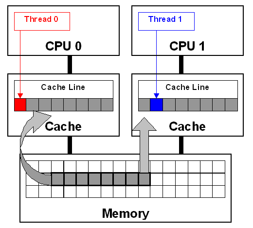
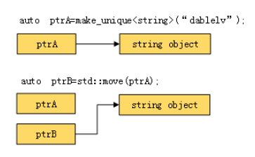
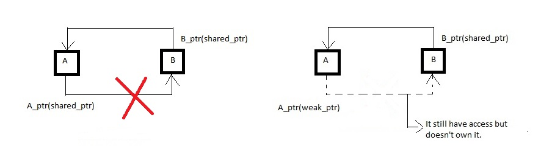

# 计算机网络

## TCP如何保证可靠传输？

1. **三次握手**
2. **确认应答和超时重传**
3. **数据校验**：接收方会缓存未按序到达的数据，重新排序后再交给应用层。

4. **数据合理分片和排序**：接收方会缓存未按序到达的数据，重新排序后再交给应用层。

5. **流量控制**：当接收方来不及处理发送方的数据，能通过滑动窗口，提示发送方降低发送的速率，防止包丢失。
6. **拥塞控制**：当网络拥塞时，通过拥塞窗口，减少数据的发送，防止包丢失。

## TCP 是如何通过滑动窗口协议实现==流量控制==和==拥塞控制==的？

通过调节窗口的大小

窗口指的是一次批量的发送多少数据（**缓冲区**）

在确认应答策略中，对每一个发送的数据段，都要给一个ACK确认应答，收到ACK后再发送下一个数据段，这样做有一个比较大的缺点，就是性能比较差，尤其是数据往返的时间长的时候，使用滑动窗口，就可以一次发送多条数据，从而就提高了性能

## TCP滑动窗口协议

用于网络数据传输时的流量控制，拥塞控制。该协议可以加速数据的传输，提高网络的吞吐量。

TCP滑动窗口是以字节为单位的，发送方的发送窗口是根据接收方窗口设置的

> 可靠性，滑动窗口只有在队列前部的被确认之后，才会往后移动，保证数据包被接收方确认并接收。
>
> 提高传输效率
>
> 稳定性，滑动窗口大小，会进行动态调整，可以尽量地避免网络拥塞，更加稳定。

## TCP三次握手 四次挥手

TCP 的三次握手过程如下：
C-> SYN -> S
S->SYN/ACK->C
C->ACK->S

TCP 的四次挥手过程如下：
C->FIN->S
S->ACK->C
S->FIN->C
C->ACK->S

## 数据库：创建一个表，增删改查

create table

insert into 表名(字段名1,字段名2,字段名3……) values(值1,值2,值3……)

delete from 表名

select * from 表名

update 表名 set 字段名=值, 字段名=值, 字段名=值……

# 操作系统

## 进程和线程的区别

* **概念**：进程是**CPU资源分配**的**最小单位**，线程是**CPU调度**的**最小单位**。
* **系统资源**：进程在执行过程中拥有独立的内存单元，而多个线程共享进程的内存。线程创建销毁内存开销大
* **通信**：进程间通信比较复杂，而同一进程的线程由于共享代码段和数据段，所以通信比较容易，进程通信效率相比较线程通信效率低
* **程序可靠性**：一个进程崩溃，不会对其他进程产生影响；而一个线程崩溃，会让同一进程内的其他线程也死掉。
* **调试**：多进程编程相比较多线程调试简单，Bug也会容易找

## 阻塞，非阻塞，同步，异步的异同

阻塞和非阻塞：调用者在事件没有发生的时候，一直在等待事件发生，不能去处理别的任务这是阻塞。调用者在事件没有发生的时候，可以去处理别的任务这是非阻塞。

同步和异步：调用者必须循环自去查看事件有没有发生，这种情况是同步。调用者不用自己去查看事件有没有发生，而是等待着注册在事件上的回调函数通知自己，这种情况是异步

## 死锁产生的原因及四个必要条件

[死锁产生的条件和解决死锁的方法_风格色的博客-CSDN博客](https://blog.csdn.net/qq_27068845/article/details/78818381)

[[c++11\]多线程编程(四)——死锁(Dead Lock) - 个人文章 - SegmentFault 思否](https://segmentfault.com/a/1190000016217199)

[c++ Programming - Bo Qian's Space](https://boqian.weebly.com/c-programming.html)

**死锁概念**：死锁指的是两个或两个以上的进程或线程因争夺资源而相互等待**阻塞**的情形

**产生死锁的原因主要是**：

1. 因为系统资源不足。
2. 进程运行推进的顺序不合适。
3. 资源分配不当等。

**产生死锁的四个必要条件**：

1. 互斥条件，进程分配到的资源不允许其他进程访问
2. 请求保持，进程分配到资源后，不释放自己的资源还要请求其他被人家占有的资源
3. 不可剥夺，进程已有的资源，其他进程不可抢夺
4. 循环等待，进程互相等待资源

**避免死锁**：

- 每个线程只持有一个锁， 锁上就不会产生死锁。
- 避免在持有锁时调用用户提供的代码。不要在互斥锁保护的区域使用用户自定义的代码，因为用户的代码可能操作了其他的互斥锁。
- 如果想同时对多个互斥锁上锁，要使用`std::lock()`
- 使用固定顺序获取锁（比较地址），或者使用层次锁
  - 可以比较`mutex`的地址，每次都先锁地址小的	
  - 使用层次锁，将互斥锁包装一下，给锁定义一个层次的属性，每次按层次由高到低的顺序上锁。

**死锁检测**：

死锁检测算法：当任一进程申请一个已被其他进程占有的资源时，通过反复查找资源分配表和进程等待表 ，来确定该进程对这个资源的申请是否会导致环路，若是，便确定出现死锁。

1. 等待获得锁自旋超过2微秒时间后开始检测是否发生了死锁
2. 建立资源分配表，为每个进程和每个资源指定一个唯一的号码，表中包含“资源号”和占有该资源的“进程号”两项。（**有向图的环判断问题**）
3. 进程等待表

# ==C/C++程序基础==

## 指针和数组的区别

## Public、Protected、Private的区别

### 基本概念

最终目的是为了满足**面向接口编程**的要求，实现使用不同的继承方式达到接口隔离

|          | public    | protected | private |
| -------- | --------- | --------- | ------- |
| 公有继承 | public    | protected | 不可见  |
| 保护继承 | protected | protected | 不可见  |
| 私有继承 | private   | private   | 不可见  |

**1）基类成员对派生类都是：共有和保护的成员是可见的，私有的的成员是不可见的。**

**2）基类成员对派生类的对象来说：要看基类的成员在派生类中变成了什么类型的成员。如：私有继承时，基类的共有成员和私有成员都变成了派生类中的私有成员，因此对于派生类中的对象来说基类的共有成员和私有成员就是不可见的。**

eg.在公有继承时，派生类的对象可以访问基类中的公有成员；派生类的成员函数可以访问基类中的公有成员和保护成员。这里，一定要区分清楚**派生类的对象**和**派生类中的成员函数**对基类的访问是不同的。

### 区别

* 访问范围不同：

  public: 可以被该类中的函数、子类的函数、其友元函数访问；可以由该类的对象访问

  protected: 可以被该类中的函数、子类的函数、其友元函数访问,；不能被该类的对象访问

  private: 只能由该类中的函数、其友元函数访问,不能被任何其他访问，该类的对象也不能访问.


## C++多线程优化

OpenMP Boost OpenBLAS SIMD 浮点转定点

## GCC编译优化选项

gcc -O0 -O1 -O2 -O3 四级优化选项

- O1优化会消耗少多的编译时间，它主要对代码的分支，常量以及表达式等进行优化。 
- O2会尝试更多的寄存器级的优化以及指令级的优化，它会在编译期间占用更多的内存和编译时间。 
- O3在O2的基础上进行更多的优化，例如使用伪寄存器网络，普通函数的内联，以及针对循环的更多优化。 
- Os主要是对代码大小的优化，我们基本不用做更多的关心。 通常各种优化都会打乱程序的结构，让调试工作变得无从着手。并且会打乱执行顺序，依赖内存操作顺序的程序需要做相关处理才能确保程序的正确性。 

## 字节对齐

[(转) 内存对齐 | Light.Moon](http://light3moon.com/2015/01/19/[转] 内存对齐/)

[C/C++内存对齐详解 - 知乎](https://zhuanlan.zhihu.com/p/30007037)

## 构造函数能否为虚函数

构造函数不能为虚函数

## 内存泄露

内存泄漏是向系统申请分配内存进行使用(new)，可是使用完了以后却不归还(delete)。

内存泄漏的堆积最终会导致内存溢出

## 伪共享



Linux系统中采用MESI协议处理缓存一致性。

**缓存失效**：CPU1对一个缓存行执行了写入操作，则此操作会导致其他CPU的该缓存行进入Invalid无效状态，CPU需要使用该缓存行的时候需要从内存中重新读取。

**概念**：当不同处理器上的线程修改驻留在同一缓存行中的变量时，就会发生错误共享。这会使高速缓存行无效，并强制进行内存更新以保持高速缓存一致性。

**解决方法**：

1. 内存对齐：使用编译器指令来强制变量内存对齐，将数据结构填充到缓存行大小的两倍
2. 填充（Padding）：可以采用在变量后面填充字节的方式达到该目的。
3. 对与经常访问修改的数据建立本地的副本。

## C++中内存越界、内存泄漏、内存溢出

内存越界：超过所申请内存的范围

内存泄漏：分配的内存而没有释放，不能被使用也不能分配给其他程序，最终会导致内存溢出

内存溢出：**申请的内存大于系统能够提供的内存，导致无法申请到足够的内存**，于是就发生了内存溢出。

## C++中的内存管理（智能指针）

[C++ 知识点 | C11 智能指针 - 董涛的博客 | Aiden Blog](https://aiden-dong.github.io/2020/01/26/cpp智能指针/)

C++内存分配通过`new` 和 `delete` 操作符

RAII（Resource Acquisition Is Initialization）**资源即对象**的管理策略。是一种利用对象生命周期来控制程序资源（如内存、文件句柄、网络连接、互斥量等等）的简单技术。 RAII 的一般做法是这样的：在对象构造时获取资源，接着控制对资源的访问使之在对象的生命周期内始终保持有效，最后在对象析构的时候释放资源。借此，我们实际上把管理一份资源的责任托管给了一个对象。主要应用智能指针！

### **智能指针**

使用智能指针，就不用去管理指针的**生命周期**，通过控制**ownership** 所有权，使实现资源管理。

| 指针类别     | 支持   | 备注                                 |
| ------------ | ------ | ------------------------------------ |
| `unique_ptr` | C++ 11 | 拥有独有对象所有权语义的智能指针     |
| `shared_ptr` | C++ 11 | 拥有共享对象所有权语义的智能指针     |
| `weak_ptr`   | C++ 11 | 对std::shared_ptr 所管理对象的弱引用 |

### shared_ptr 

shared_ptr最大的好处就是不用手动delete,只要一个对象不再被任何一个shared_ptr所指向（引用计数为0），它就会自动销毁。

用make_shared声明

### unique_ptr

**unique_ptr**引用计数为1，只能有一个对象拥有所有权，当对象被销毁时自动释放资源。



用make_shared/make_unique声明

### weak_ptr

* weak_ptr是为了辅助shared_ptr而引入的一种智能指针

* weak_ptr的构造和析构并不会改变引用计数的大小

* 主要应用场景：解决shared_ptr的循环引用问题

  有两个类A和B，各自都有一个**shared_ptr**指向对方（A指向B，B指向A，两个**shared_ptr**的引用计数都为2），因此，引用计数会永远无法达到0，导致无法删除内存，从而产生内存泄漏

  

## 左值、右值、左值引用、右值引用

* [右值引用那些事儿 - 简书](https://www.jianshu.com/p/d3cfb9acefa0)
* [Value Categories: Lvalues and Rvalues (C++) | Microsoft Docs](https://docs.microsoft.com/en-us/cpp/cpp/lvalues-and-rvalues-visual-cpp?redirectedfrom=MSDN&view=vs-2019)

左值和右值的区分方法：看能不能对表达式取地址，如果能，则为左值，否则为右值

具名变量或对象都是左值，而匿名变量则是右值

通用引用`T&&`可以接受任何类型的参数，且自动适配左值和右值。

std::move处理右值引用，std::forward处理通用引用

## 指针和引用的区别

1. 指针拥有自己的一块空间，而引用只是一个别名
2. 引用不能为空（必须初始化），指针可以为空，指向空对象。
3. 指针在使用中可以指向其它对象，但是引用只能是一个对象的引用，不能被改变
4. 引用和指针的++自增运算符意义不同
5. 引用的大小是所引用对象的大小，指针的大小，是指针本身大小，通常是4字节

## const指针的作用

把const读作常量，把星号*读作指针

比如：

int * const p 就是指针常量（const pointer），指针的地址是常量

int const * p 就是常量指针（pointer to const），指向的量是常量

## C/C++的内存分区

在c++中，内存被划分为四个区。**代码区、静态存储区、堆和栈**。

- 代码区。存放程序代码
- 静态存储区。将程序中的静态变量、全局变量存放在此区域
- 堆。程序中，由程序员申请的内存空间（new、malloc）。空间的释放一般也有程序员控制（一个new对应一个delete）。当程序员没有释放该内存空间的时候，程序运行完毕时操作系统会对该内存空间进行回收。
- 栈。就是那些由编译器在需要的时候分配，在不需要的时候自动清除的变量的存储区。里面的变量通常是局部变量、函数参数等。

# ==Python程序基础==

参考

* [Python教程 - 廖雪峰的官方网站](https://www.liaoxuefeng.com/wiki/1016959663602400)
* [装饰器浅析](https://mp.weixin.qq.com/s?__biz=MjM5MDEyMDk4Mw==&mid=2650166480&idx=2&sn=be7349921b91730a8c717f6ab28dad97&chksm=be4b59a8893cd0bee407e3d8a1b7bec44d7571623c355a37f352d5cf9e104d986af6f5b5e1fe&scene=21#wechat_redirect)

## 赋值浅拷贝深拷贝

- **直接赋值：**其实就是对象的引用（别名）。

- **浅拷贝(copy)：**拷贝父对象，不会拷贝对象的内部的子对象，只是对内部对象做了引用，并且还要考虑被拷贝的对象是否可变。可变对象相当于**引用传递**，不可变的相当于复制一份值传递。

  可变对象： list, dict.
  不可变对象: int, string, float, tuple.

- **深拷贝(deepcopy)：** copy 模块的 deepcopy 方法，完全拷贝了父对象及其子对象。

## 装饰器

Python中函数可以作为变量，赋值给其他变量，可以作为返回值，可以被定义在另外一个函数内

装饰器的核心内容其实就是将函数作为参数传递给另一个函数

**装饰器=高阶函数+函数嵌套+闭包**

```python
# 高阶函数：1.接收的参数是一个函数名 2.返回值是一个函数名
def memo(func):
    cache = {}
    def wrap(*args, **kwargs):
        if args not in cache:
            cache[args] = func(*args, **kwargs)
        return cache[args]
    return wrap

@memo
def fib(i):
    if i < 2:
        return 1
    return fib(i-1) + fib(i-2)

fibonacci=memo(fib)
```

## 闭包

封装、避免了使用全局变量、

```
def line_conf(a, b):
    def line(x):
        return a * x + b
    return line
    
# 定义两条直线
line_A = line_conf(2, 1)  # y=2x+b
line_B = line_conf(3, 2)  # y=3x+2
 
# 打印x对应y的值
print(line_A(1))  # 3
print(line_B(1))  # 5
```


## 参数*args **kwargs区别

*args传入多个值，这些值的特点是被包装成一个元组（tuple），如打印的(1, 2, 3, 4),**kwargs则传入多个值，这些值的特点是被包装成一个字典（dict），如打印的{‘a’: 5, ‘b’: 6, ‘c’: 7}

## Python的内存管理机制

Python中一切皆对象

Python的内存管理机制（垃圾回收机制）

* 引用计数
* 标记清除
* 分代回收

在Python中，主要通过引用计数进行垃圾回收；通过 “标记-清除” 解决容器对象可能产生的循环引用问题；通过 “分代回收” 以空间换时间的方法提高垃圾回收效率。

## 字典按Value排序

```python
x = {1: 2, 3: 4, 4: 3, 2: 1, 0: 0}

# dict_items([(1, 2), (3, 4), (4, 3), (2, 1), (0, 0)])
print(x.items())

# [(0, 0), (2, 1), (1, 2), (4, 3), (3, 4)]
print(sorted(x.items(), key=lambda b: b[1]))

# {0: 0, 2: 1, 1: 2, 4: 3, 3: 4}
print(dict(sorted(x.items(), key=lambda b: b[1])))

# 键值对换在使用sorted函数 还要再对换一次键值
print(sorted([(value, key) for (key, value) in x.items()]))

# lambda b ：b就是items()方法返回的每个参数 lambda [parameter_list] ： 表达式
```

