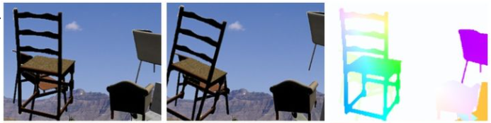
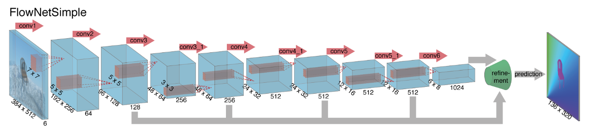
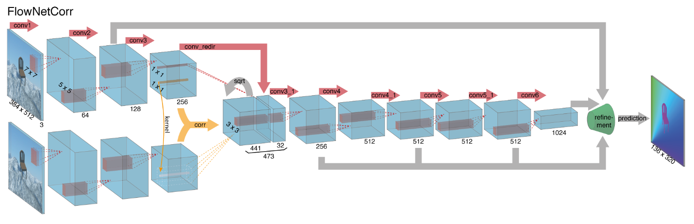

# FlowNet: Learning Optical Flow with Convolutional Networks

* [Introduction to Motion Estimation with Optical Flow](https://nanonets.com/blog/optical-flow/amp/)
* [光流估计——从传统方法到深度学习 - 知乎](https://zhuanlan.zhihu.com/p/74460341)

### TL;DR

首次采用CNN提取图像的光流特征（有监督学习）

其数据集采用生成数据（基于仿射变换对物体和相机运动同时建模，最后直接获得光流，该方法得出的光流几乎没有误差）

在计算Loss时根据求解预测光流与GT之间的欧式距离

### Detils

* FlowNetSimple

  

  将两张原始图片按channel合并起来，在用CNN提取特征

* FlowNetCoor

  

  先对两张图片先进行特征提取，并在中间层Concat特征图

这两种网络后面都有一个Refinement模块，作为Decode，其通过反卷积对特征图进行扩大