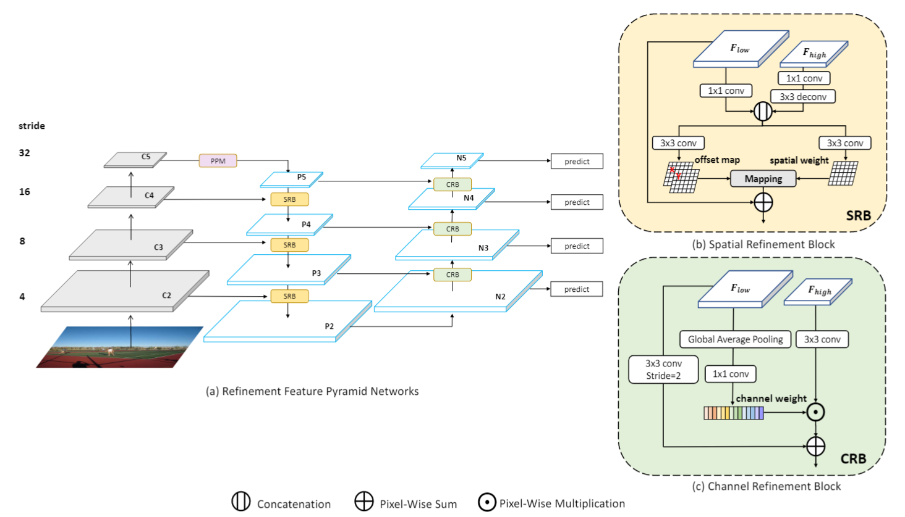
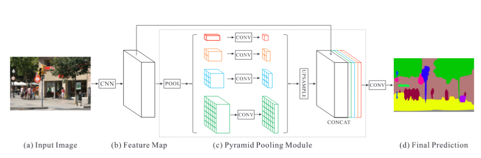
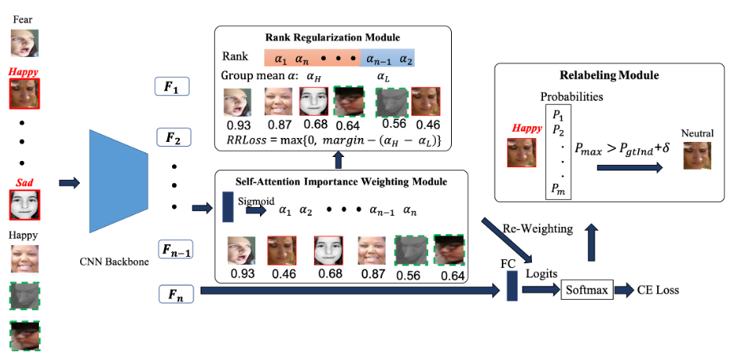
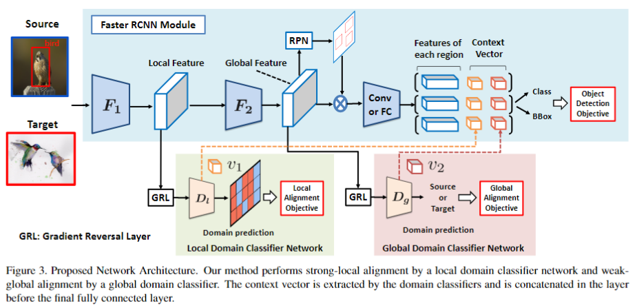

[TOC]

# 2020年12月15日

## Three Ways to Improve Semantic Segmentation with Self-Supervised Depth Estimation

* [ETH Zürich提出：用自监督深度估计改进语义分割性能的三种方法](https://mp.weixin.qq.com/s/dAhLQhuL06LtT8crCheBpA)
* [[2012.10782\] Three Ways to Improve Semantic Segmentation with Self-Supervised Depth Estimation](https://arxiv.org/abs/2012.10782)

### TL:DR

辅助任务学习 auxiliary task

* 深度估计的特征学习知识迁移到语义分割任务
* 将标记和图像基于景物结构进行混合 DepthMix
* depth特征的diversity和“学生-老师”框架的depth学习难度，有助于选择有用特征做语义分割的标注，即Unsupervised Data Selection for Annotation，其选择的标准是diversity和uncertainty

### Details


## Slender Object Detection: Diagnoses and Improvements


## Dual Refinement Feature Pyramid Networks for Object Detection

* https://arxiv.org/pdf/2012.01733

### TL:DR

FPN的改进。针对FPN在底层与顶层特征融合的匹配上提出两个问题：通道维度（channel）不匹配、空间维度（spatial）不匹配。




SRB: Spatial Refinement Block

CRB: ChannelRefinement Block

PPM: Pyramid Pooling Module [[1612.01105\] Pyramid Scene Parsing Network](https://arxiv.org/abs/1612.01105)



# 2021年1月6日

## Suppressing Uncertainties for Large-Scale Facial Expression Recognition

* 2020 CVPR

* [kaiwang960112/Self-Cure-Network: This is a novel and easy method for annotation uncertainties.](https://github.com/kaiwang960112/Self-Cure-Network)

### TL;DR

Self-Cure Network (SCN) suppresses the uncertainty from two different aspects: 1) a self-attention mechanism over mini-batch to weight each training sample with a ranking regularization, and 2) a careful relabeling mechanism to modify the labels of these samples in the lowest-ranked group.



主要包含三个模块：

* self-attention importance weighting（weight for each image using a fully-connected (FC) layer and the sigmoid function）
* ranking regularization（rank the learned attention weights and then split them into two groups [high and low]，mean weights of these groups by a margin-based loss [rank regularization loss (RR-Loss)]）
* relabeling（modify some of the uncertain samples in the low importance group）

### Detail

* Self-Attention Importance Weighting Module（ReWeighting）

  self-attention importanceweighting module is comprised of a linear **fully-connected(FC) layer and a sigmoid activation function**

  $\alpha_{i}=\sigma\left(\mathbf{W}_{a}^{\top} \mathbf{x}_{i}\right)$

  $\alpha_{i}$ the importance weight of the i-th sample

  $\mathbf{W}_{a}$ parameters of the FC layer

  ```python
  class Res18Feature(nn.Module):
      def __init__(self, pretrained = True, num_classes = 7, drop_rate = 0):
          super(Res18Feature, self).__init__()
          self.drop_rate = drop_rate
          resnet  = models.resnet18(pretrained)
          self.features = nn.Sequential(*list(resnet.children())[:-1]) # after avgpool 512x1
  
          fc_in_dim = list(resnet.children())[-1].in_features # original fc layer's in dimention 512
     
          self.fc = nn.Linear(fc_in_dim, num_classes) # new fc layer 512x7
          self.alpha = nn.Sequential(nn.Linear(fc_in_dim, 1),nn.Sigmoid())
  
      def forward(self, x):
          x = self.features(x)
          
          if self.drop_rate > 0:
              x =  nn.Dropout(self.drop_rate)(x)
          x = x.view(x.size(0), -1)
          
          attention_weights = self.alpha(x)
          out = attention_weights * self.fc(x)
          return attention_weights, out
  ```

* Rank Regularization Module

  对所有样本进行TopK排序，并分为两组（一组高置信，一组低置信）

  $\mathcal{L}_{R R}=\max \left\{0, \delta_{1}-\left(\alpha_{H}-\alpha_{L}\right)\right\}$

  * $\delta_{1}$ 超参（代码上位一个固定值）
  * $\alpha_{H}$ 高置信样本的的attention_weights均值
  * $\alpha_{L}$ 低置信样本的的attention_weights均值

  total loss function   $\mathcal{L}_{a l l}=\gamma \mathcal{L}_{R R}+(1-\gamma)$ $\mathcal{L}_{W C E}$ where $\gamma$ is a trade-off ratio

  **WCE-Loss（weighted cross-entropy）**

  ```python
              attention_weights, outputs = res18(imgs)
              
              # Rank Regularization
              _, top_idx = torch.topk(attention_weights.squeeze(), tops)
              _, down_idx = torch.topk(attention_weights.squeeze(), batch_sz - tops, largest = False)
  
              high_group = attention_weights[top_idx]
              low_group = attention_weights[down_idx]
              high_mean = torch.mean(high_group)
              low_mean = torch.mean(low_group)
              # diff  = margin_1 - (high_mean - low_mean)
              diff  = low_mean - high_mean + margin_1
  
              if diff > 0:
                  RR_loss = diff
              else:
                  RR_loss = 0.0
              
              targets = targets.cuda()
              loss = torch.nn.CrossEntropyLoss(outputs, targets) + RR_loss 
  ```

* Relabeling Module

  relabeling  module  only  considers  thesamples in the low-importance group and is performed onthe Softmax probabilities

  判断是否保留低置信度组的标签是否保留还是使用计算出来的

  $y^{\prime}=\left\{\begin{array}{ll}l_{\max } & \text { if } P_{\max }-P_{g t I n d}>\delta_{2}, \\ l_{\text {org }} & \text { otherwise }\end{array}\right.$

  * $P_{\max }$ 预测出来的最大置信度（不一定跟gt同标签）
  * $P_{g t I n d}$ GT标签的预测置信度
  * $\delta_{2}$ 超参

  

  ```python
              # Relabel samples
              if i >= args.relabel_epoch:
                  sm = torch.softmax(outputs, dim = 1)
                  Pmax, predicted_labels = torch.max(sm, 1) # predictions
                  Pgt = torch.gather(sm, 1, targets.view(-1,1)).squeeze() # retrieve predicted probabilities of targets
                  true_or_false = Pmax - Pgt > margin_2
                  update_idx = true_or_false.nonzero().squeeze() # get samples' index in this mini-batch where (Pmax - Pgt > margin_2)
                  label_idx = indexes[update_idx] # get samples' index in train_loader
                  relabels = predicted_labels[update_idx] # predictions where (Pmax - Pgt > margin_2)
                  train_loader.dataset.label[label_idx.cpu().numpy()] = relabels.cpu().numpy() # relabel samples in train_loader
  ```

### Thoughts

使用了三个module，属于常规的改进方法，代码中的Loss使用的的CE而不是WCE，很奇怪

第一个模块价值不高，第二个Ranking正则化感觉有点用，第三个模块就是卡阈值对标签进行重新分配

# 2021年1月14日

## Pseudo-Labeling and Confirmation Bias in DeepSemi-Supervised Learning

* 论文地址
* 论文代码

### TL;DR

### Details

### Thoughts


## Strong-Weak Distribution Alignment for Adaptive Object Detection

* [[1812.04798\] Strong-Weak Distribution Alignment for Adaptive Object Detection](https://arxiv.org/abs/1812.04798)
* [VisionLearningGroup/DA_Detection: Implementation of "Strong-Weak Distribution Alignment for Adaptive Object Detection"](https://github.com/VisionLearningGroup/DA_Detection?utm_source=catalyzex.com)
* Accepted to CVPR2019

### TL;DR

提出了一种域迁移方法based on **strong local alignment** and **weak global alignment**

* Weak Alignment Model: 使用adversarial alignment loss在image-level进行对齐
* Strong Domain Alignment: 只在local receptive fields of the feature map进行alignment

### Details



#### Weak Global Feature Alignment

$\mathcal{L}_{c l s}(F, R)=-\frac{1}{n_{s}} \sum_{i=1}^{n_{n}} \mathcal{L}_{d e t}\left(R\left(F\left(x_{i}^{s}\right)\right), y_{i}^{s}\right)$

* $x_{i}^{s}$$y_{i}^{s}$分别代表source domain的数据和标签

* $F$ 用来提取global feature vector

* $R$  takes features from F and outputs bounding boxes with a class label

* $\mathcal{L}_{\text {det }}$ contains all losses for detection such as a classification loss and a bounding-box regression loss loss

* ${n_{s}} $  the number of source examples

  

### Thoughts

