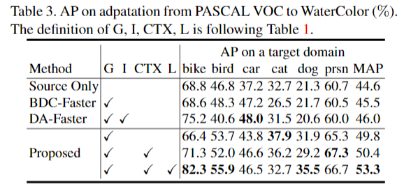
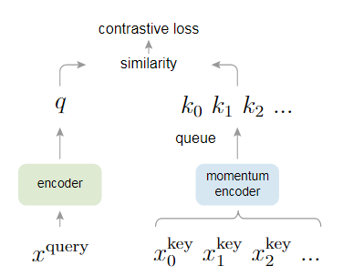
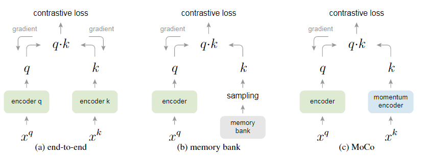
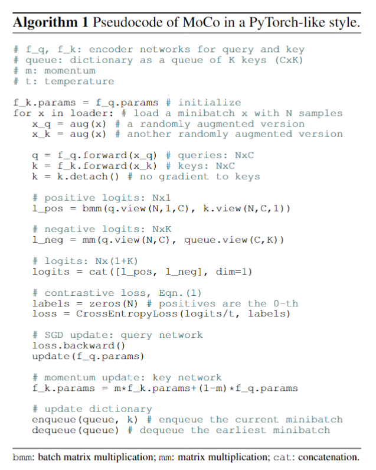
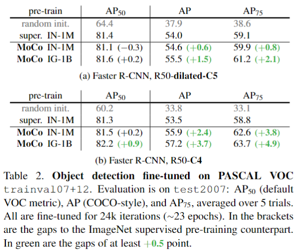

[TOC]

# 2020年12月15日

## Three Ways to Improve Semantic Segmentation with Self-Supervised Depth Estimation

* [ETH Zürich提出：用自监督深度估计改进语义分割性能的三种方法](https://mp.weixin.qq.com/s/dAhLQhuL06LtT8crCheBpA)
* [[2012.10782\] Three Ways to Improve Semantic Segmentation with Self-Supervised Depth Estimation](https://arxiv.org/abs/2012.10782)

### TL:DR

辅助任务学习 auxiliary task

* 深度估计的特征学习知识迁移到语义分割任务
* 将标记和图像基于景物结构进行混合 DepthMix
* depth特征的diversity和“学生-老师”框架的depth学习难度，有助于选择有用特征做语义分割的标注，即Unsupervised Data Selection for Annotation，其选择的标准是diversity和uncertainty

### Details


## Slender Object Detection: Diagnoses and Improvements


## Dual Refinement Feature Pyramid Networks for Object Detection

* https://arxiv.org/pdf/2012.01733

### TL:DR

FPN的改进。针对FPN在底层与顶层特征融合的匹配上提出两个问题：通道维度（channel）不匹配、空间维度（spatial）不匹配。


SRB: Spatial Refinement Block

CRB: ChannelRefinement Block

PPM: Pyramid Pooling Module [[1612.01105\] Pyramid Scene Parsing Network](https://arxiv.org/abs/1612.01105)


# 2021年1月6日

## Suppressing Uncertainties for Large-Scale Facial Expression Recognition

* 2020 CVPR

* [kaiwang960112/Self-Cure-Network: This is a novel and easy method for annotation uncertainties.](https://github.com/kaiwang960112/Self-Cure-Network)

### TL;DR

Self-Cure Network (SCN) suppresses the uncertainty from two different aspects: 1) a self-attention mechanism over mini-batch to weight each training sample with a ranking regularization, and 2) a careful relabeling mechanism to modify the labels of these samples in the lowest-ranked group.


主要包含三个模块：

* self-attention importance weighting（weight for each image using a fully-connected (FC) layer and the sigmoid function）
* ranking regularization（rank the learned attention weights and then split them into two groups [high and low]，mean weights of these groups by a margin-based loss [rank regularization loss (RR-Loss)]）
* relabeling（modify some of the uncertain samples in the low importance group）

### Detail

* Self-Attention Importance Weighting Module（ReWeighting）

  self-attention importanceweighting module is comprised of a linear **fully-connected(FC) layer and a sigmoid activation function**

  $\alpha_{i}=\sigma\left(\mathbf{W}_{a}^{\top} \mathbf{x}_{i}\right)$

  $\alpha_{i}$ the importance weight of the i-th sample

  $\mathbf{W}_{a}$ parameters of the FC layer

  ```python
  class Res18Feature(nn.Module):
      def __init__(self, pretrained = True, num_classes = 7, drop_rate = 0):
          super(Res18Feature, self).__init__()
          self.drop_rate = drop_rate
          resnet  = models.resnet18(pretrained)
          self.features = nn.Sequential(*list(resnet.children())[:-1]) # after avgpool 512x1
  
          fc_in_dim = list(resnet.children())[-1].in_features # original fc layer's in dimention 512
     
          self.fc = nn.Linear(fc_in_dim, num_classes) # new fc layer 512x7
          self.alpha = nn.Sequential(nn.Linear(fc_in_dim, 1),nn.Sigmoid())
  
      def forward(self, x):
          x = self.features(x)
          
          if self.drop_rate > 0:
              x =  nn.Dropout(self.drop_rate)(x)
          x = x.view(x.size(0), -1)
          
          attention_weights = self.alpha(x)
          out = attention_weights * self.fc(x)
          return attention_weights, out
  ```

* Rank Regularization Module

  对所有样本进行TopK排序，并分为两组（一组高置信，一组低置信）

  $\mathcal{L}_{R R}=\max \left\{0, \delta_{1}-\left(\alpha_{H}-\alpha_{L}\right)\right\}$

  * $\delta_{1}$ 超参（代码上位一个固定值）
  * $\alpha_{H}$ 高置信样本的的attention_weights均值
  * $\alpha_{L}$ 低置信样本的的attention_weights均值

  total loss function   $\mathcal{L}_{a l l}=\gamma \mathcal{L}_{R R}+(1-\gamma)$ $\mathcal{L}_{W C E}$ where $\gamma$ is a trade-off ratio

  **WCE-Loss（weighted cross-entropy）**

  ```python
              attention_weights, outputs = res18(imgs)
              
              # Rank Regularization
              _, top_idx = torch.topk(attention_weights.squeeze(), tops)
              _, down_idx = torch.topk(attention_weights.squeeze(), batch_sz - tops, largest = False)
  
              high_group = attention_weights[top_idx]
              low_group = attention_weights[down_idx]
              high_mean = torch.mean(high_group)
              low_mean = torch.mean(low_group)
              # diff  = margin_1 - (high_mean - low_mean)
              diff  = low_mean - high_mean + margin_1
  
              if diff > 0:
                  RR_loss = diff
              else:
                  RR_loss = 0.0
              
              targets = targets.cuda()
              loss = torch.nn.CrossEntropyLoss(outputs, targets) + RR_loss 
  ```

* Relabeling Module

  relabeling  module  only  considers  thesamples in the low-importance group and is performed onthe Softmax probabilities

  判断是否保留低置信度组的标签是否保留还是使用计算出来的

  $y^{\prime}=\left\{\begin{array}{ll}l_{\max } & \text { if } P_{\max }-P_{g t I n d}>\delta_{2}, \\ l_{\text {org }} & \text { otherwise }\end{array}\right.$

  * $P_{\max }$ 预测出来的最大置信度（不一定跟gt同标签）
  * $P_{g t I n d}$ GT标签的预测置信度
  * $\delta_{2}$ 超参

  

  ```python
              # Relabel samples
              if i >= args.relabel_epoch:
                  sm = torch.softmax(outputs, dim = 1)
                  Pmax, predicted_labels = torch.max(sm, 1) # predictions
                  Pgt = torch.gather(sm, 1, targets.view(-1,1)).squeeze() # retrieve predicted probabilities of targets
                  true_or_false = Pmax - Pgt > margin_2
                  update_idx = true_or_false.nonzero().squeeze() # get samples' index in this mini-batch where (Pmax - Pgt > margin_2)
                  label_idx = indexes[update_idx] # get samples' index in train_loader
                  relabels = predicted_labels[update_idx] # predictions where (Pmax - Pgt > margin_2)
                  train_loader.dataset.label[label_idx.cpu().numpy()] = relabels.cpu().numpy() # relabel samples in train_loader
  ```

### Thoughts

使用了三个module，属于常规的改进方法，代码中的Loss使用的的CE而不是WCE，很奇怪

第一个模块价值不高，第二个Ranking正则化感觉有点用，第三个模块就是卡阈值对标签进行重新分配

# 2021年1月14日

## Pseudo-Labeling and Confirmation Bias in DeepSemi-Supervised Learning

* 论文地址
* 论文代码

### TL;DR

### Details

### Thoughts


## Strong-Weak Distribution Alignment for Adaptive Object Detection

* [[1812.04798\] Strong-Weak Distribution Alignment for Adaptive Object Detection](https://arxiv.org/abs/1812.04798)
* [VisionLearningGroup/DA_Detection: Implementation of "Strong-Weak Distribution Alignment for Adaptive Object Detection"](https://github.com/VisionLearningGroup/DA_Detection?utm_source=catalyzex.com)
* Accepted to CVPR 2019

### TL;DR

提出了一种域迁移方法based on **strong local alignment** and **weak global alignment**

* Weak Alignment Model: 使用adversarial alignment loss，在global进行对齐，在rpn层后面
* Strong Domain Alignment: 只在local receptive fields of the feature map进行alignment，在local进行对齐，在特征提取后

### Details


#### Weak Global Feature Alignment

使用一个域分类器去判断是source or target，由此对齐目标域和源域全局特征


同时作者也采用Focal Loss（CE上面加入一个判断难易样本的权重$\log \left(p_{t}\right)$），训练域分类器去忽略容易区分的样本，而去强调难以区分的样本。

（重写了一下FL的公式，只不过对source标签为1，target标签为0）
$$
\mathcal{L}_{\text {global}_{s}}=-\frac{1}{n_{s}} \sum_{i=1}^{n_{s}}\left(1-D_{g}\left(F\left(x_{i}^{s}\right)\right)^{\gamma} \log \left(D_{g}\left(F\left(x_{i}^{s}\right)\right)\right)\right.
$$

$$
\mathcal{L}_{\text {global}_{t}}=-\frac{1}{n_{t}} \sum_{i=1}^{n_{t}} D_{g}\left(F\left(x_{i}^{t}\right)\right)^{\gamma} \log \left(1-D_{g}\left(F\left(x_{i}^{t}\right)\right)\right)
$$

$$
\mathcal{L}_{\text {global }}\left(F, D_{g}\right)=\frac{1}{2}\left(\mathcal{L}_{\text {global }_{s}}+\mathcal{L}_{\text {global }_{t}}\right)
$$

$\mathcal{L}_{\text {global }}\left(F, D_{g}\right)=\frac{1}{2}\left(\mathcal{L}_{\text {global }_{s}}+\mathcal{L}_{\text {global }_{t}}\right)$

整个目标检测的损失函数描述：（多了R与F两个变量）
$$
\mathcal{L}_{c l s}(F, R)=-\frac{1}{n_{s}} \sum_{i=1}^{n_{n}} \mathcal{L}_{d e t}\left(R\left(F\left(x_{i}^{s}\right)\right), y_{i}^{s}\right)
$$

* $x_{i}^{s}$ $y_{i}^{s}$分别代表source domain的数据和标签

* $F$ 用来提取global feature vector
* $R$  takes features from F and outputs bounding boxes with a class label
* $\mathcal{L}_{\text {det }}$ contains all losses for detection such as a classification loss and a bounding-box regression loss loss
* ${n_{s}} $  the number of source examples

#### Strong Local Feature Alignment


使用低层的 F1 提取的特征作为 local feature 域分类器的输入，输出一个和输入同样宽高的 feature map ，使用最小平方loss来训练域分类器
$$
\begin{array}{c}
\mathcal{L}_{l o c_{s}}=\frac{1}{n_{s} H W} \sum_{i=1}^{n_{s}} \sum_{w=1}^{W} \sum_{h=1}^{H} D_{l}\left(F_{1}\left(x_{i}^{s}\right)\right)_{w h}^{2} \\
\mathcal{L}_{l o c_{t}}=\frac{1}{n_{t} H W} \sum_{i=1}^{n_{t}} \sum_{w=1}^{W} \sum_{h=1}^{H}\left(1-D_{l}\left(F_{1}\left(x_{i}^{t}\right)\right)_{w h}\right)^{2} \\
\mathcal{L}_{l o c}\left(F, D_{l}\right)=\frac{1}{2}\left(\mathcal{L}_{l o c_{s}}+\mathcal{L}_{l o c_{t}}\right)
\end{array}
$$

#### Gradient Reversal Layer

梯度反转层

梯度下降是最小化目标函数，向负的梯度方向优化就是最大化目标函数

一个class loss是正的，要最小化它； domain loss也是正的，但是要最大化它。

#### Context Vector based Regularization

从两个域分类器的中间层抽取特征，然后根据不同的区域去跟RPN的输出对应(region-wise)进行拼接

#### Overall Objective

所有对抗loss定义：
$$
\mathcal{L}_{\text {adv }}(F, D)=\mathcal{L}_{\text {loc }}\left(F_{1}, D_{l}\right)+\mathcal{L}_{\text {global }}\left(F, D_{g}\right)
$$
Combined with the loss of detection on source examples,the overall objective is:(最大最小化loss)
$$
\max _{D} \min _{F, R} \mathcal{L}_{c l s}(F, R)-\lambda \mathcal{L}_{a d v}(F, D)
$$

#### Experiments

* Source Only 指的是仅仅使用训练集图片训练，然后直接在目标域进行测试

* BDC-Faster 是使用了域分类器的baseline

* DA-Faster 是2018年CVPR的Domain Adaptive Faster RCNN

* G代表global alignment
* I代表instance-level alignment
* L代表local-alignment
* ctx代表context-vector based regularization

不相似的域之间的适应，采用VOC，Clipart




相似的域之间的适应，从 Cityscrapes 到 Foggy Cityscrapes


#### Code

```python
    self.netD = netD(context=self.gc)
    self.netD_pixel = netD_pixel(context=self.lc)
```

Weak Global Feature Alignment

```python
class netD(nn.Module):
    def __init__(self,context=False):
        super(netD, self).__init__()
        self.conv1 = conv3x3(512, 512, stride=2)
        self.bn1 = nn.BatchNorm2d(512)
        self.conv2 = conv3x3(512, 128, stride=2)
        self.bn2 = nn.BatchNorm2d(128)
        self.conv3 = conv3x3(128, 128, stride=2)
        self.bn3 = nn.BatchNorm2d(128)
        self.fc = nn.Linear(128,2)
        self.context = context
    def forward(self, x):
        x = F.dropout(F.relu(self.bn1(self.conv1(x))),training=self.training)
        x = F.dropout(F.relu(self.bn2(self.conv2(x))),training=self.training)
        x = F.dropout(F.relu(self.bn3(self.conv3(x))),training=self.training)
        x = F.avg_pool2d(x,(x.size(2),x.size(3)))
        x = x.view(-1,128)
        if self.context:
          feat = x
        x = self.fc(x)
        if self.context:
          return x,feat#torch.cat((feat1,feat2),1)#F
        else:
          return x
```

Strong Local Feature Alignment

```python
class netD_pixel(nn.Module):
    def __init__(self,context=False):
        super(netD_pixel, self).__init__()
        self.conv1 = conv1x1(256, 256)
        #self.bn1 = nn.BatchNorm2d(256)
        self.conv2 = conv1x1(256, 128)
        #self.bn2 = nn.BatchNorm2d(128)
        self.conv3 = conv1x1(128, 1)

        self.context = context
    def forward(self, x):
        x = F.relu(x)
        x = F.relu(self.conv1(x))
        x = F.relu(self.conv2(x))
        if self.context:
            feat = F.avg_pool2d(x, (x.size(2), x.size(3)))
            # feat = x
            x = F.sigmoid(self.conv3(x))
            return x.view(-1,1), feat  # torch.cat((feat1,feat2),1)#F
        else:
            x = F.sigmoid(self.conv3(x))
            return x.view(-1,1)#F.sigmoid(x)
```

整合到Faster RCNN代码[DA_Detection/faster_rcnn_global_local.py at master · VisionLearningGroup/DA_Detection](https://github.com/VisionLearningGroup/DA_Detection/blob/master/lib/model/faster_rcnn/faster_rcnn_global_local.py#L49)

```python
		# local  context module
        base_feat1 = self.RCNN_base1(im_data)
        if self.lc:
            d_pixel, _ = self.netD_pixel(grad_reverse(base_feat1, lambd=eta))
            #print(d_pixel)
            if not target:
                _, feat_pixel = self.netD_pixel(base_feat1.detach())
        else:
            d_pixel = self.netD_pixel(grad_reverse(base_feat1, lambd=eta))
        # global context module
        base_feat = self.RCNN_base2(base_feat1)
        if self.gc:
            domain_p, _ = self.netD(grad_reverse(base_feat, lambd=eta))
            if target:
                return d_pixel,domain_p#, diff
            _,feat = self.netD(base_feat.detach())
        else:
            domain_p = self.netD(grad_reverse(base_feat, lambd=eta))
            if target:
                return d_pixel,domain_p#,diff
```

训练Loss

[DA_Detection/trainval_net_global_local.py at master · VisionLearningGroup/DA_Detection](https://github.com/VisionLearningGroup/DA_Detection/blob/master/trainval_net_global_local.py#L207)

```python
            # domain label
            domain_s = Variable(torch.zeros(out_d.size(0)).long().cuda())
            # global alignment loss
            dloss_s = 0.5 * FL(out_d, domain_s)
            # local alignment loss
            dloss_s_p = 0.5 * torch.mean(out_d_pixel ** 2)
```

### Thoughts

终极目的是在目标检测的基础上加入了两个模块提高分类的精度

* global context module
* local  context module

本文提供了一种将DA与目标检测融合的方法，在网络的低层加入strong DA，在高层加入weak DA

# 2021年1月21日

## Momentum Contrast for Unsupervised Visual Representation Learning

* [[1911.05722\] Momentum Contrast for Unsupervised Visual Representation Learning](https://arxiv.org/abs/1911.05722)
* [facebookresearch/moco: PyTorch implementation of MoCo: https://arxiv.org/abs/1911.05722](https://github.com/facebookresearch/moco)
* [Self-supervised Representation Learning in Computer Vision — Part 2 | by Ganesh Kalyansundaram | Analytics Vidhya | Medium](https://medium.com/analytics-vidhya/self-supervised-representation-learning-in-computer-vision-part-2-8254aaee937c)
* [简介Self-Supervised Learning 的近期发展（2018–2020） - 知乎](https://zhuanlan.zhihu.com/p/139561294)

### TL;DR

无监督学习通常是构建一个字典，通过这个字典衡量样本的相似度来做分类，这个存在一些问题：

* 我想构建一个很大的字典怎么办？
* 构建的字典太大怎么办？

MOCO的方案是：

* 使用队列与移动平均编码器构建了一个动态的字典

* 采用动量对比的方法(Momentum Contrast, MOCO)

  >为什么用的momentum encoder？

### Details



图解：

对于给定的一个样本$x^{\text {query }}$，选择正样本和负样本来学习字典，图中是对x进行不同的数据增强做为正样本，即$x_{0}^{\text {key }} x_{1}^{\text {key }} x_{2}^{\text {key }}$，再选择一批负样本（除 $x$ 之外的图片），通过构建一个constrastive loss，计算$k_{0} k_{1} k_{2}$之间的相似度，由此来将$x$与正样本的距离拉近，将负样本的距离增大。



图解：

（a）传统方案，采用端到端反向传播方法，图中的字典$K$由当前的mini-batch计算，该方法受限于GPU的内存，所以字典太小，但是保证了当前query与字典特征的一致性

（b）改进方案，替换Dictionary Encoder为Memory Bank（containing the representations of all samples in the dataset） ，The *dictionary keys* for each **mini-batch** are sampled from the memory bank and the query’s representation in the memory bank is updated with a **momentum update**.

> 这个方案的一个缺点是，Memory Bank中key的更新是实在每个epoch结束才更新的，当前query提取的特征，可能是很久之前epoch得到的key

（c）MoCo

1.  替换了Memory Bank，构建了一个大动态字典（**build up of a large dynamic dictionary**）

2. 正样本由相同图片数据增强得到，负样本采用其他不同类图片

3. *encoder network* and *momentum encoders* share the **same architecture** (ResNet-50)

4. 动态字典的更新方式：删除最早的mini-batch的样本，然后将最新的mini-batch更新入队

5. *encoder network* is updated by **gradient descent**（梯度下降）；*momentum network* is updated with the following **momentum update**（移动or滑动平均更新模型权重）

   $\theta_{k} \leftarrow m * \theta_{k}+(1-m) * \theta_{q}$
   $\theta_{k}:$ Encoder Network Parameters $\theta_{q}:$ Momentum Notunrl Parameters



#### Contrastive Learning

 InfoNCE Loss（Noise Contrastive Estimation 噪声对比估计） **softmax魔改**
$$
\mathcal{L}_{q}=-\log \frac{\exp \left(q \cdot k_{+} / \tau\right)}{\sum_{i=0}^{K} \exp \left(q \cdot k_{i} / \tau\right)}
$$

* **Query (q)**— the augmented image of interest
* **Positive sample (k₊)** — all samples similar to the query
* **Negative sample (k₋)** — samples dissimilar to the query

本文中

* **encoded query** vector as **q** 
* **encoded** **keys** as **{k₀, k₁, …}**

#### Experiments

FasterECNN采用在moco上面训练的无监督预训练模型，均涨点0.5，可以说可以与有监督精度相提并论




### Thoughts

无监督，从训练成本上看，比有监督需要的GPU资源更多（但是减少了人工标注成本），而且需要设计好需要设计好的pretext task（前置任务、代理任务、**对目标任务有帮助的辅助任务**）

有监督学习和无监督学习如何折衷？

