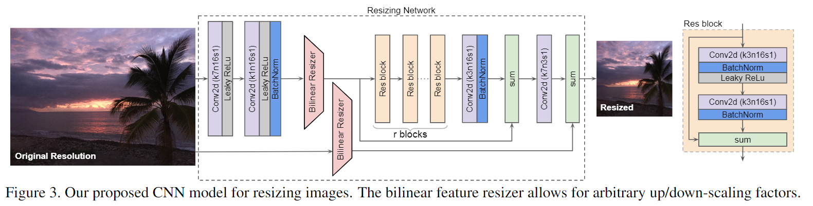
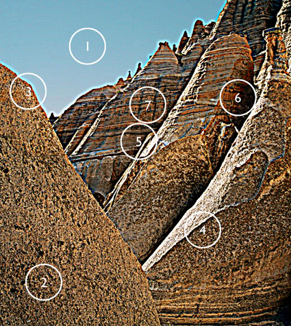

[TOC]


# 2021年10月

## Learning to Resize Images for Computer Vision Tasks

* [[2103.09950\] Learning to Resize Images for Computer Vision Tasks](https://arxiv.org/abs/2103.09950)

* [sayakpaul/Learnable-Image-Resizing: TF 2 implementation Learning to Resize Images for Computer Vision Tasks (https://arxiv.org/abs/2103.09950v1).](https://github.com/sayakpaul/Learnable-Image-Resizing)
* [KushajveerSingh/resize_network_cv: PyTorch implementation of the paper "Learning to Resize Images for Computer Vision Tasks" on Imagenette and Imagewoof datasets](https://github.com/KushajveerSingh/resize_network_cv)
* [Learning to Resize in Computer Vision](https://keras.io/examples/vision/learnable_resizer/)
* [SETI Breakthrough Listen - E.T. Signal Search | Kaggle](https://www.kaggle.com/c/seti-breakthrough-listen/discussion/246558)

### TL:DR

bilinear（双线性插值）或者bicubic的Resize方法会对图像的质量产生较大影响，容易造成细节损失，该篇文章设计了一个基于CNN的可学习resize模块（resize network）



该模型是放在CNN前面，为了证明该模块有效果，baseline为常用的先用resize的方法训练模型，然后将可学习Resize模块加在Baseline前面进行训练。（这不是换中方式把网络加深吗？）

Spatial Transformer Networks（不但可以放缩，还能做各种仿射变换）

### Detail

```python
TARGET_SIZE = (150, 150)
INTERPOLATION = "bilinear"

def get_learnable_resizer(filters=16, num_res_blocks=1, interpolation=INTERPOLATION):
    inputs = layers.Input(shape=[None, None, 3])

    # First, perform naive resizing.
    naive_resize = layers.Resizing(
        *TARGET_SIZE, interpolation=interpolation
    )(inputs)

    # First convolution block without batch normalization.
    x = layers.Conv2D(filters=filters, kernel_size=7, strides=1, padding="same")(inputs)
    x = layers.LeakyReLU(0.2)(x)

    # Second convolution block with batch normalization.
    x = layers.Conv2D(filters=filters, kernel_size=1, strides=1, padding="same")(x)
    x = layers.LeakyReLU(0.2)(x)
    x = layers.BatchNormalization()(x)

    # Intermediate resizing as a bottleneck.
    bottleneck = layers.Resizing(
        *TARGET_SIZE, interpolation=interpolation
    )(x)

    # Residual passes.
    for _ in range(num_res_blocks):
        x = res_block(bottleneck)

    # Projection.
    x = layers.Conv2D(
        filters=filters, kernel_size=3, strides=1, padding="same", use_bias=False
    )(x)
    x = layers.BatchNormalization()(x)

    # Skip connection.求和操作
    x = layers.Add()([bottleneck, x])

    # Final resized image.
    x = layers.Conv2D(filters=3, kernel_size=7, strides=1, padding="same")(x)
    final_resize = layers.Add()([naive_resize, x])

    return tf.keras.Model(inputs, final_resize, name="learnable_resizer")
```

从论文测试的图片看，resize模块似乎是增强了图片的中细节的边缘特征

### Thoughts

网络层中含有bicubic，能不能放在GPU上面跑？终端部署会不会有难度

[EfficientV2](https://arxiv.org/pdf/2104.00298) 采用的思想是自适应图片Resize，其目的是在模型训练时对image/feature maps进行自适应的Resize

与[Squeeze and Excitation (SE) blocks](https://arxiv.org/abs/1709.01507)、 [Global Context (GC) blocks](https://arxiv.org/pdf/1904.11492)（Non-local+SE）相似只需要添加少量参数就能提升模型的性能


## Large Motion Video Super-Resolution with Dual Subnet and Multi-Stage Communicated Upsampling

* [AAAI2021 大运动“视频超分辨”中的对偶子网与多阶通信上采样方案](https://mp.weixin.qq.com/s/TMNYRcCA0KvWbI_EB-NXLA)
* [[2103.11744\] Large Motion Video Super-Resolution with Dual Subnet and Multi-Stage Communicated Upsampling](https://arxiv.org/abs/2103.11744)

### TL:DR


### Detail


### Thoughts


## Real-ESRGAN: Training Real-World Blind Super-Resolution with Pure Synthetic Data

### TL:DR

通常在制作HR图片的LR图片标签时采用Bicubic等传统算法进行下采样，而真实场景的图像退化是复杂的，为了获得退化模型可以采用GAN进行学习。

传统SR算法的问题

- LR数据合成方式假定用bicubic（双三次插值）进行下采样，和真实退化方式不一致
- 基于MSE的方法倾向于得到经验平均最优解，导致SR结果偏平滑

Real-ESRGAN主要的创新点在

* 采用合成数据进行训练

* 引入多重退化类型的输入数据模拟方式(second-order degradation process 二阶的退化模型)

  常规的退化形式比如camera blur、sensor noise、sharpening artifacts（锐化伪影）、JPEG compression

  本文采用了sinc滤波模拟ringing效应和伪影（sinc filters、ringing、overshoot artifacts）

* 引入带spectral normalization (SN) regularization 的U-net判别器，提高判别器的性能和稳定训练过程


blind super-resolution：盲超分辨,假设图像的退化核函数是未知的。

### Detail

数据处理流程


其中sinc主要有两处，first order 的blur和second的最后处理

### Thoughts



1. Noise
2. Exaggerated Texture
3. Visible Light Halos
4. Visible Dark Lines
5. Loss of Highlight Detail
6. Loss of Shadow Detail
7. Increased Saturation

## EVSRNet: Efficient Video Super-Resolution with Neural Architecture Search

### TL:DR

该篇文章为MAI2021比赛Top2方案，在高通865上运行时间为12ms左右

其网络结构主要含有五层残差模块和一层PixelShuffle


## Spatial Transformer Networks

## CapsNet

* [CapsNet个人解读 - 知乎](https://zhuanlan.zhihu.com/p/341817045)

### 

