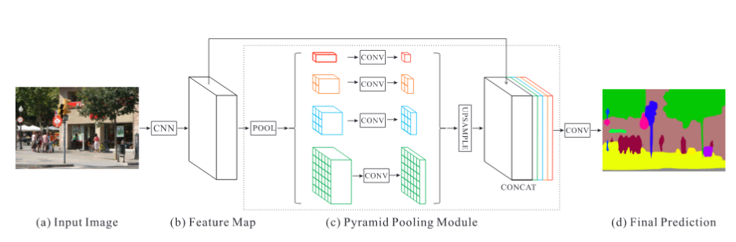

[TOC]

# Dual Refinement Feature Pyramid Networks for Object Detection

https://arxiv.org/pdf/2012.01733

## TL:DR

FPN的改进。针对FPN在底层与顶层特征融合的匹配上提出两个问题：通道维度（channel）不匹配、空间维度（spatial）不匹配。

SRB: Spatial Refinement Block

CRB: ChannelRefinement Block

PPM: Pyramid Pooling Module [[1612.01105\] Pyramid Scene Parsing Network](https://arxiv.org/abs/1612.01105)

