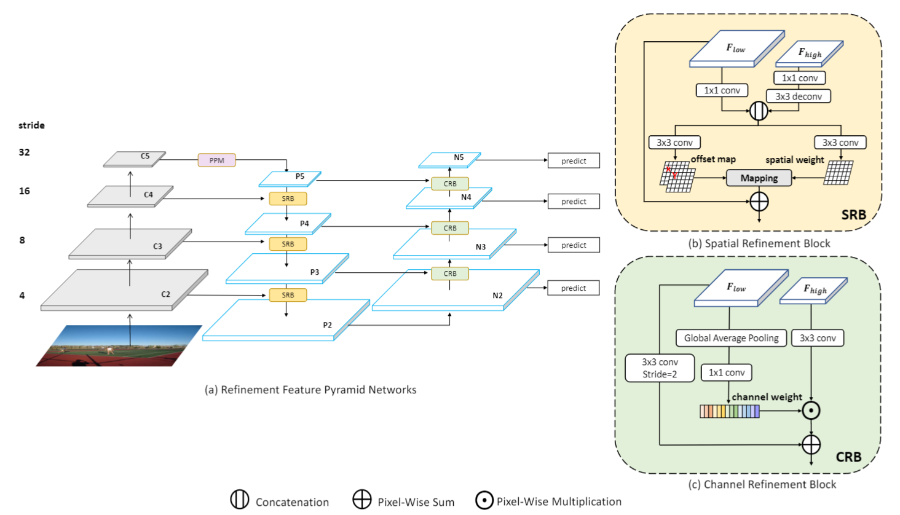

[TOC]

# 2020年12月15日

## Three Ways to Improve Semantic Segmentation with Self-Supervised Depth Estimation

## Slender Object Detection: Diagnoses and Improvements

## Dual Refinement Feature Pyramid Networks for Object Detection

https://arxiv.org/pdf/2012.01733

### TL:DR

FPN的改进。针对FPN在底层与顶层特征融合的匹配上提出两个问题：通道维度（channel）不匹配、空间维度（spatial）不匹配。

SRB: Spatial Refinement Block

CRB: ChannelRefinement Block

PPM: Pyramid Pooling Module [[1612.01105\] Pyramid Scene Parsing Network](https://arxiv.org/abs/1612.01105)

# 2021年1月6日

## Suppressing Uncertainties for Large-Scale Facial Expression Recognition

[kaiwang960112/Self-Cure-Network: This is a novel and easy method for annotation uncertainties.](https://github.com/kaiwang960112/Self-Cure-Network)

### TL;DR

Self-Cure Network (SCN) suppresses the uncertainty from two different aspects: 1) a self-attention mechanism over mini-batch to weight each training sample with a ranking regularization, and 2) a careful relabeling mechanism to modify the labels of these samples in the lowest-ranked group.

主要包含三个模块：

* self-attention importance weighting（weight for each image using a fully-connected (FC) layer and the sigmoid function）
* ranking regularization
* relabeling

