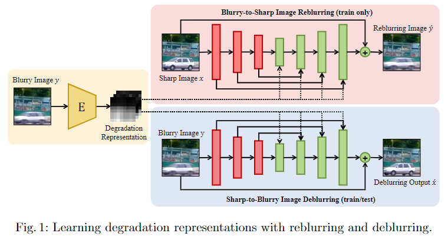
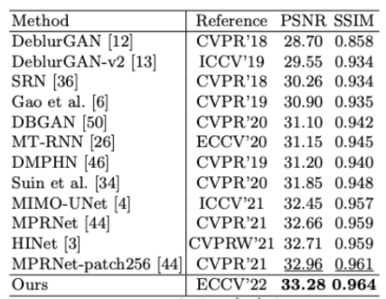
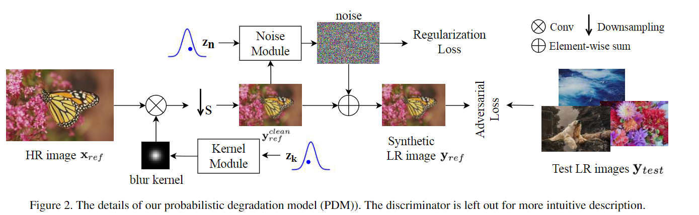
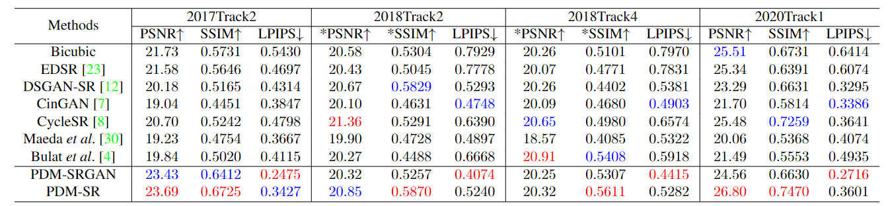
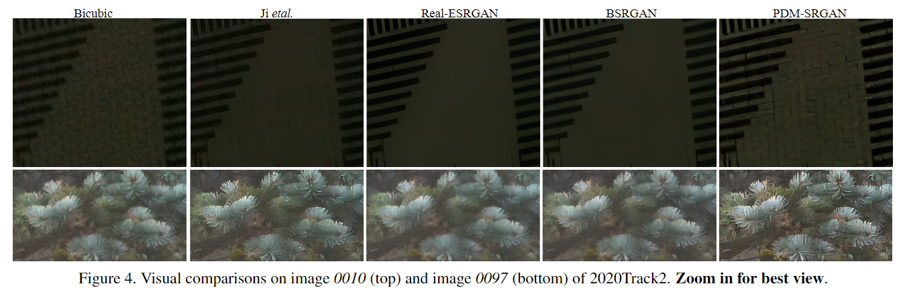
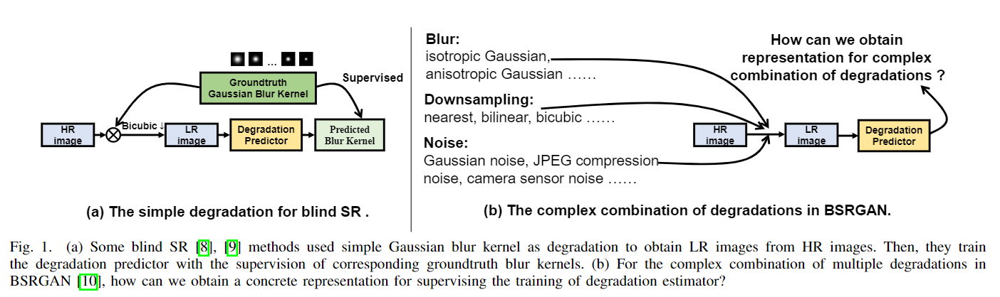
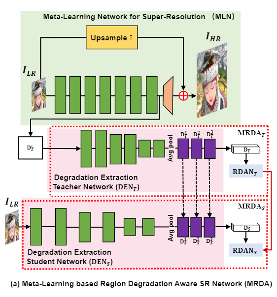
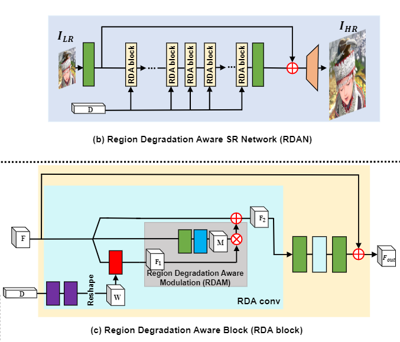
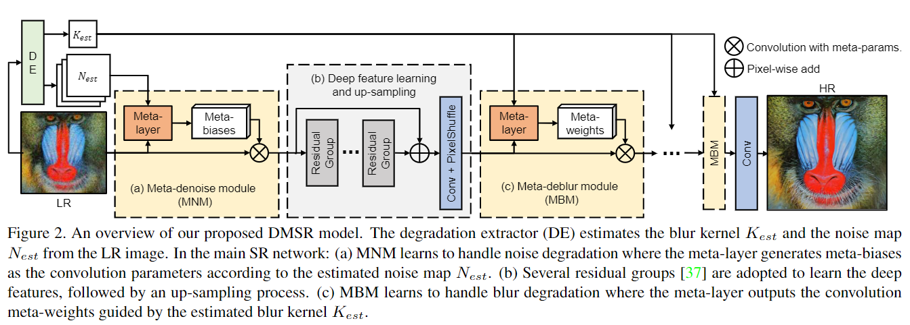
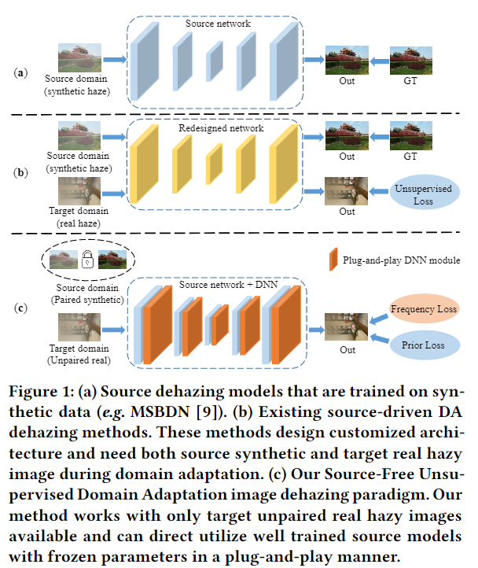

[TOC]

# Degradation

## Learning Degradation Representations for Image Deblurring

* [[2208.05244\] Learning Degradation Representations for Image Deblurring](https://arxiv.org/abs/2208.05244)
* CODE：[dasongli1/Learning_degradation](https://github.com/dasongli1/Learning_degradation)

* MMLab、NVIDIA、SenseTime

### TLDR：

主要为通过结合degradation representations与类似于cyclegan的框架的方法，进行图像deblur（GAN）

* 通过两个网络学习sharpen to blur  blur to sharpen ( reblurring and deblurring framework  cyclegan的味道 reblur2deblur)
* 数据集： Go-Pro and RealBlur
* 网络：Multi-Scale Degradation Injection Network (MSDI-Net)
* Loss：perceptual loss and adversarial loss

问题：生成的degradation representations maps是怎么跟后面的模型融合？concat。

### Performance

## Learning the Degradation Distribution for Blind Image Super-Resolution

* [[2203.04962\] Learning the Degradation Distribution for Blind Image Super-Resolution](https://arxiv.org/abs/2203.04962)

### TLDR

* 提出了一种概率退化模型（PDM， probabilistic degradation model）

  为什么叫概率？输入的zk zn为随机概率输入
  $$
  \mathbf{D}(\mathbf{x})=(\mathbf{x} \otimes \mathbf{k}) \downarrow_s+\mathbf{n}
  $$

* Loss：对抗loss+回归loss，对抗losss就是拿网络的输出与真实退化图像一起做adversarial loss（PatchGAN discriminator）；回归loss为L2，为了让生成的噪声满足0均值性质

* 文章提到退化模型可以和SR模型同时训练

### Performance

## Meta-Learning based Degradation Representation for Blind Super-Resolution

* [[2207.13963\] Meta-Learning based Degradation Representation for Blind Super-Resolution](https://arxiv.org/abs/2207.13963)

### TLDR：

该篇文章的一个主要创新点在：

构建了一个类蒸馏的复杂退化估计网络，可以直接前置于常规的超分网络前。

* 图a：常规的盲超分方案，在HR图上叠加模糊核，经过下采样，通过核估计网络估计模糊核（强监督）
* 图b：复杂的退化叠加 BSRGAN  问题：一个超大的模型，他应该具备识别特殊退化的能力，但是目前所使用的大模型，输出效果并不好？

该篇文章的主要创新点：

* 提出Meta-Learning based Region Degradation Aware SR Network (MRDA)，包含Meta-Learning Network（目的是更有效地估计复杂退化，加入了KD，优化退化的提取）、Degradation Extraction Network、Region Degradation Aware SR Network

  

* Region Degradation Aware SR Network，该网络利用MRDA提取出来的退化特征向量（reweight method），对特征层求相关系数（sigmoid、feature base reweight）

  

## Degradation-Guided Meta-Restoration Network for Blind Super-Resolution

* [[2207.00943\] Degradation-Guided Meta-Restoration Network for Blind Super-Resolution](https://arxiv.org/abs/2207.00943)

### TLDR：

比较常规的盲超方案。价值较低

通过估计blur和noise水平进行图像恢复

* degradation consistency loss：L1+L2+L2（名字取得真好）

## Source-Free Domain Adaptation for Real-world Image Dehazing

* [[2207.06644\] Source-Free Domain Adaptation for Real-world Image Dehazing](https://arxiv.org/abs/2207.06644)
* USTC
* ACM MM 2022

### TLDR：

主要想解决合成数据与真实数据之前的domain gap（Unsupervise Domain Adaptation，）

* Unsupervised Loss：Frequency Structure Loss、Frequency Style Loss、Prior Loss（Dark channel Loss、Color attenuation Loss）

  eg.dark channel prior, color line prior, color attenuation prior , sparse gradient prior , maximum reflectance prior ,
  and non-local prior

  文章没有解释清楚为什么用这些loss，堆内容嫌疑

* 计算FFT，拆解出振幅与相位，相位（Frequency Structure Loss），振幅（Frequency Style Loss）

* Dark channel Loss（pixels in [0,16]）、Color attenuation Loss（雾的浓度与亮度和饱和度之差呈正比）

# Thinking

* 如何用gan制作退化数据的时候去学习图像中纹理的模糊、halo而不是图像的亮度变化、颜色变化？

# Photography Tips

如何拍出清晰通透的照片？

1. 晴天，大中午，环境足够亮

2. 高光保护，对图片中最亮的地方测光，RAW拍摄，通过后期，拉回原图暗部细节（需要相机的宽容度足够） 

2. 通过曲线把暗部丢掉一些（用于解决图像发灰，人眼对暗部的通透性更关注）

