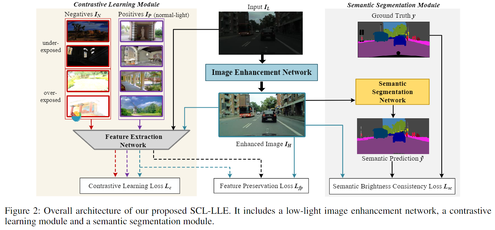
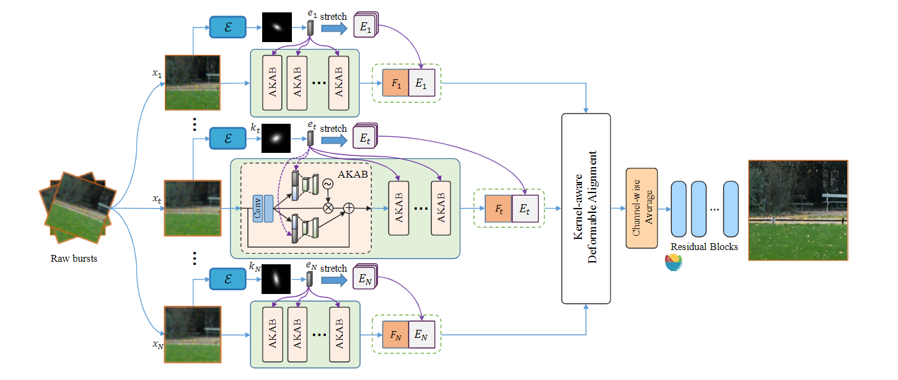
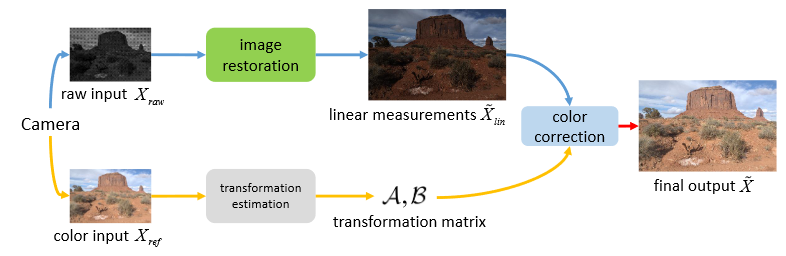

[TOC]

## [[1710.10916\] StackGAN++: Realistic Image Synthesis with Stacked Generative Adversarial Networks](https://arxiv.org/abs/1710.10916)

### TLDR：

* Color-consistency regularization 颜色一致性损失
  $$
  \mathcal{L}_{C_i}=\frac{1}{n} \sum_{j=1}^n\left(\lambda_1\left\|\mu_{s_i^j}-\mu_{s_{i-1}^j}\right\|_2^2+\lambda_2\left\|\Sigma_{s_i^j}-\mathbf{\Sigma}_{s_{i-1}^j}\right\|_F^2\right)
  $$
  最小化均值与方差（L2）

  颜色的差异用L2可以来衡量？
  
* 多域的gan方法

## [[2112.06451\] Semantically Contrastive Learning for Low-light Image Enhancement](https://arxiv.org/abs/2112.06451)

### TLDR：

使用Unpair数据进行训练，提出了三个loss提升模型（主要在颜色一致性、亮度一致性 损失函数上提供了一些想法，这个loss的效果在直方图上反应明显）

* Contrastive learning
* semantic brightness consistency：亮度一致性loss
* feature preservation：类似于perceptual loss

### Code：

* [LingLIx/SCL-LLE: SCL-LLE code](https://github.com/LingLIx/SCL-LLE)

## [[2112.07315\] Kernel-aware Raw Burst Blind Super-Resolution](https://arxiv.org/abs/2112.07315)

### TLDR：

raw域的盲超分

* 考虑了不同帧之间退化不一致性，提出了kernel-aware network（KBNet）
* kernel-aware blocks（gap+reweight）、kernel-aware deformable convolution module(DCN，与常规方法不太一样【两帧之间计算offset，再warp】，两帧之间concat再算offst)

核估计方法（GAP，每个channel feature 做average，softmax 保证和为1 ），核估计出来的特征用于各种concat

## [[2102.01579\] Exploiting Raw Images for Real-Scene Super-Resolution](https://arxiv.org/abs/2102.01579)

* [xuxy09/RawSR: Exploiting raw images for real-scene super-resolution, TPAMI 2021](https://github.com/xuxy09/RawSR)

### TLDR：

* 提出了一个新的pipeline模拟相机的ISP流程，做出更加真实的数据（做数据）
* 提出了一个两分支网络来更好地恢复图像地混叠信息（做模型，这个方案似乎行，同时输入Raw与相机数据做融合矫正）
* 提出了基于guided filter的网络用于颜色矫正（做损失）
* 可以更好的适应不同的相机（Leica SL Typ-601、iPhone 6s Plus）

### Detail

### Ref

* 数据集：Learning photographic global tonal adjustment with a database of input/output image pairs
* Raw处理软件：Dcraw
* motion blur 用 random walk生成
* 异方差高斯

## [Towards Real Scene Super-Resolution With Raw Images](https://openaccess.thecvf.com/content_CVPR_2019/html/Xu_Towards_Real_Scene_Super-Resolution_With_Raw_Images_CVPR_2019_paper.html)

### TLDR：

raw数据与最终输出的图像进行融合有助于恢复细节

## [[2104.06191\] Lucas-Kanade Reloaded: End-to-End Super-Resolution from Raw Image Bursts](https://arxiv.org/abs/2104.06191)

* 

## EBSR: Feature Enhanced Burst Super-Resolution with Deformable Alignment

### TLDR

alignment, fusion, and reconstruction

won the champion in the real track and second place in the synthetic track in the NTIRE21 Burst Super-Resolution Challenge.

## High Dynamic Range and Super-Resolution from Raw Image Bursts

## Unpaired Image Super-Resolution using Pseudo-Supervision

* Navier
* [Navier, Inc.](https://navier.co/en/)

### [[2207.09228\] Image Super-Resolution with Deep Dictionary](https://arxiv.org/abs/2207.09228)

## Author

[‪Bruno Lecouat‬ - ‪Google 学术搜索‬](https://scholar.google.com/citations?hl=zh-CN&user=7ydObdwAAAAJ&view_op=list_works&sortby=pubdate)
