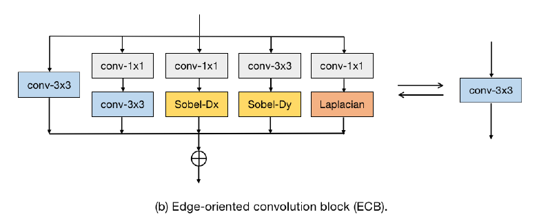
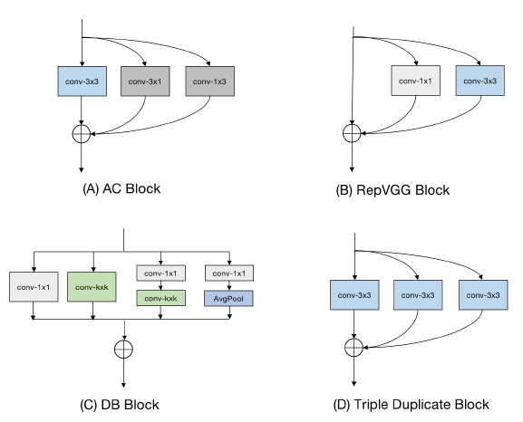

| 论文                                                         | TL;DR                                 | Code                                  |
| ------------------------------------------------------------ | ------------------------------------- | ------------------------------------- |
| Edge-oriented Convolution Block for Real-time Super Resolution on Mobile Devices | Edge-oriented Convolution Block (ECB) | https://github.com/xindongzhang/ECBSR |
|                                                              |                                       |                                       |
|                                                              |                                       |                                       |
|                                                              |                                       |                                       |

 

## 目录

[TOC]


### Edge-oriented Convolution Block for Real-time Super Resolution on Mobile Devices

#### TL;DR

基本架构为conv+pixelshufflu，本文再train时对conv进行多分支重构，测试时会被合并成常规的conv模块（不产生额外的参数量）

* 借鉴inception结构，（特点）在不同分支添加不同的特征提取方式
* ECB是一个re-parameterization block，加入edge-aware filter（传统的边缘特征：Sobel、Laplacian）（边缘信息能提升SR性能）


怎么结合传统边缘特征提取算子？

分开后怎么保证合并成常规的卷积？

#### Details



* 分支一：常规的3×3卷积。

  没有添加BN层（会影响SR的性能）

* 分支二：1×1 + 3×3 通道数先增加再压缩 通道数为两倍关系

  ```
          if self.type == 'conv1x1-conv3x3':
              self.mid_planes = int(out_planes * depth_multiplier)
              conv0 = torch.nn.Conv2d(self.inp_planes, self.mid_planes, kernel_size=1, padding=0)
              self.k0 = conv0.weight
              self.b0 = conv0.bias
  
              conv1 = torch.nn.Conv2d(self.mid_planes, self.out_planes, kernel_size=3)
              self.k1 = conv1.weight
              self.b1 = conv1.bias
  ```

  

* 分支三：1×1 + Sobel-Dx（水平方向边缘特征）

  $F_{D x}=\left(S_{D x} \cdot D_{x}\right) \otimes\left(K_{x} * X+B_{x}\right)+B_{D x}$

  ```
          elif self.type == 'conv1x1-sobelx':
              conv0 = torch.nn.Conv2d(self.inp_planes, self.out_planes, kernel_size=1, padding=0)
              self.k0 = conv0.weight
              self.b0 = conv0.bias
  
              # init scale & bias
              scale = torch.randn(size=(self.out_planes, 1, 1, 1)) * 1e-3
              self.scale = nn.Parameter(scale)
              # bias = 0.0
              # bias = [bias for c in range(self.out_planes)]
              # bias = torch.FloatTensor(bias)
              bias = torch.randn(self.out_planes) * 1e-3
              bias = torch.reshape(bias, (self.out_planes,))
              self.bias = nn.Parameter(bias)
              # init mask
              self.mask = torch.zeros((self.out_planes, 1, 3, 3), dtype=torch.float32)
              for i in range(self.out_planes):
                  self.mask[i, 0, 0, 0] = 1.0
                  self.mask[i, 0, 1, 0] = 2.0
                  self.mask[i, 0, 2, 0] = 1.0
                  self.mask[i, 0, 0, 2] = -1.0
                  self.mask[i, 0, 1, 2] = -2.0
                  self.mask[i, 0, 2, 2] = -1.0
              self.mask = nn.Parameter(data=self.mask, requires_grad=False)
  ```

  

* 分支四：1×1 + Sobel-Dy（垂直方向边缘特征）

* 分支五：1×1 + Laplacian

  ```
          elif self.type == 'conv1x1-laplacian':
              conv0 = torch.nn.Conv2d(self.inp_planes, self.out_planes, kernel_size=1, padding=0)
              self.k0 = conv0.weight
              self.b0 = conv0.bias
  
              # init scale & bias
              scale = torch.randn(size=(self.out_planes, 1, 1, 1)) * 1e-3
              self.scale = nn.Parameter(torch.FloatTensor(scale))
              # bias = 0.0
              # bias = [bias for c in range(self.out_planes)]
              # bias = torch.FloatTensor(bias)
              bias = torch.randn(self.out_planes) * 1e-3
              bias = torch.reshape(bias, (self.out_planes,))
              self.bias = nn.Parameter(torch.FloatTensor(bias))
              # init mask
              self.mask = torch.zeros((self.out_planes, 1, 3, 3), dtype=torch.float32)
              for i in range(self.out_planes):
                  self.mask[i, 0, 0, 1] = 1.0
                  self.mask[i, 0, 1, 0] = 1.0
                  self.mask[i, 0, 1, 2] = 1.0
                  self.mask[i, 0, 2, 1] = 1.0
                  self.mask[i, 0, 1, 1] = -4.0
              self.mask = nn.Parameter(data=self.mask, requires_grad=False)
  ```


合并参数的方法：

```
    def rep_params(self):
        device = self.k0.get_device()
        if device < 0:
            device = None

        if self.type == 'conv1x1-conv3x3':
            # re-param conv kernel
            RK = F.conv2d(input=self.k1, weight=self.k0.permute(1, 0, 2, 3))
            # re-param conv bias
            RB = torch.ones(1, self.mid_planes, 3, 3, device=device) * self.b0.view(1, -1, 1, 1)
            RB = F.conv2d(input=RB, weight=self.k1).view(-1,) + self.b1
        else:
            tmp = self.scale * self.mask
            k1 = torch.zeros((self.out_planes, self.out_planes, 3, 3), device=device)
            for i in range(self.out_planes):
                k1[i, i, :, :] = tmp[i, 0, :, :]
            b1 = self.bias
            # re-param conv kernel
            RK = F.conv2d(input=k1, weight=self.k0.permute(1, 0, 2, 3))
            # re-param conv bias
            RB = torch.ones(1, self.out_planes, 3, 3, device=device) * self.b0.view(1, -1, 1, 1)
            RB = F.conv2d(input=RB, weight=k1).view(-1,) + b1
        return RK, RB
```



* ACNet
* RepVGG
* DB Block
