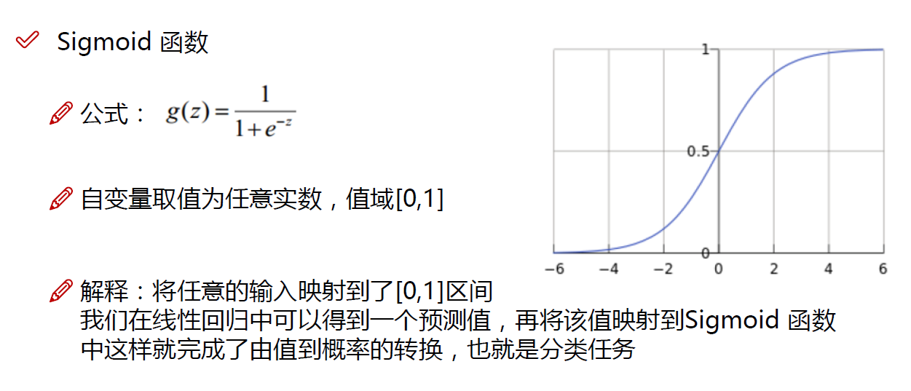

# 机器学习

参考

* [Algorithm_Interview_Notes-Chinese]([https://github.com/DarLiner/Algorithm_Interview_Notes-Chinese/blob/master/A-%E6%9C%BA%E5%99%A8%E5%AD%A6%E4%B9%A0/A-%E6%9C%BA%E5%99%A8%E5%AD%A6%E4%B9%A0%E7%AE%97%E6%B3%95.md](https://github.com/DarLiner/Algorithm_Interview_Notes-Chinese/blob/master/A-机器学习/A-机器学习算法.md))

## SVM

### **SVM如何处理多分类问题？**

一般有两种做法：

1. 直接法：直接在目标函数上修改，将多个分类面的参数求解合并到一个最优化问题里面。看似简单但是计算量却非常的大。
2. 间接法：对训练器进行组合。其中比较典型的有一对一，和一对多。


* 间接法：主要是通过组合多个二分类器来实现多分类器的构造

  [`SVC`](https://www.studyai.cn/modules/generated/sklearn.svm.SVC.html#sklearn.svm.SVC) 和 [`NuSVC`](https://www.studyai.cn/modules/generated/sklearn.svm.NuSVC.html#sklearn.svm.NuSVC) 实现了 “one-against-one” 方法用于解决多类别分类问题。 如果 n_class 是类的数量，那么总共需要构建 **n_class * (n_class - 1) / 2** 个分类器，其中每一个分类器都是在数据上训练得到的两类分类器。

### **为什么SVM要引入核函数？**

当样本在原始空间线性不可分时，可将样本从原始空间映射到一个更高维的特征空间，使得样本在这个特征空间内线性可分。

### 支持向量机的分类？

- 线性可分支持向量机
  - 当训练数据**线性可分**时，通过**硬间隔最大化**，学习一个线性分类器，即**线性可分支持向量机**，又称**硬间隔支持向量机**。
- 线性支持向量机
  - 当训练数据**接近线性可分**时，通过**软间隔最大化**，学习一个线性分类器，即线性支持向量机，又称**软间隔支持向量机**。
- 非线性支持向量机
  - 当训练数据**线性不可分**时，通过使用**核技巧**及**软间隔最大化**，学习非线性支持向量机。

### SVM核函数有哪些？

- 线性（Linear）核函数：主要用于线性可分的情形。参数少，速度快。
- 多项式核函数
- 高斯（RBF）核函数：主要用于线性不可分的情形。参数多，分类结果非常依赖于参数。
- Sigmoid核函数
- 拉普拉斯（Laplac）核函数

注：如果feature数量很大，跟样本数量差不多，建议使用LR或者Linear kernel的SVM。如果feature数量较少，样本数量一般，建议使用Gaussian Kernel的SVM。

## 逻辑回归（Logistic regression）

* **分类**，经典的二分类算法

* 逻辑回归的本质：极大似然估计

* 逻辑回归的激活函数：Sigmoid

  

* 逻辑回归的代价函数：交叉熵

## K-近邻算法（KNN）

就是在训练集中数据和标签已知的情况下，输入测试数据，将测试数据的特征与训练集中对应的特征进行相互比较，找到训练集中与之最为相似的前K个数据，则该测试数据对应的类别就是K个数据中出现次数最多的那个分类

* 计算测试数据与各个训练数据之间的距离
* 按照距离的递增关系进行排序
* 选取距离最小的K个点
* 确定前K个点所在类别的出现频率
* 返回前K个点中出现频率最高的类别作为测试数据的预测分类

## 集成学习（Ensemble learning）

集成学习的基本策略

* ### **Boosting**

  学习一系列基学习器，然后组合它们构成一个强学习器。**将弱分类器串联组合成一个强分类器**。

  Boosting 基于**串行策略**。

  代表算法/模型：**AdaBoost**（根据前一次的分类效果调整数据权重，如果某一个数据在这次分错了，那么在下一次我就会给它更大的权重）， **GBDT**，**Xgboost**

* ### Bagging

  并行训练多个分类器取平均

  Bagging 基于**并行策略**：基学习器之间不存在依赖关系，可同时生成。

  代表算法/模型：**随机森林**，神经网络的 **Dropout** 策略

* ### Stacking

  聚合多个分类或回归模型（可以分阶段来做），堆叠各种各样的分类器（KNN,SVM,RF等等）

## K-MEANS

是一种典型的**无监督学习算法**

```
选择K个点作为初始质心  
repeat  
    计算每一个样本与质心之间的相似度(这里为欧式距离)，将样本点归到最相似的类中
    重新计算每个类的质心(即为类中心)  
until 簇不发生变化或达到最大迭代次数  
```

## 线性判别分析（LDA）

用途：数据预处理中的降维，分类任务

原理：投影到维度更低的空间中，使得投影后的点，会形成按类别区分

## 主成分分析（PCA）

用途：降维中最常用的一种手段

原理：基于方差，提取最有价值的信息

