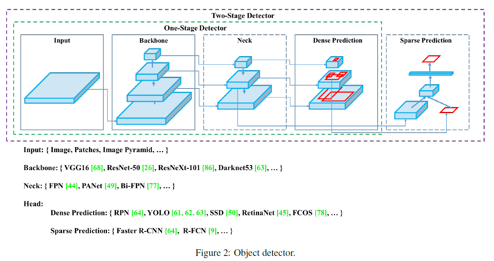
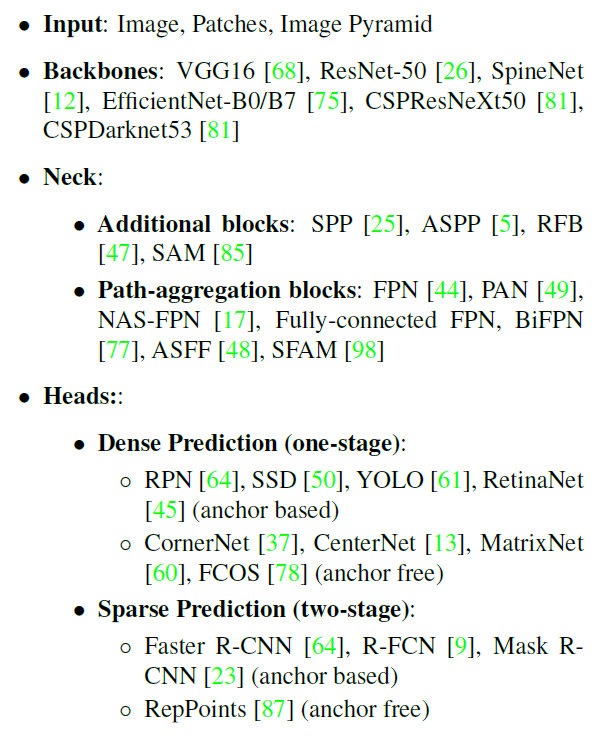

# 目标检测

参考：

- 《[从RCNN到SSD，这应该是最全的一份目标检测算法盘点 | 机器之心](https://www.jiqizhixin.com/articles/2018-04-27?from=synced&keyword=从RCNN到SSD，这应该是最全的一份目标检测算法盘点)》
- 《[基于深度学习的目标检测技术演进：R-CNN、Fast R-CNN、Faster R-CNN、YOLO、SSD | 七月在线](https://www.julyedu.com/question/big/kp_id/32/ques_id/2103)》
- [最详细目标检测讲解](https://www.telesens.co/2018/03/11/object-detection-and-classification-using-r-cnns/)

## Faster RCNN

论文：《[Faster R-CNN: Towards Real-Time Object Detection with Region Proposal Networks (NIPS2015)](https://arxiv.org/pdf/1506.01497.pdf)》

参考：

- 《[一文读懂Faster RCNN | 知乎, 白裳](https://zhuanlan.zhihu.com/p/31426458)》
- 《[Faster R-CNN | 知乎, 晓雷](https://zhuanlan.zhihu.com/p/24916624)》

## YOLO系列

参考：

- 《[YOLO v1 v2 v3系列原理与实现 | 知乎, Joe.Zhao](https://zhuanlan.zhihu.com/p/80855877)》
- 《[YOLO系列：V1,V2,V3,V4简介 | 知乎, 初识CV](https://zhuanlan.zhihu.com/p/136382095)》
- [代码](https://github.com/AlexeyAB/darknet)

论文

* v1：《[You Only Look Once: Unified, Real-Time Object Detection (CVPR2016)](https://arxiv.org/pdf/1506.02640)》

- v2：《[YOLO9000: Better, Faster, Stronger (CVPR2017)](https://arxiv.org/pdf/1612.08242)》
- v3：《[YOLOv3: An Incremental Improvement (2018)](https://arxiv.org/pdf/1804.02767)》
- v4：《[YOLOv4: Optimal Speed and Accuracy of Object Detection (2020)](https://arxiv.org/pdf/2004.10934v1)》

### YOLO v4

目标检测框架总结：

目标检测两种优化套路：

* **Bag of Freebies**，指的是在训练上增加一些策略，达到更高的精度并且在测试的时候不会增加额外的时间的策略。
  * 比如数据增广的方法图像几何变换、CutOut、grid mask等，网络正则化的方法DropOut、DropBlock等，类别不平衡的处理方法、困难样本挖掘方法、损失函数的设计等。
* **Bag of Specials**，稍微增加测试时间，但是可以提高较多的精度的方法。
  * 比如增大模型感受野的SPP、ASPP、RFB等，引入注意力机制Squeeze-and-Excitation (SE) 、Spatial Attention Module (SAM)等 ，特征集成方法SFAM , ASFF , BiFPN等，改进的激活函数Swish、Mish等，或者是后处理方法如soft NMS、DIoU NMS等。

YOLO v4 框架

- **Backbone：CSPDarknet53**
- **Neck：SPP，PAN**
- **Head：YOLOv3**

- Weighted-Residual-Connections (WRC)
- Cross-Stage-Partial-connections (CSP)
- Cross mini-Batch Normalization (CmBN)
- Self-adversarial-training (SAT)
- Mish-activation
- Mosaic data augmentation
- CmBN
  - CBN的一个变体，CBN统计多个迭代步的数据然后做一次BN参数的更新，而因为Mosaic数据增广的使用，可以在空间上按照输入图片的划分来划分特征图，然后把它们视为四个mini-batch的数据来统计均值和方差，有效解决了BN本身对BatchSize大小的要求。
- DropBlock regularization
- CIoU loss

### YOLO v5